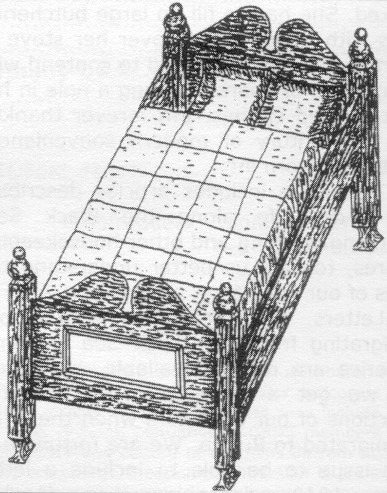
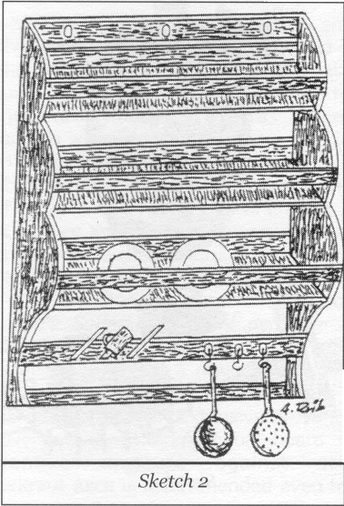
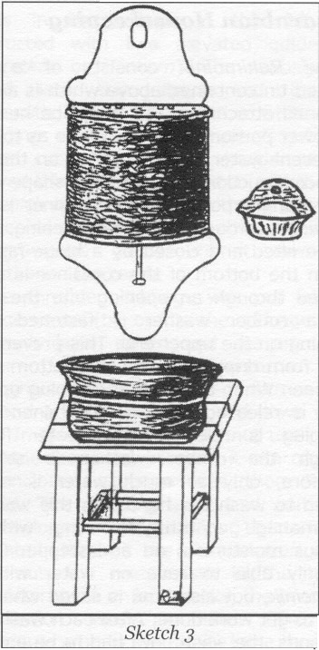
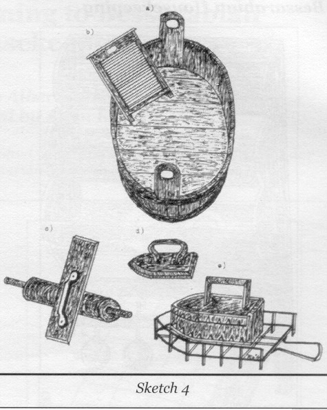
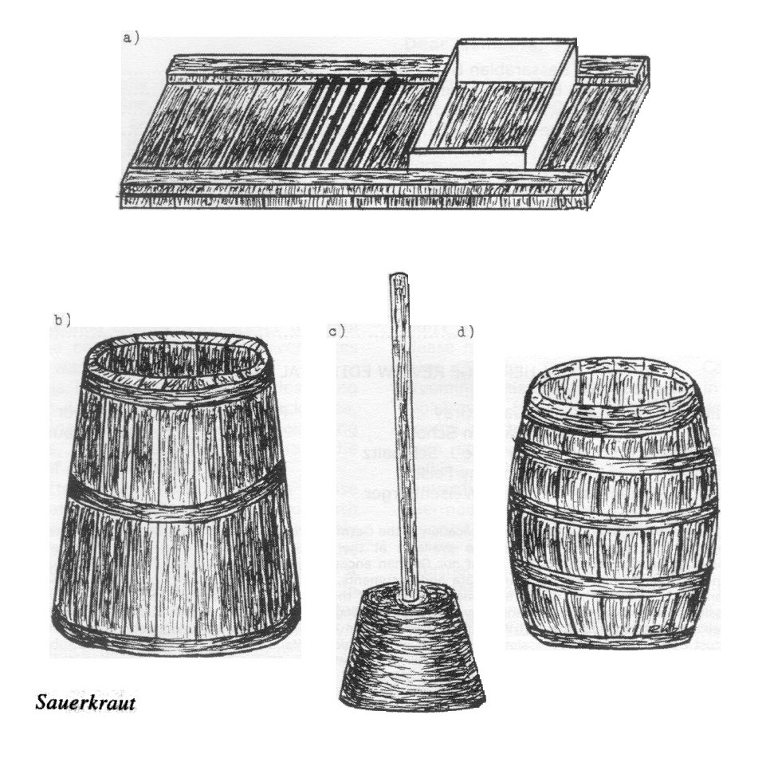
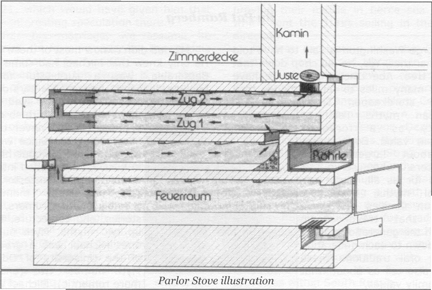

<!-- source_page: 1 -->

# Things Pertaining to Bessarabian Housekeeping

*By Albert Rueb*
*[Translated by Allen Konrad September, 2007]*

[Begin Translation]

With not much by way of earthly goods packed in trunks and bags, our ancestors one day set out from old Wuerttemberg to settle the prairie (Steppe) of southern Bessarabia. Their simple and wretched way of life at the start of colonization is nigh unto an impossible task in the minds of their descendants today. Although the emigrants had confidence as farmer families blessed with an impoverished existence in their old homeland, and did not set too high expectations in their new surroundings, they more than likely overcame the temporary condition by their power of imagination. The crowded living conditions of the earthen shelters at the beginning of establishing themselves, combined with health related and emotional stress, placed great demands on a person's body and spirit. In spite of it, they did not give up and pursued with resolve the beginning of the settling of the steppe.

After the mastery of the initial difficulties and with the increase in prosperity, there followed a slow but steady tolerable, humane way of life in the established colonies. With the inner craving once again to be settled down and to once again to be able to call something his own property, the first furniture showed up in the houses. After the beds of grass and straw in the makeshift earthen shelters, there appeared in the construction of settlement houses the use of the bed (*Bettlad*) which was familiar in the old homeland (sketch 1). While at first no partitioning between living and sleeping rooms was possible due to the fact that the floor plan was small in the first houses, the beds in the beginning, in order to conserve space, were often double bunks. The head board and the foot board were usually heightened and , in the beginning, sometimes decorated with painted pictures. The bedposts had as a finish lathe-turned crowns on top and similar designs as well on the foot-boards. The mattress (*Strohsack*) (in this country *Bettsack*) was at first stuffed with straw. Later the filler was changed to "slit" well-dried corn leaves, which were already sorted out at the place where the leaves were separated from the cobs (*Bobscheplatta*). The corn leaves had the advantage of not crumpling so quickly and in that way fewer were needed. (It should be noted that the old folks hid their savings in the straw mattress, so that if thieves broke in it would not be found. The descendants now and then discovered their inheritance only by accident.) The pillow for the head was filled with down-feathers which they plucked themselves from ducks or geese. The bed cover (*Zudecke*) (also *Bettdecke*, in our country *Zuadecke*) contained wool from their own sheep. After the shearing it was washed, pulled, combed and made into a bed-cover by a seamstress. The seams ran crisscross. This kept the wool in its place and prevented it from sliding here and there. In many homes feathers were used to fill the bed-covers. The bed-covers were placed into a slip-cover (*Bettbezug*) (also *Bettziech*, in our land *Bettziach*), which, when in <!-- source_page: 2 --> need of washing, could be changed. Later on, various kinds of bedsteads with metal frames were put in the guest room and provided at the top with fringed pillows and blankets. They were mostly thought of as for show since it happened very seldom that company stayed overnight.

In the matter of the things one needed close at hand for meal time, such as plates, dishes, cups and drinking goblets, something was used that reminds one of an open book shelf, which in the old homeland was called a *Schanze*, but in Bessarabia a *Kuechenbrett* (also *Gschirracha*, or *Geschirrahmen*—see sketch 2). On this the items were stowed in clear sight and easy to reach; at the same time serving as an eye-catcher for the guest, who had to admire the good equipment of the housewife.

The *Rukimoinik* (Russian for a hand washing vessel) was used in the aristocratic Russian homes (sketch 3). The colonists thought the vessel extremely useful. For that reason, pretty soon it belonged to the equipment of the summer as well as the winter kitchen of the Bessarabian farm-houses. It not only served the housewife to wash her hands before she started the preparation of the meals, but also the hand washing of the rest of the family members before they came to the table to eat.

The *Rukimoinik* consists of a half-rounded tin container, above which is a nicely fashioned attachment so it can be hung up. The lower portion is finished off so as to serve to prevent water from splashing on the wall, in its construction similar to the shape of the upper hanger portion. Through the upper opening, which can be opened and closed by a hinge-fastened lid, the container is filled with water. On the bottom of the container is a plug inserted through an opening into the inside and by a widening on the upper end a rubber washer is fastened. This prevents the water from dripping out of the bottom of the container. When one pushes the plug upward, water is released from the container. When the plug is released, the water flowing through the rubber washer is stopped. Therefore, only as much water is run as is needed to wash the hands. In this way, one can manage a thrifty soaking of the precious moisture in an arid steppe. One is not only able to save on water with the *Rukimoinik*, but also, when in a hurry to get work done, time is saved. After each washing of the hands, the wash bowl had to be emptied. With the *Rukimoinik*, more people could wash their hands, one after the other, until the bowl, sitting either on a *Taburetka* (stool) or on an artistically finished iron stand, was full and then had to be emptied.

In our time, with its highly developed technology, one needs a good imagination to comprehend the former power-deprived wash day of the Bessarabian farm-wife (see sketch 4). For her it meant each time—especially in the summer months—a sweat-drenched physical struggle. Also, at the beginning of mowing and threshing time, when a supply of clean wash and work clothes had to be on hand, washing had to again take place more often, because in those days there were <!-- source_page: 3 --> more sweat-soaked and dusty pieces to wash than usual. In the heat of the summer, a lot of energy was used up in heating up steaming hot water in big butchering kettles and mixing it with cold water in the two-handled tub (a), followed up with the up and down scrubbing motion on the wash-board (b) as well as wringing things out. A brief pause to wipe the sweat from the brow, a deep breath and then on with the job.

In order not only to have breakfast, but also to have the noon meal on the table in time for the workers, one could find the housewives, in summer-time, often already at the first crow of the rooster, standing at the washtub and at the first rays of sunlight hanging up the wash. And in the midst of this, the cows had to be milked because at sunup the cow herder would gather together the cows of the village and with the loud crack of his long whip (*Harabnik – Peitsche*) bring them into the meadow.

Once the wash was dried, which happened quickly in the summer temperature, the large pieces were folded and pressed with the wood roller (*Mangelholz*) (c), the delicate wash pressed with the flat-iron (*Plaetteisen*) (d), which was heated up on the hearth or the cooking stove, or with the ironing devise (*Plaettmaschine*) (e). The ironing devise was filled with glowing charcoal from the hearth, which was brought to a glow by the draft created as the devise was moved back and forth thus heating up the iron. One had to be careful when it crackled in the devise and tiny pieces of ash fell out of the openings on the side and landed on the white Sunday shirt or on the loose shirt collar where it would leave behind an annoying black spot. If unable to remove it, the piece of wash had to be washed over again. It was especially dangerous when a spark burned a hole in the wash and rendered the item useless.

It is worth noting what satisfaction and relief it gave the housewife when the clean work clothes and fresh underwear were ready for the family to change into.

"Love is like sauerkraut, wonderful for the one who can stand/tolerate it." ("*D'Lieb, die isch wie's Sauerkraut, wohl dem der's gut verdaut!*" vernacular)

Sauerkraut played a major medicinal role since Greek and Roman antiquity. James Cook (1728-1779), in his extensive voyages of discovery, had sauerkraut on board as a preventive measure against scurvy. Sauerkraut juice is recommended even to this day as an aid to staying slim. With its rich content of minerals and vitamins, sauerkraut is truly a source of good health. Sauerkraut, for example – the juice, as much as before, is consumed, that is, drunk by the rural folks as a home remedy for arthritis, constipation and sluggish bowels. A fork full of sauerkraut has cleaned out many an upset stomach and enhanced well-being. According to medical knowledge, it distils, gets rid of and delivers components of vitamin B-12 to the blood. Statistics show that Germans consume as much as 2 kg [4.4 pounds] of sauerkraut a year.

Sauerkraut also had its fixed place on the list of food among the Bessarabian farm families. To that end, white cabbage could be purchased from the cabbage handlers in volume at the market, <!-- source_page: 4 --> where it was offered in large quantities for a good price. The procedure for preserving it has not changed since the emigration of our ancestors. The cabbage was processed according to the method they brought with them. (sketch 5)

The cabbage vessel (*Krautstand*) or cabbage barrel (*Krautfass*) was first of all thoroughly scalded with boiling water so that the sauerkraut did not take on an after-taste. The cabbage shredder (*Krauthobel*) (a), which made the rounds in the village in the Fall, was constructed with two elevated guide rails (*Taburetkas* or *Hockern*). The cabbage was shaved into thin strips and gathered underneath into a tub or on a white cloth. Shredding was primarily a man's job. The women cut the cabbage heads in half, removed the outer leaves and cut out the core (*Dorschich* or *Strunk*). When the stringy layer was pealed off, not only the children but also the grownups gladly ate it raw. This strengthened the teeth.

The shredded cabbage was put into the cabbage vessel (b) or into the cabbage barrel (d), each layer salted and seasoned with juniper berries or peppercorns, then thoroughly stomped, covered with a linen cloth and a wood cover weighed down with a stone. In this process you do not use porous sandstone (*sandeln*) because it can crumble. The enclosed cabbage was then left to ferment. The resulting lactic acid warded off the development of putrefying bacteria and stimulated, through the consumption of the sauerkraut, the metabolism in the human body. After three or four weeks, the process of fermentation was complete. Then the sauerkraut came to the family table by means in a variety of preparations of long standing recipes.

Besides coriander, caraway seed was also added to the sauerkraut preparation, and this for good reason. Through these additions the taste was not only improved, but the secondary effects of the sauerkraut were reduced. Both spices prevented the passing of gas and stomach cramps and promoted digestion. The addition of rice allowed the sauerkraut to thicken. (See the recipe "dumplings and pepper sauce" by Helene Krueger-Haecker).

The sauerkraut really started tasting lovely when it was at least warmed up a couple of times and had taken on a brownish color. It was traditional in the rural homeland of the emigrants to keep the sauerkraut pot in the oven warmer during winter time. Wilhelm Busch himself let widow Bolte go into the cellar: "In order to get for herself a lot from out of the sauerkraut pot, to which she especially retreated, when it again got reheated." ("*Dass sie von dem Sauerkohle eine Portion sich hole, wofuer sie besonders schwaermt, wenn es wieder aufgewaermt.*")

## Our Parlor Stove, An Efficient Space Heater

*By Karl Roth*

It spread a warmth and coziness in the German colony houses in South Bessarabia. There was neither wood nor coal in this steppe region. Mostly, it would heat the house. It vented the stale air and smoke through the chimney.

<!-- source_page: 5 -->

Our parlor stove took up little room as compared to the Russian *Petsch*, because they were not positioned like that one, but stood in an upright position in the room. In the true sense of the word, it was a burner of any substance. Everything burnable, which the steppe had to offer, it took and converted into warmth. Loose burnable material such as straw, corn stocks, grape vines, wood, weeds and more like that were collected in baskets and sacks.

Fine dust was created in bringing in the burnable material and in the removal of the ashes. World over, one has to make allowance for this. Overall, the good parlor stove had more advantages than disadvantages. During the winter, it could heat up to four rooms since it, at the same time, served as a bulk-head between two rooms. During the summer, one could use it as a cooler for smoked meat, sausage and such things when a person kept the air passage door slightly open.

All kinds of designs and tests are conducted on behalf of dust-free heating. It is just that the technology at that times was not yet as advanced as today, to chop up the straw real fine and to transform it into straw briquettes. – German landowners install their parlor stoves in an underground tunnel. I saw such equipment at the home of Mr. Eduard Gerstenberger in Tscheligider. Heating in this manner keeps the whole home dust-free.

There is more than enough straw in the superabundant wheat region of South Russia. It is piled up in the back yard in space saving straw stacks where it awaits its being put to use. It serves as heating material for the parlor stove and in the numerous brickyards in the German settlements.

Everyone can afford a parlor stove. It's stove mantle consists of a simple small stone slab, brick or Dutch tile. The parlor stove can be beautified and decorated according to one's own taste, pocket book and artistic sense,. Also, if one were unable to afford an expensive glazed tile, but was resourceful, could find the right shade of color for his stove.

### Function of the Parlor Stove

The attached sketch helps to see and comprehend.

Stove size: Overall length of the stove = ca. 2.5 to 3 meters [ca. 98" to 118"]; Stove height = ca. 2 m [ca. 78"]; Stove base = ca. .45 m [ca. 17"]; Fire-box = ca. .45 x .45 m [ca. 17" x 17"]; Draft chamber = ca. .20 x .20 m [ca. 8" x 8"]; Lower deck = ca. 15 cm thick [ca. 6"] and it rests on strong flat iron.

Stove recess (*Ofenroehrle*) = ca. .30 m high and .40 m wide [ca. 12" x 16"]. No stove could be without one and it was located <!-- source_page: 6 --> on the front side, but could also be on the long side of the stove.

The bulk-head of the stove up to the ceiling was ca. .25 m [ca. 10"] and most of the time was built up on one side from the stove to the ceiling.

The versatile, useful and popular small recess (*Roehrchen*) in the stove was seldom painted. It was made out of strong tin and rested on a flat piece of iron.

Heat Regulation Service: a strong stove door like the ventilation door under it. The damper, or the *Juste* serves to cut off the stove heat, after which the stove embers only flicker and draws smoke-free.

You have from us the description of the stove construction and its specifications. The painted parlor stove will delight you especially during the winter time, very popular with the old and the young, with the poor and the rich.

The colonists felt as good about their parlor stoves as the princes in their dream castles. For from the stove came warmth and security, which a person could fall in love with.

The parlor stove was one extremely simple, space-saving and yet efficient space heater.

---

1. You could get stove tile from the business firm Wilske, in Kloestitz. They were cheaper than the artistic tile from abroad.
2. The front mounted small door, or stones, served to keep the stove soot-free.

[End Translation]
