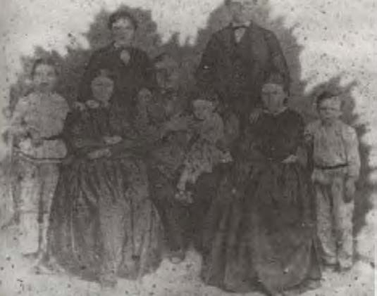
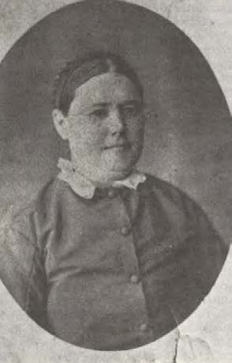
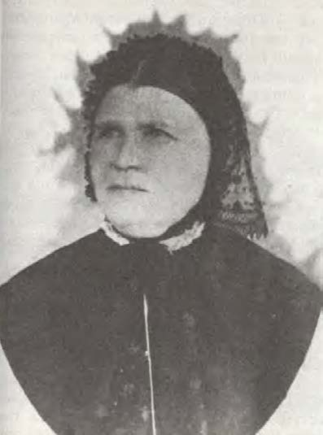
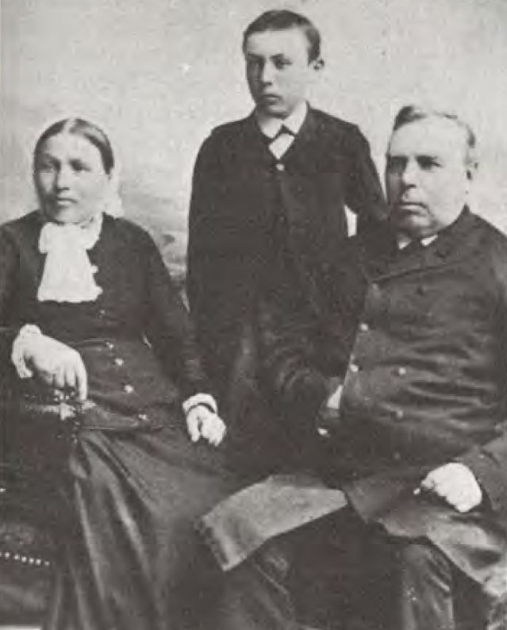
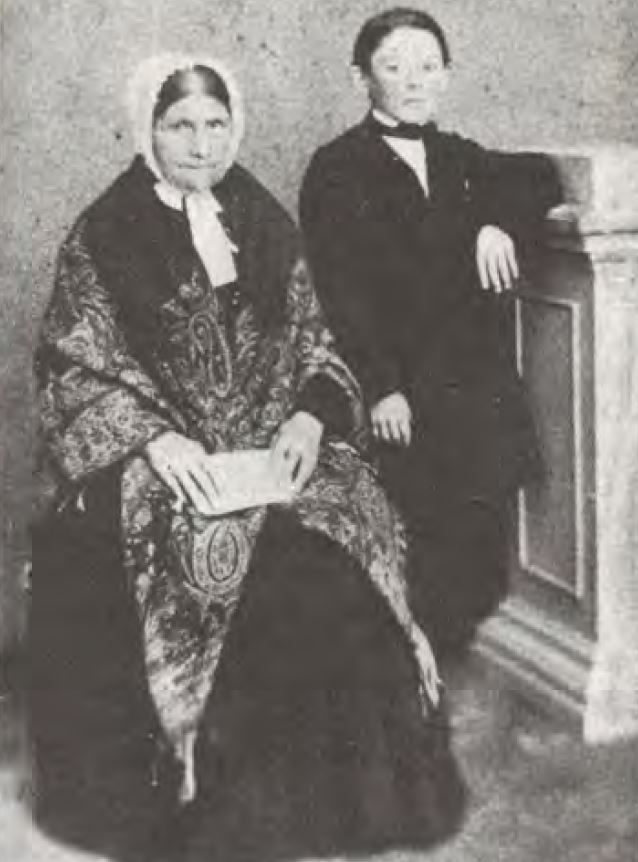
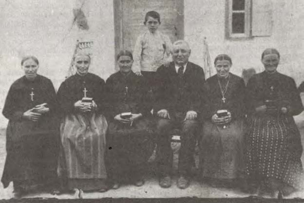
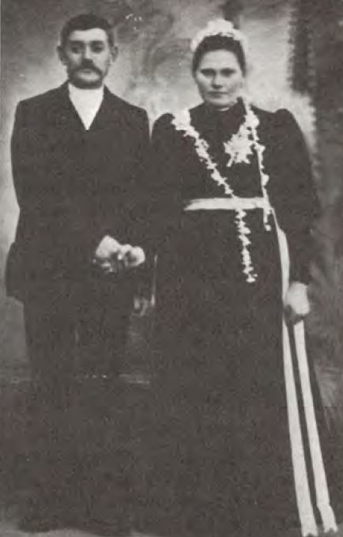
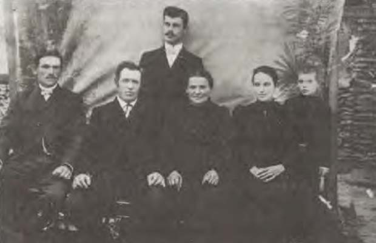
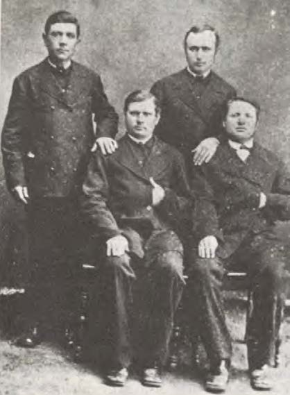

<!-- source_page: 1 -->

# Clothing of Germans in Bessarabia

*Bessarabischer Heimatkalender—1977*  
W. Rumpeltin, Buchdruckerei und Zeitungsverlag K.G.  
[Book Printing and Newspaper Publishing Limited]  
Burgdorf, Hannover/Germany  
Pages 42-67  
Translated by: Allen E. Konrad  
March, 2026  
P.O. Box 157, Rowley, IA 52329  
onamission1939@gmail.com  

Note: Information within [brackets] are comments by the translator.

---

[Translation Begins]

## On the Clothing of the Germans in Bessarabia

*Ella Winkler-Lütze*

On the many pages of our Homeland Calendar (*Heimatkalender*), which has meanwhile had the honor of celebrating its fifty-fifth anniversary, villages and buildings, the farmland, the gardens, and much that concerns the life of the colonists are described. Detailed reports are also dedicated to the development of the German villages from the time of their founding up to their resettlement in Germany. Many character sketches of the people who shaped life on the steppe and predominantly lived a rural lifestyle, fulfilling their earthly existence and attending to their duties, found their rightful place in it. To fully complete this picture, the description of the persons alone with all their positive and negative character traits is not sufficient; their appearance, which is reflected in their clothing, is also necessary. The following pages shall be devoted to this topic, according to the meaning of the following sentence: Human clothing in its various forms has always been a characteristic expression of the lifestyle of an era.

If we follow the meaning of this sentence, applied to the colonist, we see, first and foremost, the one bathed in sweat working on his threshing floor under scorching heat. Even the time of sowing, mowing, and all the other agricultural work ridicules the proverb: "Clothes make the people," which primarily refers to the well-dressed person but says nothing about his diligence. In everything that was created over the course of 125 years, one could see that his capable-type-of-person worked here, who knew exactly what he wanted and why he wanted it. Unfortunately, this era of striving forward came to a swift, unforeseen end.

---

<!-- source_page: 2 -->

  
*Gottlieb Gerstenberger Family around 1872*

The emigration of German people to Bessarabia took place at a time when the old German homeland was severely afflicted by various political events. In need and distress, communities had formed that, guided by religious beliefs, followed the call of the Tsar from the large Russian Empire in the East. They left their ancestral homeland to seek and fight for a new one in a foreign land, one that was suitable with their convictions. For these people, the quality and style of clothing played an insignificant role. The clothing merely served to protect the body against the various effects of the weather.

Since the traditional costume had not been maintained for several decades before emigration, there were no new acquisitions in this regard; nevertheless, a colorfully dressed procession of people may have been moving through the streets of all regions of Germany towards the East at that time, especially since the traditional costumes varied locally. The fashion of earlier centuries allowed the garment to gain value and dignity with increasing age. It filled the wearer, or the female wearer, with pride when they could report: "this piece was already worn by my ancestor for so and so many years." In accordance with the meager conditions of that time, this view was still alive and allowed the wearing of old traditional costumes. The new acquisitions, however, were of a simpler nature, but still showed the retention of the traditionally inherited basic forms. They were adapted to the local conditions in the new steppe homeland and continued to be worn. Such a simple women's garment from the first settlement period was in the possession of the Bessarabian Homeland Museum in Sarata, where it was preserved as the wedding dress of a settler who had emigrated from Bavaria.

In the first years after settlement, the German-Bessarabian farmers was dependent on their own products. The meager income was offset by large expenses. However, clothing was produced as much as possible by themselves.

In addition to native cereal crops, flax and hemp were cultivated, which had to meet the need for undergarments and clothing for the different seasons. The sheep provided the wool. The art of spinning and weaving was still known from the old homeland. Summer work was devoted to <!-- source_page: 3 --> grain cultivation. In the winter, clothing was provided. It was made appropriately according to the occupation and weather conditions. The colors were dull and reflected the harsh fate and the mental attitude of their wearers. Unintentionally, they reminded one of the saying about the emigrants:

> Death for the first [generation],  
> Hardship for the second [generation].

The years passed by in difficult work and effort. The colonist had written the words "Pray and work" on his banner. Everything else had to take a step back. In that early period of taking root and acquiring, most of the colonists lived by the belief that fine clothing was sinful. At that time, a certain colonist style became established, strict in form and color, which was worn in many villages until the First World War, and in some cases even until the Resettlement, and which will still be remembered by some of the old people today. These were primarily hand-woven, sturdy woolen dresses and woolen aprons, mostly in dark colors, among which dark blue, and often a very dark gray or brown alongside black, prevailed.

The woman wore to work a gathered bodice dress reaching to the ankles, with a built-in pocket, whose width allowed comfortable freedom of movement. According to the season, it was made from handwoven and sewn linen or wool. It was worn over a linen shirt, whose sleeves reached the elbows in the summer. During the cold season, an attached, long-sleeved jacket with a row of buttons on the chest closure was worn over the wool dress, along with a length-wise striped handwoven apron made of wool yarn. The Sunday dress was sewn according to this pattern, but the length of the dress reached the floor. The wealthy woman liked to adorn the jacket with a white ruffle at the neck and sleeves. The apron for this outfit was of one color and dark, preferably black.

  
*Tarutino around 1913. Woman without a Bonnet*

**Editorial relevance:** The c.1913 photograph illustrates the button-front jacket and light neck ruffle described on PDF p.3 as part of the early colonist Sunday outfit; the article says the older colonist style persisted into the twentieth century. This supports comparison of those features, not a date for every detail of this outfit.

<!-- source_page: 4 -->

  
*Tamurka Estate around 1868. Karoline Gerstenberger née Nußke*

In later years, when the clothing material was already being purchased by some of the colonists, it was often made from black wool twill fabric, frequently decorated with embroidered borders and crocheted lace. This was an influence of Biedermeier-era fashion, which lasted from 1828-1840.

The garment of the small and adolescent girl differed little in its style from that of the adults. It was slightly shorter, with the dress and jacket sewn together as one piece.

It may seem quite unusual to the generation of the returned settlers that the first headwear of the German woman in Bessarabia during fieldwork was a self-braided straw hat brought from the old homeland. Since the steppe wind did not get along with the hat and tore it from the head of the wearer at every opportunity, the custom of the foreign-born people living in the vicinity was soon adopted. It was exchanged for a self-woven light headscarf. As prescribed, this had to be tied under the chin. In unbearable heat, this custom was broken, the chin was left free, and the two cloth ends were wrapped around the head in the Russian manner and tied in a small knot on the forehead. After the turn of the century, it was placed around the head and knotted at the back of the neck.

Some of the first straw hats continued to lead a quiet, dusty existence for many years in the attic floor of the descendants of their owners. They partly even experienced the occupation of the country by the Romanians and were eventually indifferently burned. It was regrettable that not one of them was handed over to the local history museum founded in Sarata in 1922.

<!-- source_page: 5 -->

In general, however, married women in those days still wore a bonnet (*Haube*). It was worn not only on Sundays during church services or otherwise during public appearances. As a mark of feminine dignity, it was the proper headwear of the woman at home and on the street by day and by night. German owes the saying "getting under the bonnet" to it, which means "to get married." — This custom, originating from the early Middle Ages, persisted despite many changes in style, color, and material due to ongoing fashion up to the second half of the nineteenth century. In the first photographs of our colonist women, dating at the earliest from the 1850s, we see the woman in the bonnet. Whether made of fabric, tulle (*Tüll*), or lace probably depended on the material circumstances and social status of the wearer. The black bobbin-lace bonnet persisted until the twenties after the Great War. It must also be noted that in villages far from the larger colonies, the bonnet was still gladly worn, especially by older women, until the Resettlement. The dear old, single aunt (*Bäsle*) who had lost contact with her fellow villagers during the Resettlement may serve as example. The Resettlement Commission placed her in Camp Rumburg-Sudeten, where for a short time, she was together with those from Sarata. She wore her little bonnet day and night.

At the end of the second half of the nineteenth century, the bonnet was replaced by the scarf. As a Sunday head covering for the winter months, it was made of wool with fringes, black or dark in color. This item was already brought to the colonies by traders. During the transitional period, the small beige scarf (*Beschtüchlein*) made of fine woolen twill became established as a Sunday head covering in many places. In any case, it was imported from Lodz [Łódź], as indeed a large part of the cut goods were obtained from there until the First World War. It probably appeared for the first time in linen in a beige color and for that reason received its name (beige = French word, pronounced sand-colored).

*[Image omitted]* <!-- Image description: Eight young women stand together in dark clothing with light fringed scarves covering their heads and shoulders. -->  
*Krasna 1933. Girls in White Scarfs*

<!-- source_page: 6 -->

The little beige scarf was worn in many villages until the Resettlement, in recent years in many places only by older women. The Krasna woman preferred black-and-white checks in a houndstooth (*Pepita*) pattern.

Young girls preferred to wear a light-colored scarf. The market adapted to this wish and offered it in various bright colors, often with matching small fringes made of mercerized [to treat with caustic alkali under tension, in order to increase strength, luster, and affinity for dye] yarn of the same color. The artificially attached fringes were also made of mercerized yarns, often knotted from silk threads. Colorfully printed floral patterns on smaller, short-fringed scarfs were the joy and pride of little girls. The confirmation scarf was made by hand from white batiste material. The corner falling over the back was often decorated with a little wreath in handcrafted white embroidery, if there happened to be a woman in the village who mastered this type of artistic embroidery, she than had a small additional income. In larger, wealthier villages, a lace scarf made from silk threads was soon introduced as a summer head covering, which is described in more detail in *Kalender 1975*, page 45.

Properly tying the good scarf was a certain art in olden days. Since it could not lie evenly against the head with the smoothly parted hairstyle and two braids wrapped around the head, it was placed so that it stood out over the forehead in a point and was not adapted to the shape of the head. This custom persisted until the hairstyle was combed smoothly back and pinned into a knot. However, among individual wearers who remained true to the old hairstyle, it persisted into the first years of the twentieth century.

  
*Paris around 1875. Teacher Beck with Wife and Son*

<!-- source_page: 7 -->

In the winter, the woman wore, for protection against the cold outdoors, instead of a coat, the thick, large, square, fringed wrap-around, which was commercially available striped or checkered in dark colors. For the transitional period, the market primarily circulated it in black made of fine wool. It was an uplifting sight that emphasized the seriousness and celebration of the moment when, on Good Friday, the women wearing these black wrap-arounds walked to the Lord's table in front of the altar. — On old paintings from the beginning of the nineteenth century, it is obvious that a similar light triangular shawl in bright colors was once a fashion item during the Biedermeier period (1820-1848). It is not out of the question that in the cold steppe winters, the large shawl in its square form developed from the fashionable triangular shawl of those years. In addition to the wrap-around, the large striped *Placht* ("plachte" = Russian word) must be mentioned, which was made as a woolen carrying shawl for the infant and toddler in colorful stripes by hand weaving. In the first years of settlement, when the streets still lacked proper sidewalks and were almost impassable during the rainy periods, the "Placht" replaced the stroller in the inhospitable steppe. It expressed the ability of the settlers to adapt to new, strange conditions. As strips seventy to one hundred centimeters [27.5 to 39.3 inches] wide and two hundred fifty to three hundred centimeters [94.4 to 118 inches] long, they were wrapped around the body of the woman, then the child was wrapped in one end over the chest. The other end, once again covered over the little one, was placed between the body of the carrier and the child. The Placht made it easier to carry the infant, who was snugly nestled at the mother's breast. It was practical and functional and persisted in some villages until the Resettlement. A number of the most beautiful paintings in our local history museum testify to this. They were created immediately after the Resettlement by well-known artists, while the Bessarabian Germans were still in the Resettlement Camps.

In stocking knitting, the skill, dexterity, and endurance of the settler woman were evident. Up to the knee, and rarely just above it, better wool stockings often had edges knitted with multicolored little floral wreaths in knit stitches. Cotton (*Baumwoll*) stockings for the summer months were made in the most varied and intricate openwork patterns. In old times, they often featured an embroidered bead pattern or monogram at the stocking edge. One should not forget the striped stockings. Having come onto the market as a fashion item in the middle of the nineteenth century, they found their way into the German colonies by the end of the century. Hand-embroidered in wool and also cotton, mostly two-colored, they were worn by adults and children until the First World War. As for the woolen men's socks striped in gray and white, they partly experienced the Resettlement of 1940. The garter was made from a double-folded strip of fabric, which on the upper side was often embroidered with a nice trim, adjusted to the circumference of the leg, and provided at both ends with a narrow ribbon that could be tied into a bow.

The footwear outside the house in the winter was mainly a boot (*Stiefel*). It gave support to the foot and protected against moisture and cold. Practical was the slip-on boot. It was mostly made by the village shoemaker, who practiced his craft together with his farming. Elastic rubber strips were worked into the sides of the slip-on boot. At the upper front and back center, slip-on loops made of strong strap were attached, which could be tucked into the boot while wearing it. The modern button boot, which fashion was brought onto the market in the second half of the nineteenth century, was worn mostly by the younger generation on Sundays. The busy colonist woman preferred a quick slip-on to the slow fastening with a hook.

<!-- source_page: 8 -->

  
*Taken around 1885. Katharina Vaatz née Stief with Triangular Wrap-around Shawl*

**Editorial relevance:** The c.1885 photograph illustrates the triangular shawl discussed on PDF p.7, where similar shawls are traced to Biedermeier-era paintings (1820-1848). The pictured pattern and the precise date of its adoption in Bessarabia are not established.

As an outstanding footwear for women, the black fabric boot should also be mentioned, a slip-on boot made, instead of upper leather, from sturdy black Russian satin, whose durability surpassed that of the leather sole. Fitting closely, it gave the foot firm support, was light, comfortable, and practical for the duties of a housewife. It was introduced for the deaconesses after the opening of the Alexander Asylum in 1864, who wore it as work footwear. Unfortunately, the Bessarabian housewife mostly used it as a Sunday boot. In the house, however, the usual slipper (*Schlappschuh*) was common, which, often handmade in later years, mostly led to foot ailments. Over the dress boot, galoshes (rubber overshoes) had to be worn in the winter outside the house for protection against dirt and cold, which had already been introduced as overshoes.

The lace-up boot became popular before the First World War, but it was never able to completely replace the slip-on boot, especially among older people. In the 1890s, a light lace-up shoe for summer was introduced to the market in Russia. It had the name "*Skorochod*" (fast walker). As decoration and a distinguishing feature, narrow stripes were pierced into the upper leather of these shoes. These shoes were light, comfortable, durable, and quickly won the affection of German colonists of both sexes. For children, "*Skorochodi*" were also preferred. They remained in use until 1906-1907. Then they were replaced by others, among which the summer "*Parusina*" shoes in black, brown, and gray are worth mentioning (*Parusina*—a strong Russian canvas, tent cloth).

<!-- source_page: 9 -->

For fieldwork, however, people wore the so-called "*Steppschuh*" made of sturdy leather, which was made for women and men in various sizes. It was a slip-on shoe without laces or buttons, developed by the colonists themselves. Among others, in the last years before the Resettlement, it was made by the Emil Hermann Company from Arzis. The foreign population had recognized the practicality of these work shoes and so promoted the sales of the German shoemaker by wearing them.

---

The pattern of the already mentioned good dress of the colonist woman during the first years after the settlement was also used for the wedding dress. The difference was that the jacket was not worn over the dress, but was tucked into the skirt like a blouse. Over it, the bride wore an apron in a slightly lighter color. The waist-line (*Taille*) was adorned with a belt made of broad silk ribbon, which matched the color of the dress. It was called a "waist-band" (*Leibband*) and was tied on the side over the hip into a bow, whose long ribbon ends fell down to the seam of the skirt. This wedding dress, which was worn in the upper villages before the First World War mainly in dark blue, is described in more detail in *Kalender 1976* on pages 120-121. On the attached drawing, the dress, apron and waistband are correctly depicted in the document. Unfortunately, the hairstyle and headdress are not right in the picture. The Bessarabian bride wore her hair combed straight back, sometimes parted and tied in a bun at the back of the neck. The bridal wreath was low and close to the head. It was placed around the head about 5 cm [2 inches] from the hairline of the forehead. Two thin runners fell down on their backs.

In search of the origin of the custom of the waist-band, the author of this writing visited various traditional costume museums and also consulted and researched in books on traditional costumes. During a visit to the Folk Art Museum in Innsbruck/Tyrol, a belt was seen on a doll dressed in wedding attire from Gröden, a side valley of the Eisack Valley in South Tyrol, that was tied exactly in the same way as the Bessarabian bride wore it.

  
*Krasna 1921. Women with Striped Aprons*

<!-- source_page: 10 -->

That the mentioned belt had a deeper symbolic significance, which, across time and space, connected the German-Bessarabian colonists with their ancestors from previous centuries from various German regions, is also demonstrated by the words of Schiller "with the belt, with the veil".

*[Image omitted]* <!-- Image description: A bride in a light dress, veil, and waistband stands beside a groom in a dark suit with a long light decoration hanging from his lapel. -->  
*Krasna 1936. Bride with Waist-band (remained til the Resettlement)*

  
*Krasna. Bride with Waist-band*

Only slowly was the bridal veil (*Brautschleier*) introduced with increasing prosperity. The major markets were groundbreaking here. With them, people moved away from the traditional dark colors of the wedding dress and switched to lighter colors, of which light gray was still the most popular at the beginning of the new century. The white wedding dress largely established itself after the First World War. In its style, although modernized, the basic form mostly remained. The waist-band, now in white, was also kept in many villages until the Resettlement. It can still be seen in pictures of individual Camp weddings immediately after the Resettlement.

The confirmation dress was originally also dark, but not of a uniform color. When Pastor Alfons Meyer took office in Sarata in 1883, he introduced a light gray dress for the female confirmands of his diocese (*Sprengel*). This custom was strictly observed until he left office in 1918. In the meantime, the other villages had switched to a dress in white color. The larger colonies of Tarutino and Arzis with Brienne played a leading role in this. As already mentioned, the head covering was initially a white batiste scarf. At the beginning of the new century, the silk scarf appeared, one end of which was placed around the neck. It partially replaced the usual cloth.

<!-- source_page: 11 -->

*[Image omitted]* <!-- Image description: Two young women pose in decorated hats; one stands in a striped jacket, while the seated woman wears a dark upper garment and a light skirt with dark curved trim. -->  
*Tarutino. Girls around 1907*

When the Girls' School was established in Tarutino, the confirmation for students of the High Schools took place at Pentecost and not, as had always been the custom, on Palm Sunday. For the hot weather of this season, a scarf wrapped around the neck would have been burdensome. Bareheaded, with a beautiful white ribbon bow in the braid, and the light white summer dress emphasized the youthful appearance of its wearers. Through the annexation of Bessarabia to Romania, there arose lively contact with the Transylvanian Saxons. Here, the girls were confirmed with a veil as a head decoration. This custom was enthusiastically adopted and also introduced by us.

Also in the Catholic villages of our ethnic community, the first communicants were originally dressed in dark clothing. Pastor Bernhard Leibham introduced white dresses in 1911. In the *Homeland Book of the Catholic Colonies* published by Alois Leinz in 1965, several pictures show first female communicants dressed in white with veils and flower crowns.

The Holy Week preceding Palm Sunday was strictly observed as a Silent Week. Good Friday was observed particularly impressively. Not only for the church procession, but during the other hours of the day as well, the colonists were seen dressed in black or dark clothing.

Besides the farmers and craftsmen, who came from rural social strata and had often lived a modest life in poor conditions, there were also wealthy people with a certain level of education among the settlers, some of whom came from cities. For them in this era of the Empire, a<!-- source_page: 12 -->fashion trend that replaced the luxurious Rococo and in its forms, including clothing, favored simple yet noble lines, had not passed them by without leaving a mark.

Although they were numerically in the minority, they differed from the others in the village community through their clothing and appearance. Odessa, the new, rapidly growing port city on the Black Sea, where a craft suburb had emerged due to German emigrants, was also at the forefront of the latest fashion. From here, family connections extended to the most remote villages. Trips to Odessa were not made solely for visits, but mainly for business matters. With increasing prosperity, quite a few colonist couples would go to this large city in the autumn to make purchases, including clothing material for a whole year. The fashion era of Biedermeier did not remain without influence on the inhabitants of most larger colonies. Slowly but surely, a part of the population began to loosen the strict line of old clothing. Especially the youth, who in several communities of South German origin did not cling to the strict dark colors of the clothing of women, but on Sundays wore a bodice skirt over a light blouse, along with a white fringed shoulder scarf and a light apron, now easily embraced the new fashion. The skirts became narrower. They were adorned with frills, which were sometimes gathered or pleated. Ribbons, little bows, fringing, and ruffles decorated the blouses. Since the 1850s, one preferred striped or patterned fabrics instead of solid-colored ones. Wide puffed sleeves trimmed with lace and decorated collars appeared. Hairstyles became looser, and the strict parting became rarer. With slightly rounded hair combs, the hair was pinned up, giving the face a softer expression.

*[Image omitted]* <!-- Image description: A family poses with boys standing at the left and right in dark high-collared shirts; the printed caption identifies their side closures. -->  
*Krasna 1928. Boys standing on the left and right wearing Shirts with Side Closures*

<!-- source_page: 13 -->

The beginnings of trade and industry started in the larger colonies in the last decades of the nineteenth century. They experienced a rapid upswing and reached their first flourishing period at the beginning of the twentieth century until the outbreak of the First World War. The increase in prosperity was initially reflected in residential culture and, furthermore, was visible in the beautifying of the settlements. Stately churches emerged, straight rows of well-kept acacia trees separated the streets from the sidewalks, along which beautiful whitewashed houses standing in a row, surrounded by stone walls also whitewashed. No wonder that the inhabitants of these villages also wanted to express their prosperity through their clothing. Mainly the younger people of both sexes from well-off families among the villagers and also the estate owners, who already counted as the fourth generation of settlers, eagerly followed the new fashion. Good fabrics, including velvet and silk, with accessories such as lace, inserts, decorative ribbons like Soutache [a Russian braid], and other trimmings, were often used to adorn the clothing of women. At this time, people began to wear the blouse tucked into the skirt, and the belt also became fashionable. As an elastic or leather belt, it was fastened with a metal decorative buckle and worn with a dress made of fine fabric. Modern stockings, good shoes, coats, and fur accessories, such as fur collars, muffs, and hats, no longer had to be obtained from the city. They could be bought in the shops of the German market towns. Good seamstresses and men's tailors from the city also settled in these places. First and foremost is Tarutino with its large market and the many haberdashery shops. A milliner had also moved here, who besides selling elegant hats, caps, and velvet bonnets for older children, also sold the Russian *Kapor*, which were very fashionable at the time. This was a kind of artistically machine-knitted pointed bonnet made of very thick wool yarn with a colorful frill as decoration over the forehead and two long ends that could be passed around the throat and tied in the back of the neck. The *kapor* was excellently suited for the cold Russian winter.

Also for the little girl, fashion from the city was adopted in many places. Through a one-piece hanging dress, often with ruffles and a nice collar, also adorned with lace, it had its own pattern. It was shorter and now differed from the style of adult dresses.

  
*Sarata 1906. Sitting second from the left: with Wool Cord*

<!-- source_page: 14 -->

The outbreak of the First World War brought a slight halt to fashion matters. By the time the Romanians moved in, all the aforementioned changes in the clothing of the colonists had already been carried out. The market also had to adapt to the new conditions. Odessa, the city from which many goods of Russian manufacture were obtained, had now become foreign. Its role was taken over by the trading city of Galatz, which was located in old Romanian territory. The popular bobbin lace scarf, made in the Moscow Governorate and brought from there to the market in Odessa, was unavailable. Instead, Galatz supplied beautiful black silk lace shawls of Italian manufacture. They were bought by the younger women and worn gladly. However, the lace scarf was extraordinarily durable and was worn by its owners from older generations, who had bought it back in Russian times. In the meantime, the art of bobbin lace (*Klöppelns*) had also become established in the German colonies. Therefore, it could still be purchased by women enthusiastic for such things. Through the Resettlement, it came to Germany. Several specimens of it are in the Bessarabian Homeland Museum in Stuttgart.

The Romanian blouse, woven from the finest yarns, adorned very tastefully with rich hemstitching, smocking seams, and the most beautiful colorful embroidery, was gladly bought and worn by the younger generation. The price was not too high, for its creation was largely owed to the Romanian prisons, where it was woven, sewn, and embroidered by convicts.

### Men's Clothing

Many of the settlers, especially those who had immigrated from Swabia, had many pieces of clothing that were of great durability. Teacher Karl Roth, a native of Lichtental, recounted that he remembered how his grandfather often wore a red vest and knee breeches before the First World War. These were old traditional costume clothing items in their new homeland. These handwoven garments had been brought by his father from Württemberg. The new acquirements of the settlers had to be made from their own produce. Also, in terms of color, one could not adhere to the customs of the old homeland. While in the first years for everyday life they still used the clothes they had brought with them, they made new ones from their own produce as soon as circumstances allowed. They were also made of homemade woolen fabric in the early years. Soon, strong fabrics were introduced by traveling merchants, which were very suitable for suits for men and warmer, and therefore were purchased as soon as the resources allowed. A good suit for a man was now made of dark cloth in the winter, mostly of dark gray Marengo, while in the summer it was preferably made of light woolen fabric. It consisted of a robe (*Kittel*), vest, and pants, and was sewn by the village tailor. The suit of the men underwent fewer changes than clothing for the women. However, the influence of the new era could also be seen here. The vest was alternately closed higher and lower, and the number of buttons not always the same. The smock [loose over-garment] also experienced small deviations from its original form, as can be seen in old photos, because even the work of the little village tailor did not leave fashion untouched. Nevertheless, the clothing of the men retained its rural character, as can be seen from old photos. The pants of the boy often reached only to mid-calf. The jacket, buttoned up to the neck, often had a small, narrow stand-up collar.

The Sunday shirt was in the early years less uniform in cut and shape. In many villages, it still had clear traces of the ancestral homeland, but it was always made from white, hand-woven domestic linen. The collar, instead of the neck tie of today, was decorated early on with a small <!-- source_page: 15 --> bow tied under the chin made of hand-twisted black wool cord, at both ends of which were hand-crafted "*pompons*". In Swabian villages, they were called *Bombala*, and in those of Prussian origin, *Bummelchen*. Presumably, this cord was also brought along into the steppe by the latter.

*[Image omitted]* <!-- Image description: Four young men in decorated caps stand behind four seated young women; the women wear dark clothing with light waist ribbons. -->  
*Krasna 1938. Groomsmen and Bridesmaids*

In villages where people had soon moved away from the traditional shirt pattern, it was sewn from purchased cotton fabric in a modern style. Even at the beginning of the new century, a chest flap made of raw silk was added to the Sunday shirt, as it was produced in home industry in the Bessarabian Bulgarian villages or purchased on the market as raw silk under the Chinese name "*tsche-su-tscha*". This breast flap had the Russian name *Manischka*. A black tie was worn with these shirts. Sewing shirts, as well as twisting cords, were the tasks of housewives. Furthermore, it must be emphasized that the colonist woman was an excellent ironer of raw-stiffened collars and cuffs and knew how to prepare modern shirts for her husband in the best way.

The everyday and work shirt for the winter was made of dark flannel, while the summer one was mostly made of striped calico (*Zitz* or *Kattun*) and dark gray or dark blue. Soon it was sewn in the Russian style with a small stand-up collar and the closure on the left side of the chest. In the winter, a warm, often padded flap with a stand-up collar could be worn over this shirt, which was tucked into the vest. This flap was also adopted from the Russians, and it too was called *Manischka*. The young village boys, who mostly went out without a coat in their warm Sunday suits, liked to wear it and knew how to make an impression with it. Often it was made of blue or dark red velvet. With the arrival of the Romanians in Bessarabia, Russian influence disappeared. Instead of the chest flap, a warm scarf appeared. Among the youth, the winter coat was introduced.

In general, however, people wore sheepskin in the winter for protection against the cold, which was worn as a "half fur" (reaching a little over the hips) or also long. As a work fur coat for weekdays, it was usually unlined, the leather exterior being white in color, getting dirty easily <!-- source_page: 16 --> and soon achieving a certain gray sheen. Those who could afford it wore a red fur coat, that is, the leather was dyed red. The finest-looking leather was dyed purple, which was also the most expensive. Tanning and dyeing were preferably work done by Bulgarians.

The state fur coat was made of choice lambskin. Since there were also passionate hunters among the German colonists and fox were common on the steppe, fox furs were also present. The good fur coat was lined either with *Marenga* cloth [textile covered with moringa leaf extract] or black cloth, both of the best quality. For traveling across the wintery steppe, the wealthy farmer used a very large fur with a mighty shaggy fur collar, which, when tied high with a scarf, could also protect the head, covered with a fur cap, from the cold. Anyone who did not own such a fur coat and had to travel in the winter borrowed one from a relative or a good friend. The fur hat was called a *Pudelmütze*, it was made from the best and most beautiful furs. Since the north wind in the vast steppe ruled mercilessly in the winter, people also liked to obtain a *Burka* for journeys overland. This was a large coat adopted by the Russians, made of coarse, durable, felt-like woven fabric in its natural color, which ranged between beige and hall-brown. It was so large that it could be worn over an ordinary fur coat. To the *Burka* belonged a *Bashlyk*. It represented a large hood that could be pulled over the fur cap. Its long ends were placed over the high-standing *Burka* collar around the neck of the wearer and tied at the back. Often, however, a hood was attached to the back of the *Burka*. In that case, the *Burka* collar had to be turned up and fastened with a scarf. One example each of the fur coat, *Burka*, and *Bashlyk* is located in the Homeland Museum of the Germans from Bessarabia in Stuttgart, Florian Street.

  
*Tarutino around 1880-1890. Men in Suits with Vests, some of which are buttoned up high.*

<!-- source_page: 17 -->

It must be particularly emphasized that the colonist coat worn by the more affluent, lined with good lamb or fox fur and covered with selected fine black cloth, was, up until the turn of the century, often lined with the finest quality red cloth as an inner lining for the overlapping front parts not covered with fur, where buttons and buttonholes were located. When the coat was worn open, the red lapels were noticeable. The uniform coat of the Russian general had a lining of the same color. Whether this lining was actually copied from the Russian general seems very questionable. Since the Black Forest, as well as the Pomeranian and also the Brunswick traditional costume coat of the man had such a lining, it seems more probable that this color was familiar to the settlers of North and South German origin from their old homeland and was imitated. Since trade in Russia knew such a lining only for the coat of the general, one had to refer to this when purchasing this material. Already the second generation, which no longer knew the ancestral homeland and its customs, used this comparison and was proud of it.

But also in the colonies, fashionable outerwear was worn by individual personalities. Mention should especially be made of the coat with a pelerine [*Pererlin* = small cape-like garment that covers the shoulders] collar from the Biedermeier period. People in Sarata laughed for many years about how a mother of the bride, who was against the marriage of her daughter, had her bonnet sitting crooked on her head in the excitement of the wedding procession, while the father of the groom, who was in favor of this choice of his son, entered the church very solemnly in his coat with a pelerine collar.

There are no records, either written or oral, of what kind of headgear the German emigrant wore when he set foot on Russian soil. In old pictures from the Biedermeier period, the fashionably dressed man wears a top hat (*Zylinder*), while the farmer and worker, and often children, are depicted wearing a peaked cap. In the picture book of children *Struwwelpeter*, whose author Dr. Hoffmann drew it during the Biedermeier period for his little son, the people depicted are shown in the clothing fashion of that time. These pictures are very illustrative. The clothing and also the headgear of men of that time will probably correspond with that of many of our ancestors.

It can therefore be assumed that the settlers arrived in Russia wearing a German peaked cap, which probably looked somewhat different in shape and color than the one in their new homeland. The new one acquired there was already a Russian peaked cap, which over time underwent changes, such as a larger or smaller, stiffer or softer brim, and other alterations. The peaked cap worn at the end of the past century and until the annexation of Bessarabia to Romania was in cut and shape the Russian civil service cap, only without a cockade [patch or emblem]: made of black fabric of fine quality with a bluish sheen, with a straight velvet band about five centimeters [2 inches] wide in the same color, and a horn-shaped, hard-pressed glossy cardboard shield. This cap was worn by most younger men, but mainly by the youth, almost throughout the year as a Sunday head covering, while the boys drew a bright ribbon (light blue, pale pink, white) over the velvet stripe during recruitment. The Krasna bridesmaids decorated these shield caps for weddings in the following way until the Resettlement: the velvet strip was covered with a light blue ribbon, and attached above the shield was a wax bouquet, into which white or green leaves made of glossy paper were woven. A custom of the young men in many communities should also be mentioned: a row of pins with colorful glass heads, which the Swabians called *Gliefla*, was pinned as decoration around the velvet strip on the Sunday cap. They looked like colorful glass beads. The more Gliefla, the greater the pride of the young man.

<!-- source_page: 18 -->

*[Image omitted]* <!-- Image description: Two girls wear wide dark hats and light bib aprons over dark dresses. -->  
*Tarutino 1911. Students at the Girls' School.*

The cap was generally called *Kappe*, in Swabian *Kapp*. In rare cases, it was referred to by the Russian word *Furaschka* (also *Pudelskapp* instead of *Pudelmütze* commonly used in Swabian villages). In Krasna, the peaked cap was called *Schnepperkappe* (*Schneppe*, an old term for the spout of a jug, also referring to the beak-shaped tip of a garment), and the worker's cap was called *Judenkappe* [Jewish cap]. It was introduced shortly after the turn of the century by Jewish merchants and travelers in the German communities and was mainly worn by boys but also by adults in transitional periods as a working cap.

Fur and poodle caps were made by their own tailors and cap makers. In several larger villages and market towns, around the turn of the century, Jewish craftsmen settled and, in addition to men's tailoring, mainly took over the production of male headgear. After the accession of Bessarabia to Romania, many German youths in Transylvania received professional training as apprentices in men's tailoring. At the time of the Resettlement, the German colonists in Bessarabia had a state-approved number of their own tailors, who carried out the finest custom work according to the latest elegance.

<!-- source_page: 19 -->

The felt hat was the hat of the more refined people. It was rarely seen during Russian times. As already mentioned, teachers, as well as other officials, wore the Russian peaked cap. It was only with the occupation of Bessarabia by the Romanians that it was introduced and mostly worn on Sundays. The straw hat, however, had always been worn in the summer, especially during the harvest season, to protect against the Bessarabian sun. It was self-made in many villages until the 1890s. In Brienne, Katharina Werner, who was considered an expert craftswoman in this field, continued to make straw hats until the First World War. Her hats made from goat's beard were distinguished by particular beauty. But even those made from pressed rye straw aroused admiration and found buyers easily.

As footwear, one used largely, but not exclusively, leg boots (*Schaftstiefel*), which were also called riding boots (*Rohrstiefel*). Up until the turn of the century, they were preferred. The youth were particularly proud of them and had high expectations of the shoemaker. The fineness and elegance of stately riding boots depended, besides the quality of the leather, on the style. There had to be hexagonal folds on them. However, they achieved special perfection through the "crack" when stepping down. "The shoemaker really gave them some good cracks!" people used to say, and many believed that the shoemaker worked in special cracks. When a man equipped with such footwear proceeded to his seat in the church, he drew attention and admiration.

*[Image omitted]* <!-- Image description: Two boys wear peaked caps and dark uniform coats with rows of buttons. -->  
*Tarutino 1912. Students of the Boys' Gymnasium*

In the winter, in deep snow, people wore Russian *Walenki*. These were leg boots made of densely felted beige-colored felt. They kept the foot warm and were especially suitable for trudging through the snow in the winter. There was also a better, more expensive type of felt boots, whose shafts were made of soft, black-dyed felt, while the forefoot and sole were made of <!-- source_page: 20 --> fine upper leather (*Schawro*). Rubber shoes had to be worn over these boots, which in the steppe homeland were indispensable over other footwear during wet weather.

The slip-on boot also served as light footwear for men. For summer fieldwork, one wore the *Steppschuh*. After the First World War, the lace-up boot and lace-up shoe were introduced, which were mostly preferred by the younger generation. During the Romanian period, sandals were commonly worn in the summer. For bad weather, *Baganschi–Docanei* were introduced, a sturdy boot with a nailed sole, similar to mountaineering boots. It was often gladly worn in bad weather by adolescents and teenagers. It should also be mentioned that in Beresina, people liked to wear wood-sole clogs (*Pantinen*) daily.

### Clothing of the Students from Higher Schools

In 1844, the Teacher Training College, the Werner School, was opened in Sarata. The regulations at higher schools in Russia required a certain uniform clothing for all students of each school. It was called *Forma*. The Germans called it *Form*. It had to indicate the location, type, and name of the school with letters. The pupils of the Werner School wore a dark gray suit, the jacket closed up to the neck. On the metal buckle of the approximately 5 cm [2 inches] wide leather belt, the Russian letters SWZU were engraved (*Saratskoje, Wernerowskoje, Zentralnoje, Utschilischtsche*), Sarata Werner Central School. Together with it, the Russian peaked cap.

After the annexation to Romania, new laws prevailed in all areas of the country. The school system was also subordinated to them. The regulations of the Romanian school authorities required that all students of higher schools wear a self-made badge of black satin in a right-angled triangular shape, with each side five centimeters [2 inches}, sewn on the left sleeve between the elbow and shoulder. The student's number and the name of the school had to be embroidered on it. In the last years before the Resettlement, the new student uniform of the Werner students consisted of gray trousers, a double-breasted dark blue jacket with lapels, over which the white shirt collar was visible.

In the Girls' School, which opened in Tarutino in 1906, the students wore a gray uniform dress. In cut and design, it was similar to the styles of Russian Higher Daughter Schools (*Töchterschulen*). To the simple skirt was attached a smooth blouse without any decoration, with long sleeves and a standing collar about three to four centimeters [1.2 to 1.5 inches] high. Over this, a white lace strip (half-linen in machine embroidery) had to be pinned. The strict regulation required that it be kept perfectly clean at all times and changed twice a week. This aimed to instill a sense of cleanliness. On weekdays, a student wore a black apron with shoulder straps over the gray dress. The Sunday apron was white and could be decorated with lace at the bib and under the seam similar to the one around the collar. A dark blue felt hat with a double bow completed the formal uniform. — During Romanian time, when this school was changed into a Girls' High School and later into a Teachers' Training College, a dark green version in the same style was introduced. But from the white Sunday apron the bib and shoulder straps had disappeared. In its place, a white cape (*Pelerine*) was used.

<!-- source_page: 21 -->

In 1918, girls were also admitted to study at the Werner School, which until then had only been attended by male students. They wore the same uniform dress that had been introduced at the Tarutino High School.

*[Image omitted]* <!-- Image description: A group of students poses in rows wearing dark uniform jackets, many with peaked caps. -->  
*Tarutino around 1914. Students of the Boys' Gymnasium*

The Boys' High School that opened in Tarutino in 1908 had adopted for its students, from the very beginning, the usual uniform of Russian Boys' High Schools. A jacket closed up to the neck with a row of silver-colored metal buttons was worn with the black trousers. The clothing was black, the coat light gray in color. Along the chest of the coat ran two rows of the same metal buttons. Above the badge of the Russian cap was the "*Gerb*" (the coat of arms) in Russian letters TOG (*Tarutinskaja Obschtschestwennaja Gymnasia*) Tarutino Private Gymnasium. The school uniform during the Romanian period remained black, only the silver buttons on the front closure had disappeared. The peaked cap was smaller, the brim no longer stiffened and therefore looked softer. The letters LGB (*Liceul German de Baieti*), that is, the German Tarutino Boys' Gymnasium, were embroidered onto the badge on the arm.

---

The connection to Romania brought profound changes in cultural as well as social terms, also regarding clothing in general. Odessa, Moscow, and Dorpat were now abroad. They were no longer available as training institutions for our students. In return, the universities in Germany were open to them. Relations with the Transylvanian Saxons became lively. Bucharest was easy to reach by train. The German bookstores in the colonies circulated the latest fashion magazines. They provided much inspiration. Already through the high schools, the circle of intellectuals had considerably expanded. It strove to be dressed in a modern way. Especially at social events, such as amateur theater evenings, dances in larger villages, at singing festivals of the free choirs, at church services, but also in the house and on the street, one could clearly see the influence of <!-- source_page: 22 --> the wider world on the clothing of many people. The clothing of women with rich variations in color and style was matched by the man in a well-tailored men's suit, at celebrations and in wedding attire in a Sacco coat or tuxedo (*Smoking*), whereas earlier the Sacco coat was only worn by pastors, teachers, and clerks, occasionally also by some village mayors and headmen at festive appearances. The confirmand, in many places, also now wore a well-tailored black suit with a white shirt and black tie, which earlier only occurred among children of wealthier parents.

### The Traditional Costume

When German settlers entered Bessarabian soil, they came into a sparsely populated land. Near their newly founded colonies, villages soon emerged, whose inhabitants belonged to various people groups. The largest groups among them were Russians and Bulgarians. They came in closed communities and brought their customs and traditions with them. Long-established in the land were the Moldovians. All these people dressed in their own folk traditional costumes.

The German colonist differed from his fellow citizens of other ethnic groups through his neat, clean clothing when he encountered them at markets or other gatherings. Over the course of a hundred years of residing in the steppe, the descendants of those who had immigrated from various German regions had grown together into a people of Bessarabian Germans. This group first had to mature to take its own path of ideal culture alongside the existing culture of farming. This includes, in addition to native folk songs and musical heritage, above all also the clothing.

*[Image omitted]* <!-- Image description: Three young men pose in dark suits with light T-shaped insignia. -->  
*Tarutino. Students of the Boys' Gymnasium during Romanian times.*

<!-- source_page: 23 -->

The time had now come to demonstrate independence through common clothing. It was to express inner attitude and commitment to indigenous folk culture as these have always stood in countries where ethnic groups consciously had to fight on the front lines for the preservation of their distinctiveness against foreign influences.

*[Image omitted]* <!-- Image description: Two views show traditional costume with a dark skirt, light blouse and apron, fringed shoulder scarf, and bonnet; the rear view shows the scarf decoration and apron ties. -->  
*Sarata. Traditional Costume Pictures. This model was chosen by the women of Sarata. It is without a flap on the bodice and without a bow and long ribbons in the neck of the bonnet.*

The motivation for the creation of a traditional costume came from the Romanian government itself. It called into existence the "Guard of the Country." This was an organization in which minority students were also to be won over for things Romanian through sports, games, and singing. The clothing for this purpose was a Romanian uniform, which everyone had to acquire on their own. Since this cost money, but the Romanians in the old Reich were mostly poor and their children were expected to appear in Romanian national costume, the law included a clause that allowed them to appear in their own traditional costume, if one was available.

This idea was taken up and carried out by the Germans. According to the records found in the archive of the purely Swabian community of Lichtental from the first decades of the settlement period, the first traditional costumes were made. As a peasant costume, they were meant to be a clearer expression of the people in rural communal life, while at the same time representing the dignity, prosperity, and status of their wearers. Incidentally, they should also reflect in them the <!-- source_page: 24 --> diverse plants (Flora) of the new homeland and the colorful richness of the intricately embroidered traditional costumes of the Balkan people, to which they were meant to adapt.

### Women's Traditional Costume

The traditional costume of women consisted of a white blouse, a bodice skirt, which should be in the colors dark blue, dark green, dark red, and black, depending on the taste of the wearer, a white apron, a matching shoulder scarf, a bodice jacket in the color of the skirt, a small bonnet, stockings, and simple black shoes.

The collar, first attached to the blouse, which often appears on German traditional costumes, was unsuitable for the hot climate of Bessarabia. It was soon replaced by a series of smocking seams, as found on Romanian blouses. The wide sleeves, reaching to the elbows for girls, with elastic gathering, for women three-quarter length, also ended with wide smocking. They were decorated from the shoulder downwards with a fringe of folk patterns in white embroidery.

The bodice had a black triangular flap over the chest, which tapered to the waist and across which a golden-yellow cord ran in a crisscross pattern, with its bow falling down over the white apron. Along the skirt, ten centimeters [3.9 inches] from the hem, ran a black fringe, just as the flap was colorfully embroidered. The apron, slightly shorter than the skirt, was gathered and embroidered with a colorful fringe about five centimeters [2 inches] high from the seam. On the married woman, two narrow runners of embroidery ran fifteen centimeters [5.9 inches] inward from the edge of each side, from the fringe to the apron waistband.

The shoulder scarf, white, with fringes, was placed on the front on both sides of the chest into the wide neckline of the bodice. The corner that fell over the back was embroidered with colorful thread. A specific pattern in a folk-style was still being sought. In its place, people liked to use the popular motif with cornflowers, ears of grain, and red poppies, which symbolically helped underline the agricultural environment.

The spencer, a jacket made in the color of the bodice dress, belonged to the traditional costume and was worn on cooler days. In a simple, tight-fitting cut with long sleeves, it had a row of black clasps down the front for closure, like those our settler women wore at the time of settlement and in the first decades afterward. The forward-running corners of the shoulder scarf could be held together over the chest with a brooch.

The complete traditional costume also included the attractive black velvet bonnet. It fit snugly on the head. The design left some hair free over the forehead, which gave the face a soft, friendly expression. The back of the head was adorned with a bow made of black silk ribbon five centimeters [2 inches] wide, whose two ends, about sixty centimeters [23.6 inches] long, fell folded over the backs of the girls. In the case of the married women, these were cut, thus becoming four ribbons. The small bonnet of the woman also featured a black, eight-centimeter [3.2 inches] high, stiff, slightly ruffled lace above the forehead. — With the black shoe, one wore white hand-knitted cotton stockings with handwork stripped patterns. — The little girl also looked very nice in this traditional costume.

<!-- source_page: 25 -->

### Men's Traditional Costume

The traditional costume for men consisted of trousers, a jacket, a men's white shirt, a wool cord instead of a necktie, and riding boots. It was considerably simpler than the traditional costume for women. In the records of the Lichtental Archive, it is described as being a dark gray color. This was less sensitive to dirt. However, since in 1936 the revived traditional costume was mainly intended for festive public appearances, it was deliberately sewn in black, which appeared more impressive and serious. The jacket reached to the hips. It was single-breasted and the lapels were made so that the white shirt stood out clearly. Instead of a necktie, a black wool cord ran around the collar, which was tied in a bow at the front. Wool pompoms hung from its two ends.

This cord revived an old custom of the settlers. It was still preferred in many villages, mainly by older men, in the early years of the new century.

The footwear consisted of riding boots of the highest quality. Since the wool suit in the summer Bessarabian heat prompted a lot of sweating, the women, in their service as mothers, had designed a light linen shirt for the men's traditional costume for the hot season. Richly embroidered, it looked very good and was a dignified counterpart to the colorfully embroidered women's traditional costume. It could also compete well with the linen shirts of the neighboring people of the Balkans. The cut was once brought to Bessarabia by immigrants from Prussia and the Congress Poland. It was used for many years at that time and eventually had to give way to fashionable innovations. Now it was supposed to be revived in the traditional shirt. The shirt had already been sewn in two copies when, unexpectedly due to political events, Resettlement to Germany took place. Through this, the development of our ethnic group came to an end. (More details about the men's shirt in the *Kalender 1976*, pages 115-120.)

---

*[Image omitted]* <!-- Image description: A group of young women walks along a village road wearing dark skirts, light aprons, and fringed shoulder scarves. -->  
*Tarutino. Girls in Traditional Costume before the Resettlement*

<!-- source_page: 26 -->

In earlier centuries, certain pieces of women's clothing were attributed with symbolic meaning. The following descriptions are taken from Ruth Klein's *Fashion Encyclopedia*. The word *Mieder* originated as follows: in Old High German, *muder* or *mouder*, means mother; in Middle High German, this became *mueder* as a term for skin or body and at the same time for a piece of women's clothing. Even in the seventeenth century, *Müder* was common, which only around the mid-eighteenth century changed to *Mieder*. *Mieder*, like *Leibchen*, means closely fitting. The *Mieder* can be part of women's outerwear but also of underwear as a corset. The *Mieder* also belongs to a traditional costume.

The Belt (*Gürtel*): In the Middle Ages, the belt also had symbolic significance. It was a talisman for women and at the same time considered a sign of dignity and virtue. In some places, women of questionable reputation were forbidden by official "dress codes" from wearing a belt. For the respectable housewife, the belt pouch and above all the attached bunch of keys were symbols of feminine dignity.

---

This work is a modest attempt to document in writing the clothing of the German colonists of Bessarabia. It is not a clear and complete picture. For that, one would have had to travel from place to place in the old homeland, visit the older people of the communities, question them, and record what was heard. This was neglected, as no one suspected that our ethnic group, which had consciously practiced cultural preservation for not even ten years, was heading for a rapid dissolution. What could be collected and noted here over the course of twenty-five years has been done. The elders of our community are becoming fewer each year, making the sharing of information more sparse. The visual material from the second half of the nineteenth century is very limited. No photos can exist from the early years of the settlement period, since photography was indeed developed in 1839, but was not made accessible to the general population until the 1850s. It required effort, time, and money to gather certain things together. To all who helped me with this, I extend a heartfelt "thank you!" I pay particular respect and thanks to the memory of the teacher Christian Herrmann, who passed away in 1959, and his late wife Mrs. Lydia, née Maas, last residing in Waiblingen. Both were able to provide me with precise information from villages that were remote from the centers of our settlement area, in a kindly manner, since Mr. Herrmann, in his younger years as a teacher in Wittenberg, had also become well acquainted with the surrounding communities and their customs and traditions.

A special thanks is also due to Mr. Alois Leinz, who reported to me about his home community of Krasna along with its daughter colonies and provided the Homeland Book he authored with rich descriptions and pictures.

[Translation Ends]
