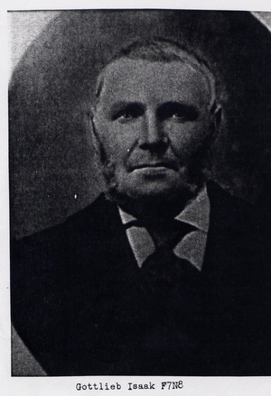
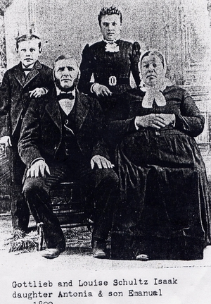

# Gottlieb Isaak, Autobiography

*Gottlieb Isaak F7N8*

This autobiography of Grandpa August Isaak Sr's first cousin, Gottlieb Isaak, was written in 1914. Gottlieb Isaak was born October 24, 1834, at Kulm, Bessarabia, Russia, and died on January 20, 1921, at Tripp, South Dakota. He married Louisa Schultz on December 17, 1854, at Kulm, Bessarabia, South Russia. They had a total of 11 children. [Note: Gottlieb Isaak's parents were Karl August Isaak & Anna Elizabeth L. Schimke Isaak.]

His autobiography contains history of an Isaak family in Russia, Early Dakota Territory and some history of Mercer County, where he live for five years. I obtained this history from Otto Wenzel, who was the grand-nephew of Gottlieb Isaak in the 1980's. The autobiography is noted below with comments from Otto and myself. This was first written in long-hand german before being translated and typed into english several years later. This was written over 100 years ago and talks about the 100 years prior to it be written by an old German farmer, Gottlieb Isaak. Gottlieb Isaak was a first cousin once removed from our Grandfather August Isaak Jr. *~Submitted by Fred S. Isaak*

Gottlieb came to Parkston, S.D., area 13 April 1878 on SS.Mossel. Later he went to the Mercer County in N.D. in 1880's and then moved to Eureka, S.D., where he and his family ran a grain elevator for several years. His son Solomon was married to a Maria Miller. Gottlieb wrote an autobiography in the 1920's about his life in Russia & the reasons why he left and life in this country. Arrived out of Bremen, Germany, via Southampton on April 13, 1878, with 9 children. *~Source: Data National archives by Allan Hins 7 June 1977*

*Gottlieb and Louise Schultz Isaak daughter Antonia & son Emanuel 1900*

> TO Isaak Descendants
>
> FROM Erma and Otto Wenzel
>
> SUBJECT (Biography of Gottlieb Isaak)
>
> The attached was written by Gottlieb Isaak when he was 80 years of age.
>
> It was in the Bible he and Grandmother Louisa received at their Golden Wedding celebration and was found by his daughter, Magdalena Sailer. Pastor Otto Bruntsch received it from Mrs. Sailer while visiting her in August of 1933. He took it with himself to New Leipsig, N.D. in order to recopy it on a typewriter and in that way make it available for the remaining children, who at that time were: Solomon, Magdalena, Sailer, Antonia Bruntsch, and Emanuel.
>
> A Xerox copy of Pastor Bruntsch's original was mailed to me by cooperatives and appreciated effort of William. R Brown, South Plainfield, New Jersey. Mr. Brown, the son of Elma Sailer Brown, obtained it on the West coast while visiting relatives there during the summer of 1976.

## Eureka, S.D. March 17, 1914

Gottlieb Isaak, born October 24, 1834, and Louisa Schulz, born March 12, 1837.

I desire to dedicate something to our wedlock; we were married December 17, 1854, in Kulm, South Russia (Bessarabia). We lived in Kulm for five years, troubled and burdened, primarily because of the shortage of land. Therefore, in harmony of minds, we left Kulm and went to Sophiental as tenants on rented land. At the time, the rental cost was not high, but the land had light and sandy soil. For this reason there always were crop failures, to the extent that most of the time, cattle and horses had to be sold to pay for the rent. In 1873 there was a complete crop failure. This was not only for us, but for the entire area. There was nothing to live on; no feed, no seed, and everything had to be sold.

In addition to these troubles, the misfortune of being elected the village Mayor, also came upon me. There resulted many circumstances which caused me to become involved the administrators. (Presumably representing the Russian government regarding land and village management policies.) They were completely without any feeling. Our contract specified that, in case of a crop failure, the rent money to be paid would be delayed for payment during the following years. I was constantly being asked to submit intelligence reports, (perhaps regarding the financial conditions of the village) but held to the contract. I then, received a letter from them stating that the contract had been sold to the Crown's broker; that the rent money must be submitted. If not, by that fall the colony would have to be cleared away and removed; we had 30 days in which to decide. I also received orders from the Akkerman Justice court that on that day (at the end of 30 days) the mayor would have to appear before the court. This I did, but, it had all been arranged previously for the judges to vote as one; "submit the money or leave." I requested that the contract be read, which was done. When the paragraph with reference to crop failures appeared I stopped the reading and asked, "Is this as expressed in the contract?" The answer was, "It has been decided, and there is no other way." Then I asked, "For what purpose is the contract?" The answer was, "So you will know how to behave yourselves, and that settles the matters." What I thought I did not dare to say, because then it would have been commanded, "Wotnigimo kidei jim Ostrok" (presumable Russian), which means, "Bring him into prison." It was necessary to borrow the money from the entire community and pay them.

Oh, how this gave me the urge to emigrate. Up to now I had been working for the Dimitov* (apparently a Russian word or name, perhaps an employer, or a government agency.) Since the sons were too far away to be of help, and the Czar was taking one young man after another into war, the drive to get away was strong enough to emigrate. In the year of 1878 this slavery ended. Oh, with what pleasure I could say good bye to all of these privations.

Luckily we arrived in Dakota. We were looking for land which had not been taken up by other farmers, near Parkston. There we built our home. This made it favorable for me, and the wife and children to start working. We had no money; however, I and each one of the children were ready to hire out to someone for wages. The wages received amounted to more than three times the amount I had to pay in Russia for expenses. Everything the children earned came into lay hands, and was used to take care of our needs.

The debts I had made in Russia, during the bad year of 1873, amounted to 330 rubles (a Russian monetary unit.)

The favorable exchange rate in American dollars, allowed me to pay this debt, - including interest, build, break up 25 acres of land, purchase a pair of oxen, one cow, and some swine. During the summer we had a "Baschtam" (a piece of broken land in which cucumbers, pumpkins, and especially water melons were planted,) the likes of which we never again had. After four years, with everyone helping, all debts were paid. With the labor of our hands we obtained a home and a barn and could say, "How this is ours." Oh, how lucky each one of us could consider ourselves, in that we were rescued out of servitude.

My brother, Johann (John), had picked us up from Yankton (S. D.) We received shelter from him until we arrived at this spacious and flat land. All was free (unfenced) prairie. There were several families here. It was only with great trouble that we found a half section of land. The colonization was so fast. Parkston came into its own in just seven years.

At that time there were only three land jurisdictions. The sons desired to homestead some land, but there was no more available in the area. It was necessary for them to move north. With this, I said, "Children, if you are going to leave, I too, do not wish to remain here." Immediately a buyer was found and I sold the farm. We, however, had to go to our new destination in a round about way. First, south to Yankton, from there to St. Paul (Minnesota), then on the Northern Pacific Railroad to Hebron, N. D. Then my wife and I first perceived the hills; we were of one mind: "In this place we do not want to die."

Never the less, we had plenty of family provisions, feed, seed, and a herd of swine with us. We especially planted a huge amount of potatoes, and broke up 50 acres of land which was also planted and seeded. We also erected a sod house, spacious enough to hold the family. From there we constantly drove out, in search of better land. It was real dry, no rain. The time arrived for haying, no grass, and what was planted and seeded, did not come up. The potatoes remained in the ground and not a penny was derived as an income. We were fearful that every thing, man and beast, would have to die from hunger during the next winter.

Then Solomon (his son), and Johann (John) Klein (his son in law), went to a place 60 miles from Hebron and arrived at Mercer County. On the Knife and Missouri rivers, there was an area of land inhabited by several Irish and English folks who busied themselves only with hunting. There also were a few German families from Hannover, N. D. On the higher ground and on the plains there was nothing, (no settlers.) This was exactly what we wanted. Klein and I purchased company land (perhaps railroad), while the children and other settlers, homesteaded government land. Here again, were the "wide open spaces." But we had a severe ordeal, in trying to make it through the winter, because of the shortage of feed.

That fall our family had so many visitors that during every meal two servings had to be made. The lodging during the nights, had to be arranged by bedding them down on hay "which had been spread over the floor." It was a very hard winter, with more snow than we had normally experienced. We were, however, able to console ourselves with the feeling that we had good land, which made us all feel more content.

Yet, soon also, a disturbing situation came along. I became a county commissioner. There were four that were English and I was German. Oh, what a time I had. The county was badly in debt; in spite of the fact that only a few people lived there. Almost everyone had their mind set to get a gain out of the county. When the commissioners were in session, the bills came in thick and heavy, and were accepted. It was always "yes," but most of the time I said "no," until finally a change in the amount of bills coming in was affected. Eventually more Germans became county commissioners and the county was released from the burden of heavy debts, but not during my time. I was only there for six years.

David (his son), and Mewing brought me the proposition to become a partner with them in a business. (This was in Eureka, S. D.) I had misgivings, wondering if the wife and I had the proper determination for this. I then laid the deal before Solomon and Klein. They soon changed our mind when they said, "Do you think we want to remain here?" "At the first opportunity that comes along, we are going to leave." As a result of this information, I took this business proposition. (A hardware store).

After six years of residence in Mercer County, we left, and came to Eureka, South Dakota, in the year of 1892. During that same fall the Adam Sailer family (son in law) came, and in 1893, Solomon, Klein, and Netzer (son in law), also came. During the first year our business suffered quite a few losses. That caused this misfortune for us, was the fact that most of the settlers were very needy. Each time they purchased something, it would be said, "Of course, you will have to write this up on a charge." After three or four years, we usually received the information that this or that customer had moved away from the area. Because of this, many of the notes we had received came up with no value. This caused the business to be to such an emergency situation that it became necessary to dissolve the partnership. There was not enough work and income for all of us.

At this juncture, Sailer moved to Mannhaven, North Dakota, (in Mercer county.) He had a good business there. Solomon went into "business with Raab" (at Eureka Implements and Feed) so, with this it came to the point that I, as well as the other two (Soloman and Sailer) gave up the business to David alone. Neither of the two, nor I could demand the return of our investment. The two did however receive a few notes receivable and a small portion of their partnership share, but I had the loss of even that, and left the business empty handed.

This left me with nothing of my own, except the house. I then purchased, for the both of us, a smaller lot and house on which I paid interest. We however had, thank God, a more tranquil life than we had while in business. Too, from the larger house we had a steady rent income, which took better care of our needs then did the business. We also received some help from the Bruntsch's and Sailer 's (son in laws.)

So with this we, mother and I, could carry on a peaceful life. During this time of our life, our 50th wedding anniversary arrived, and our loving God graciously blessed this event with a Golden Wedding Celebration on December 17, 1904. (The first ever in Eureka, South Dakota, and the entire town took part in it. It had been arranged by the Evangelical Lutheran Zion Church. There the couple was presented with a new Bible. The pastor was H. Reinhardt.)

In consequence of having had pain for years, and finally becoming almost intolerable, mother was confined to her bed until in 1905, our loving God released her from her suffering on the first of May. Thereafter I sold my small house, paid the debts, and then the beloved (perhaps said as an antonym) journeys began. Every one of the children wanted me to live with them. This arrangement existed for eight years until when at Emanuel's (youngest son who lived at Oshkosh, Wisconsin) I was struck: with rheumatism, so severely that living became a bitter task. I should never have left Einanuel, but I lacked the patience to remain. I arrived at Eureka on the 28th of October, with the hope that my illness would soon leave me in a drier climate. However the loving God arranged it so that I was forced to ask Him to be my doctor. This happened at 12 midnight on November 13, 1913. I left my bed, and in the rocking chair I began to talk as follows;

> "I have been living in the belief that your word is the truth, and this I firmly believe. You have said, 'all that you shall ask for, in my name, I will grant you'-- this promise is true. "This you can prove to me by removing my pain."

I then went to bed, fell asleep and awoke again, the pains were gone.

************

There the biography ended abruptly. The copy was made exactly 20 years after it was written, May it, and the amazing prayer, be a blessing to all who may read it. Father Isaak has often told me that from that night on, the trusting God and Savior removed the rheumatic pains which he never thereafter experienced. He died on January 20, 1921, at the age of 86 years, 2 months and 27 days.

The above footnote was written, in German, by Pastor Otto (Franz Otto) Bruntsch, Son in law of Grandfather, Gottlieb Isaak. The pastor made a typewritten copy of the biography, which had been written in German script. I translated it from the typewritten copy. Some of the contents in parenthesis were originally entered by pastor Bruntsch, however I shortened some of them and added others. I also paraphrased some of the translation in order to more clearly indicate some the of the meaning, which I felt Grandfather Isaak intended. I believe this will, therefore, be of more value to whatever descendants may read it.- - - Otto Wenzel

30 August 2003 I scanned *(Fred S. Isaak of Dubuque, Iowa)* this autobiography of Gottlieb Isaak on the computer. I hope that all the relatives can read and enjoy this piece of family history written almost 100 years ago and connect us back to our roots in the old country and the 19th century. I was born and raised in Mercer County, North Dakota, and my family still owns the land around the ghost town of Mannhaven, North Dakota, written about in this autobiography.
