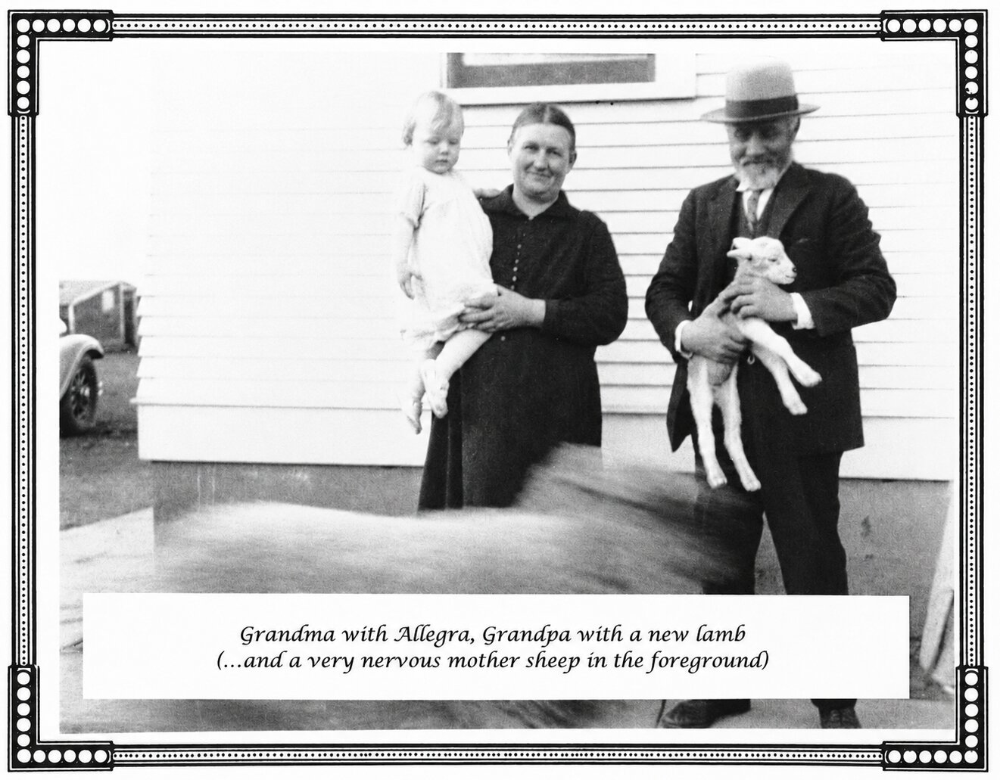

> **Note.** Childhood memoir by Allegra (Isaak) McBirney (© 2002). *"Grandma and Grandpa"* are the parents of her mother, **Eva Roesch** — the author's maternal grandparents (1898 Germans-from-Russia emigrants). This is the **Roesch maternal branch**, not the Isaak line.

# Grandma's and Grandpa's Sunday Events

*...as seen through the eyes (and recalled from the memory) of a very young cousin...*

**Allegra (Isaak) McBirney** 
1930 (age 3) to 1934 (age 7)

Copyrighted 2002 
By Allegra McBirney 
P. O. Box 654—San Carlos, CA 94070

---

From the time I was born, until 7 years later when my family left South Dakota, I was a regular at the SUNDAY EVENTS at Grandma and Grandpa's house on the farm they had homesteaded some years earlier.

True, these were not "events" in the sense of landmark celebrations, gigantic receptions, or fireworks, but to a very small girl who got to play for an entire Sunday afternoon with her many girl cousins, it was an occasion highly deserving of being termed an "event." (There were boy cousins there, too, you understand, but they had their own agenda, which I never bothered to investigate. I think mostly they spent their time searching the prairie for arrowheads, left behind by Indians who had lived on Grandma and Grandpa's property not long before.)

These Sunday Events usually began with church, after which everyone gathered at Grandma and Grandpa's house. (Some made it there with Uncle Ed in his car, a vehicle memorable because of its incurable muffler problem. The result was noise so deafening that conversation was impossible, but everyone tried, nonetheless—and arrived hoarse and a bit deaf, but thankful to both Uncle Ed and Henry Ford as they recalled the buggy alternative of former years.)

Upon arrival we were greeted by Grandma and the huge dinner she had prepared. The big oilcloth-covered table was all set for the invasion.

That dinner consisted of absolutely everything that Grandma had to offer, including lots of homemade bread, mountains of mashed potatoes, and her specialty: fried chicken. These were birds that she herself had lovingly raised, dutifully decapitated, patiently plucked, bravely eviscerated, and expertly cooked...all as a love-gift for her family.

Grandma was a strong woman. (Even the way she dispatched those chickens indicated that.) Her life had demanded it—strength of all varieties. She had been through the hardship of emigrating from Russia, settling on raw prairie land in an area of harsh winters and scorching summers. And she had given birth to 14 babies, too—without anesthetic, without pain-killers...nothing but a wooden spoon from the kitchen clenched between her teeth for biting down on hard when contractions got unbearable. (Her teeth-marks were still on that spoon. I know. I saw the spoon in the mashed potatoes.) But now in addition to all these trials, she also faced the hardships of the Great Depression, and the devastating drought that hit the Dakotas at the same time....

Two of those babies were buried at a quiet edge of their piece of America, and three were buried in Russia—one of them the very day before she and Grandpa left by ship for this country in 1898. Grandma <u>had</u> to be a strong woman for that. Surely her tears came often as she thought of those little ones left behind, as well as the two tiny Americans out there on the prairie....

Grandma and Grandpa were among the many Germans from Russia who made the hurried and difficult decision to abandon their homes and friends there, and take on the anxieties, and the challenge, of moving to America. Their underlying motive to make that move was that in Russia they were already feeling the oppression of anti-Christian forces which soon erupted in the Bolshevik Revolution...and ultimately led to atheistic communism.

Grandpa explained that they had left Russia for spiritual freedom—adding, quite prophetically, that there would come a time when there would again be more spiritual freedom in Russia than in America. And now—over 100 years later—that time has come. Communism <u>has</u> suddenly and strangely receded (if only briefly) and my husband and I have taken advantage of the resulting open doors to share the Gospel in many parts of that country--including in the very area from which Grandma and Grandpa came! (Won't Grandpa be surprised when I tell him about that in Heaven!...but maybe he'll already know....)

Somehow there was always a special affinity between Grandpa and me—and although I was <u>very</u> young during the few years we had together, I'm convinced that it was a <u>spiritual</u> affinity. He would never miss taking me out to see the sheep when I visited him, or he'd bring a lamb to the house for me to hug. And, strangely, our mutual love for sheep and lambs seemed somehow suggestive of the close relationship which he had with the Good Shepherd, and which I would have in my life, as well.

...but all too suddenly, Grandpa was no longer with us for our Sunday Events.... He had moved to Heaven. (I was 3 ½, and remember dreaming that I saw him climb a kind of celestial ladder to get there!) Really Grandpa didn't need a ladder. Jesus Himself always provides the means of getting there....

I can remember Grandpa's casket on the sun porch. My mother lifted me up so I could see him. It was Grandpa there, all right. And yet it really wasn't. I only knew that this was the first time I'd come to visit Grandpa that he didn't take me out to see the sheep....

Grandpa was <u>very</u> much missed, and additionally so at our Sunday Events--and conspicuously so at the dinner table. Everyone kind of squeezed together to make his place seem not so empty...but it didn't help.

It might be noted, concerning the seating at these Sunday gatherings, that the aunts and uncles got to sit at the big table with Grandma, as did a few of the bigger cousins. (It was kind of a rite of passage for them to be accepted there.) The rest of the cousins sat in assorted places of lesser honor in the living room.

And always the littlest cousins ate at the piano bench--until they grew big enough to advance to the next seating bracket. For some reason, I seemed ever to be relegated to the piano bench, and never got promoted. I must have been either the shortest or the skinniest cousin. I don't know. Grandma, by the way, worried about the skinny part. She firmly admonished my mother to take better care of me, and make certain that I eat more.

To Grandma "heavy" was "healthy." She wore a size 52.

Incidentally, that piano bench was a part of Grandma's most valuable possession as far as the cousins were concerned: namely, a player piano. We took turns pumping away with great determination and delight! (One cousin operated each pedal because some of the cousins were small and had neither the size nor strength to manage two pedals. Also, with each cousin operating a single pedal, everyone could have a turn.) We learned every tune and melodic run of all the World War I songs, and all the hits of the '20's which that remarkable instrument could produce! (In fact, that player piano threatened to take away from <u>all</u> of us the desire to ever learn to play a <u>regular</u> piano because we knew we could never get that good at it...)

After dinner the various categories of the family went their assorted ways in little groups—all except Grandma and the auntie-category. They continued sitting at the table, discussing important matters that grandmas and aunties are particularly qualified to handle.

The uncles all went out to the pasture to geld horses. They always talked German, so I had no idea what they meant or what they were doing; and even in English it made no sense whatever. At any rate, it didn't sound like much of a way to spend a Sunday afternoon.

My girl cousins and I had lots of ideas for far more fun ways to spend those precious hours together! One thing we <u>really</u> liked to do was to play with dolls. Grandma had a few orphaned ones upstairs which were very much in need of love and clothing; and she had some scraps of cloth from which we would have made clothes for them, too; but there was a problem: we were not allowed to sew that day, because sewing was a sin on Sunday. And so, instead, we carefully wrapped the scraps of cloth around each needy doll, and tied these "dresses" in place with pieces of string. (Tying was not a sin on Sunday.) And we thought that maybe, instead of sewing for the dolls, we could cut pictures of ladies out of the Sears and Roebuck catalog, and turn them into paper dolls—but then we remembered that using a scissors was a sin on Sunday, too.

And so we had an earnest discussion as to what we might do instead. There was never any consideration of challenging the regulations. We accepted them, and honored them because they were parental directives, and thereby in our sight God-ordained. I for one was terrified by the thought of deliberately disobeying <u>GOD</u>.

But when doll-play was ruled out because it was Sunday, we simply turned to playing one of our very favorite games instead: killing flies!...(an activity that carried no Sunday restrictions.) You may not realize it, but killing flies can be a highly competitive sport...a real test of stealth and skill. The most promising playing field was the entry hall just off the kitchen. The fragrance of Grandma's cooking had drawn prey from all corners of the prairie. (And Grandma—quite logically and joyfully—encouraged the activity, and little wonder: I remember my triumphant win when I killed 9 flies—or was it 11?—with a single swat.)

The fly-killing competition, however, got a little noisy for all the aunties, who were still sitting around the dining table involved in a bit of gemutlichkeit in a mixture of German and English. Needless to say, they encouraged us to play outdoors, instead.

By the way, I remember the telephone on the wall there in the dining room right beside where Grandma was sitting. When it rang two rings--which was Grandma's designated signal, her designated "frequency"—she would rush to answer, with urgency grab the receiver, and almost immediately begin her response at top voice. Shouting was part of the system in those days, because apparently telephones at that time did not operate on an electrical principle, but rather on a megaphone principle. Being heard was totally dependent on the power of the human voice...but the wonder of this communication was worth all effort.

(Frequently the call was simply from someone across the road, but the reception was so poor that within minutes the caller was at the door to deliver the message in person....)

Well, the girl cousins did move outdoors to play, when the fly-killing competition got a little noisy for Grandma and the aunties. And how excited we were to carry out our decision to play house! The equipment for this was nature-made. The only thing required was stones—the one raw material of which the South Dakota prairie had plenty.

Each of us would gather a supply of stones, and then lay them out on the ground to form the perimeter of our own little house—with an opening that was acknowledged as the door (and woe to anyone who would try to enter our house by stepping over its "wall" rather than coming in that "door.") Within the outline of the house itself we would lay additional rows of stones to designate rooms. And when we had finished laying out our very special places of residence, oh, what fun we'd have "straightening them up," and taking care of our imaginary families within them; and then going out those little designated "doors" to visit the cousins who lived nearby! (TOYS 'R' US has yet to come up with a toy which could match the longevity of interest—to say nothing of the cost—of our little stone-perimeter houses there on the prairie!)

And for a break in this domestic play, we would sometimes go out to the pasture and "pick wool" left by the sheep on the barbed-wire fences. Triumphantly we'd bring our bundles of fluff back to our stone-perimeter "houses," determined to make little mattresses from them for our dolls. (We would do that on Monday when it wasn't a sin to sew.)

I remember, too, how thirsty we'd all be when we came in from outdoor play. There'd be a line-up beside the single ladle, shared by all. Very likely sharing the germs from that one ladle gave all of us unexpected immunity to every disease in South Dakota, including the ones that killed the cattle.

I must mention that Grandma's and Grandpa's house had a most unusual feature for that time, and that was a big beautiful bathroom—a real up-grade for its day, and surely the only one around. But in reality, that big, beautiful bathroom proved to be more of a showcase than a convenience during those years, because the plumbing was notoriously non-cooperative. That bathroom, for all of its promise, did little to shorten the lines of relatives waiting by a certain small outbuilding visible from the window of that classy upgrade. The outbuilding was no showcase—but nothing ever went wrong with its plumbing, either.

Life was pretty basic out there on the farm. You adapted to situations as was necessary. Take Grandma's big wood-burning cookstove, for example. Not only did that big iron stove cook the food, but it also heated much of the house in the process, whether that was a plus in the winter or a negative in the summer; but on that treeless prairie, the term "wood-burning" was essentially a misnomer, because seldom was there wood to burn. The only "alternative fuel" was cow manure. And it was the children's duty to collect that fuel as needed.

Another thing, always when we went to Grandma and Grandpa's house there seemed to be new dogs to meet. They represented an amazing assortment of breeds and places of origin. Few of them had names. Farm dogs don't last long, so I guess it hardly paid to name them. All of them patiently battled fleas, and all longed for loving attention and anything else they could get. The greatest threat to their longevity was the gravel highway that went past Grandma's house. In our eyes that road was the equivalent of an Interstate, the Turnpike of the Prairie! In the dogs' eyes it was Death Row.

That gravel road linked Grandma's house to everybody else's. In winter it was often blocked with snow. In summer it kicked up heavy clouds of dust that engulfed each passing car, and continued to shroud the car until it was out of sight.

During the drought years dust-storms were like blizzards. They were like a plague of Egypt striking the South Dakota prairie. I remember one night, when we were driving home from Grandma's house, a dust-storm blew the car off the road and into a ditch. The wind with a fury brought an onslaught of dust that proceeded to bury the car. We were covered with dust even inside the car, and it became a problem to breathe. My uncle finally managed to crawl out of a window, and make it to a farmhouse. And eventually he returned with a compassionate farmer and a very obedient team of horses that managed to pull the car out of that ditch.

The drought during those years was unbelievable. (Our only drinking water was a meager supply at the bottom of our cistern. It was smelly and yucky...but it was all that we had.) The fields were literally like a desert. The government had tried not long before to plant trees to hold the soil, but too little, too late. Those pathetic trees were dry sticks in no time—bending to the ground in the windstorms. And the barren prairies were strewn with the carcasses of cattle. Farmhouses and barns were empty. People had left behind homes and land in which they'd invested their lives.

But God in His mercy brought Grandma and her family, and the farm, through it all. It was definitely His doing. She and Grandpa had come to America to honor HIM. They had come for spiritual safety, and spiritual freedom, and in response the Lord gave not only that safety and freedom, but His protection through even that severe drought and the Great Depression. And with it all, He opened the door to new beginnings for all the family.

I left South Dakota when I was 7, but oh, how many (and how clear) are my memories of those early years! And how greatly the Lord enriched my life through family and experiences that were such an important part of that brief time. And how the Lord enriched my life through all the interaction--and all the memories--of GRANDMA AND GRANDPA'S SUNDAY EVENTS.....

Allegra McBirney 
P. O. Box 654 
San Carlos, CA 94070

---

*Grandma with Allegra, Grandpa with a new lamb (...and a very nervous mother sheep in the foreground)*
