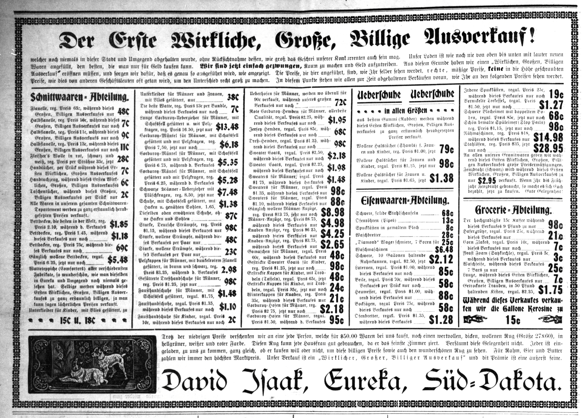

<!-- source_page: 1 -->

# Die Eureka Post

### Eureka, McPherson Co., Süd-Dakota — 20. Jahrgang, Nummer 33 — den 28. Oktober 1909


## Unter Kugeln von Mörderhand.

### Ableben des großen japanischen Staatsmannes Ito.

### Rache von Koreanern für seine Tyrannie.

### Wichtige politische Mission des Verstorbenen in der Mandschurei.

**Tokio, 26. Okt.** Marquis Ito, der berühmte japanische Staatsmann, von dessen versöhnlichem Auftreten anläßlich seiner Informationsreise in der Mandschurei noch vor kurzem berichtet wurde, ist von einem Koreaner in Charbin (Mandschurei) ermordet worden.

Er war im Jahre 1838 geboren, wurde 1868 Gouverneur von Hiogo, 1869 Vize-Finanzminister und ist später vier Male Ministerpräsident gewesen. Er ist nach allgemeiner Ansicht der größte japanische Staatsmann gewesen und hat seiner Zeit an der Ausarbeitung der japanischen Verfassung, die sein Land in die Reihe der zivilisierten Staaten eintreten ließ, überaus regen Anteil genommen.

### Mord auf dem Bahnhofe.

**Charbin, 26. Okt.** Die sofort eingeleitete Untersuchung hat ergeben, daß die Ermordung Marquis Itos das Resultat eines geschickt angelegten Komplotts von Koreanern war, die sich und ihr Land an all das Ungemach rächen wollten, das unmittelbar und mittelbar durch Itos Politik über sie hereingebrochen ist. Schon am Montag abend hatte die hiesige Polizei drei verdächtige Koreaner, die sich bewaffnet in der Nähe des Bahnhofes herumtrieben, verhaftet. Eine ausgiebige Bewachung der Station war aber nicht möglich, da der japanische Generalkonsul Kawakami verlangt hatte, daß die Eisenbahn allen Japanern den Zutritt zum Bahnhof gestatten sollte. Es sei aber ganz unmöglich, Japaner und Koreaner immer nach ihrem Aussehen zu unterscheiden. So ist der Mörder nach der Erklärung der Polizei auf den Bahnhof gelangt.

Unmittelbar nach der Ankunft des Zuges wurden sofort mehrere Schüsse auf den japanischen Staatsmann abgegeben, von denen einige ihn, andere auch den Generalkonsul Kawakami, den Generaldirektor Tannaka von der südmanschurischen Eisenbahn und den Privatsekretär des Marquis trafen. Generalkonsul Kawakami ist schwer, aber wie man hofft, nicht tödlich verletzt worden. Marquis Ito sank sofort tot zu Boden.

Wären die Schüsse nur einige Augenblicke später gefallen, so wären die ausländischen Konsuln, welche sich gerade dem Staatsmanne zur Begrüßung näherten, in die größte Gefahr geraten. Wie durch ein Wunder entgingen der russische Finanzminister Kokowzoff und die hohen russischen Offiziere, die sich in der Begleitung des Japaners befanden, den herumschwirrenden Kugeln.

Die Leiche des ermordeten Staatsmannes befindet sich bereits auf dem Heimwege.

### Trauer in Japan.

**Tokio, 26. Okt.** Nach dem Eintreffen der Trauerbotschaft aus Charbin wurden die Minister ins Auswärtige Amt berufen. Die Nachricht verbreitete sich blitzschnell durch die Stadt und verursachte überall die tiefste Depression. Die Gattin des Ermordeten erreichte die Hiobspost auf ihrem Landsitze zu Oiso. Der älteste Sohn des Toten, Hirokuni Ito, befindet sich augenblicklich in London, ein jüngerer Sohn, Bunkichi Ito, ist mit einer Tochter des Ministerpräsidenten Katsura verlobt.

### Die politische Mission.

**Washington, 26. Okt.** Die hiesige Regierung nimmt den größten Anteil an Japans Trauer um seinen größten Staatsmann. Die Beamten des Staatsdepartements drückten dem japanischen Gesandten ihr Beileid aus.

Die Sendung Itos nach der Mandschurei war trotz aller offiziellen Ableugnungen politischer Natur. Er war vom Mikado mit einer wichtigen Mission beauftragt worden. Der Hauptzweck der letzteren war wohl, den drohenden Protesten Amerikas und anderer ausländischer Mächte durch eine noch vollkommenere Verständigung mit China die Spitze abzubrechen. Ito spielte eine hervorragende Rolle bei dem Abschluß des kürzlichen Abkommens zwischen Japan und China bezüglich der Eisenbahnbauten in der Mandschurei. Dieser Vertrag war am 31. August abgeschlossen worden und wurde von vielen Seiten als ein Bruch des Friedensvertrages zwischen Japan und Rußland angesehen. China wurde in dem Abkommen von Japan zu der Verpflichtung gezwungen, nördlich von Hsiuminten keine Eisenbahn ohne Japans Zustimmung zu bauen, und mußte sich auch noch zu anderen Zugeständnissen an Japan in der Mandschurei bequemen. Die japanische Haltung stand in grellem Gegensatze zu der loyalen Gebiete seitens Rußlands in dem Vertrage von Charbin.


## Niederlage der Konservativen.

### Eine Folge der Unzufriedenheit mit der Finanzreform.

## Ausfall der Wahlen zum badischen Landtag.

### Beträchtliches Truppenaufgebot gegen streikende Bergleute.

**Berlin, 26. Okt.** Das Ergebnis der Landtagswahlen in Sachsen, welches jetzt vollständig vorliegt, bedeutet eine sehr schwere Niederlage für die Konservativen. Der eingetretene gewaltige Umschwung ist hauptsächlich die Folge der weitverbreiteten Unzufriedenheit mit der in der letzten Reichstagssession angenommenen Finanzreform.

Endgültig gewählt sind im ersten Wahlgang 14 Konservative, 4 Nationalliberale und 16 Sozialdemokraten. Es haben nicht weniger als 57 Stichwahlen stattzufinden. An diesen sind beteiligt: 55 Sozialdemokraten, 29 Nationalliberale, 17 Konservative, 7 Freisinnige, 2 Antisemiten und 1 Vertreter der Mittelstandspartei. (Die zweite Kammer der sächsischen Ständeversammlung, für welche die Neuwahlen nach einem neuen Wahlgesetz stattgefunden haben, war bisher wie folgt zusammengesetzt: 46 Konservative, 31 Nationalliberale, 3 Deutschfreisinnige, 1 Reformparteiler und 1 Sozialdemokrat.)

### Die badischen Wahlen.

Die badischen Landtagswahlen, welche, wie gemeldet, gleichfalls stattfanden, haben keine Mehrheit des Centrums ergeben. Diese ist dadurch verhindert worden, daß das bisher zwischen Nationalliberalen und Sozialdemokraten bestandene Wahlbündnis erhalten geblieben ist. Endgültig gewählt sind im ersten Wahlgang 23 Centrumsleute, 10 Sozialdemokraten, 4 Nationalliberale und 1 Demokrat. Es sind 35 Stichwahlen notwendig.

### Streik der Bergleute.

Im Mansfelder Bergrevier, welches im preußischen Regierungsbezirk Merseburg gelegen ist, sind schwere Streikunruhen ausgebrochen, welche sogar ein beträchtliches Truppen-Aufgebot notwendig gemacht haben. Die Kupfergräber und Hüttenleute, insgesamt sechstausend an der Zahl, befinden sich im Ausstand und haben wiederholt die Streikbrecher angegriffen, welche von der Grubenleitung beschafft worden sind.

Inzwischen haben ein Bataillon des 36. Füsilier-Regiments General-Feldmarschall Graf Blumenthal und ein Bataillon des 3. Magdeburgischen Infanterie-Regiments No. 66, welche auf telegraphischem Wege herbeigerufen wurden, die Kupferhammerhütte und die Schachtausgänge besetzt. Dem Kommando stehen Maschinengewehre zur Verfügung, damit jeder Eventualität begegnet werden kann.

### Ballonflug des Generalkonsuls.

**Wronke, Preußen, 26. Okt.** Der amerikanische Generalkonsul in Dresden, John Gaffney, ist nach einer erfolgreichen Ballonfahrt von Dresden aus hier gelandet. Der Ballon wurde von Hauptmann von Funke geführt. Es war die Probefahrt des neuen Ballons „Herden" des sächsischen Luftschiffahrtsvereins.

**Lynchburg, Va., 26. Okt.** Bei einem Feuer, welches das Mädchen-College des hiesigen Presbyterianer-Waisenhauses in Asche legte, haben fünf Kinder das Leben eingebüßt.


## Nette Zustände im Zolldienst.

### Gravierendes Zeugnis des Angeklagten gegen die Beamten.

### Lockendes Beispiel der anderen Exporteure.

### Eigenmächtiges Handeln ohne Wissen des Vaters.

**New York, 26. Okt.** Philipp Musica, der jüngere der beiden Angeklagten in dem Zolldefraudationsprozesse, wurde am Montag als Zeuge in eigener Sache vernommen. Er bestritt, den Zollwägemeister Brehm, der stark belastende Aussagen gegen ihn gemacht hatte, jemals vorher gesehen zu haben.

Er erzählte, daß er allerhand Umstände und Scherereien mit dem Wiegen der Käsesendungen gehabt habe. Er hätte dann einen der amtlichen Verwieger, Hyland, getroffen und dieser habe ihm einen Wink gegeben, was er zu tun hätte, um die prompte Erledigung des Wiegegeschäfts zu veranlassen.

Hyland hätte ihm verschiedene ihm bekannte ausländische Exporteure und hiesige Importeure genannt, die alle „Geld machten", und ihm geraten, denselben Weg einzuschlagen. Er hätte Bedenken gehabt, weil er damit in Ungelegenheiten zu kommen fürchtete. Aber Hyland habe ihm seine Einwände ausgeredet, da die Zollbeamten ihn decken würden.

Es sei ihm dann später der Vorschlag gemacht worden, daß alles, was am Zoll gespart werden könne, in drei Teile geteilt werden sollte, von denen einer an den Exporteur, einer an ihn, Musica, und der dritte an die Zollbeamten gehen sollte. Da ihm bewiesen wurde, daß so und so viele andere diese Praxis befolgten, habe er schließlich in dieses Arrangement eingewilligt, ohne seinem Vater etwas davon mitzuteilen.


## Die Tat einer Geisteskranken.

### Auftauchen der vermutlichen Gattenmörderin.

**Warren, Pa., 26. Okt.** Frau J. D. Anderson, die am vergangenen Samstag ihrem Sohne geschrieben hatte, sie habe ihren Gatten getötet und stehe im Begriffe, Selbstmord zu begehen, wurde hier in Gewahrsam genommen, als sie einem aus dem Osten kommenden Zuge entstieg. Sie wies alle Merkmale einer geistigen Störung auf.

Nachdem ihr Sohn Elmer Anderson den Brief seiner Mutter erhalten hatte, begab er sich in das fünf Meilen von hier entfernte Elternhaus, wo er seinen Vater mit zwei Stich- und drei Kugelwunden im Rücken tot auffand, während seine Mutter nicht da war. Man hatte angenommen, daß sie nach ihrer alten Heimat in Schweden zurückreisen würde.


## Große Befriedigung des deutschen Admirals.

### Guter Eindruck der deutschen Matrosen in New York.

**Berlin, 26. Okt.** Großadmiral v. Koester, welcher in Kiel, seinem ständigen Wohnort, wohlbehalten wieder angelangt ist, hat unverweilt seiner besonderen Freude über die Hochachtung und Freundlichkeit, die ihm als Vertreter des Kaisers und des Deutschen Reiches gelegentlich der Hudson-Fulton-Feier in New York erwiesen worden, Ausdruck verliehen. Eine weitere große Freude bereitete es dem Großadmiral, wie er erklärte, die Deutschamerikaner in der neuen Heimat kennen zu lernen, welche an der alten Heimat noch mit großer Liebe hingen.

Der Besuch der deutschen Schiffe zur New Yorker Doppelfeier, fügte der Großadmiral hinzu, sei von großer Bedeutung gewesen. Er trage dazu bei, das Band zwischen Deutschland und den Vereinigten Staaten enger zu knüpfen. Der Eindruck, den die deutschen Schiffe und die deutschen Matrosen in der Metropole am Hudson gemacht haben, sei ein vorzüglicher gewesen. Den bündigsten Beweis hierfür habe der jubelnde Beifall gebildet, mit welchem die deutschen Matrosen beim Vorbeimarsch in der Parade von den riesigen Zuschauermengen begrüßt worden seien.


## Wasserstraßen in Aussicht.

### Rede des Präsidenten Taft im Kolosseum zu St. Louis.

### Besonderes Interesse der Mississippi-Anwohner.

### Beginn der Stromfahrt des Staatsoberhauptes.

**St. Louis, Mo., 26. Okt.** Präsident Taft hielt trotz seiner starken Heiserkeit im Kolosseum eine zweite bemerkenswerte Rede über die Notwendigkeit des Baues von Binnenwasserstraßen. Es gelang ihm bei der musterhaften Ruhe und gespannten Aufmerksamkeit seiner Zuhörer, sich trotz seiner schwachen Stimme, die nur geringe Besserung seit dem Tage vorher aufwies, bis in den äußersten Winkel des geräumigen Saales verständlich zu machen. Er führte etwa folgendes aus:

„Wir stehen im Begriffe, eine große Strombereisung des Mississippi vorzunehmen, welche in enger Beziehung zu dem Problem des Transportwesens, der Eisenbahnen und der Wasserstraßen steht. Es ist dies aber nur ein integrierender Teil jener großen Bewegung, die Theodor Roosevelt zum Schöpfer hat und von ihm die Konservation unserer natürlichen Hilfsquellen genannt worden ist."

### Interesse der Anwohner.

Die Bewohner des Mississippitales sind ganz besonders an der Herstellung von Binnenwasserwegen und am Forstschutz interessiert, da beide dazu beitragen werden, die Hochwassergefahren, die so viele Farmen in Iowa, Missouri und anderen Staaten bis hinab zur Mississippimündung jahraus jahrein bedrohen, zu vermindern.

Die Vereinigten Staaten sind in früheren Jahren sehr generös mit der Vergebung ihrer Ländereien gewesen. Jetzt ist indessen die Zeit gekommen, wo wir eine andere, neue Politik in dieser Hinsicht einschlagen müssen. Es ist notwendig, die Wasserkräfte des Landes durch die Gesetzgebung davor zu sichern, daß sie eine Beute der Monopole werden.

### Kein System in der Arbeit.

Ohne eine Kritik an dem üben zu wollen, was bisher im Interesse von Binnenwasserstraßen getan worden ist, kann man sich doch nicht der Ansicht verschließen, daß kein System in der Arbeit gewesen ist. Vorsicht ist aber geboten. Jedes Projekt, dessen Durchführung angeregt wird, muß streng auf seine Vorteile für das gesamte Land geprüft werden. Die Projekte dürfen nicht deshalb im Kongreß angenommen werden, um bestimmten Kongreßleuten den Weg zur Rückkehr nach Washington zu ebnen oder um gewissen Landesteilen pekuniäre Vorteile für die Dauer der Wasserarbeiten zu sichern, sondern jedes Projekt muß auf seinen wahrscheinlichen Nutzen für das Land und seine Rentabilität genau untersucht und dann erst entschieden werden, ob das betreffende Land, wo das Projekt ausgeführt werden soll, so weit in der Entwicklung vorgeschritten ist, um die gewaltige Ausgabe für dasselbe zu rechtfertigen.

### Anleihen.

Ist das Resultat dieser Prüfung der Durchführung des Projektes günstig, dann lassen sich meiner Ansicht nach die notwendigen Baukosten am besten durch eine Anleihe aufbringen. Man hat den Vorschlag gemacht, eine Riesenanleihe von einer halben oder auch einer ganzen Milliarde für Wasserbauten aufzunehmen und das Geld nach Maßgabe des Bedürfnisses auf die verschiedenen Staaten zu verteilen. Ich teile diese Ansicht nicht, sondern bin dafür, in jedem Falle einzeln zu entscheiden."

### Vorsichtige Rede.

Während Herr Taft sich diesergestalt in St. Louis aussprach, hielt Sprecher Cannon im neuen Bundesgebäude in East St. Louis eine Rede über so ziemlich das gleiche Thema, in der er im allgemeinen gleichfalls einer Entwicklung der Binnenwasserstraßen das Wort redete, ohne dabei seine Ansichten über die geplanten Anleihen, die schließlich ein wesentlicher Faktor des ganzen Projektes sind, zu äußern.


## Die Mississippifahrt.

**Cap Girardeau, Mo., 26. Okt.** Präsident Taft, der Montag abend um 6 Uhr St. Louis verlassen hatte, landete am Dienstag früh zur Zeit des Sonnenaufganges hierselbst und wurde trotz der frühen Morgenstunde von Tausenden begrüßt. Die meisten hatten sich an der staatlichen Normalschule, die etwa eine Meile vom Landungsplatze entfernt liegt, aufgestellt. Dorthin fuhr der Präsident im Automobil und wurde den Versammelten von Kongreßmann C. C. Crow vorgestellt. Zur Erinnerung an den Besuch des Staatsoberhauptes wurde ein Baum gepflanzt.

## Wiederaufnahme der Sitzungen.

### Wahl des christlich-sozialen Führers zum Präsidenten.

## Nahes Bevorstehen neuer Sturmszenen.

### Interpellation über die Tumulte am Prager Graben.

**Wien, 26. Oktober.** Das Abgeordnetenhaus des Reichsrats trat wieder in Sitzung, nachdem es ein paar Tage Pause gemacht hatte, um der „Slavischen Union" hinreichend Zeit zur Beratung über ihre künftige Stellungnahme zu gewähren. Es wurde die Organisation des Hauses vollzogen.

Dr. Robert v. Pattai, der christlich-soziale Führer, wurde wieder zum Präsidenten gewählt, und zwar mit 266 gegen 152 Stimmen.

Die erkorenen Vizepräsidenten sind Pernerstorfer, Sozialdemokrat; Bogacnik, von der slowenischen Volkspartei; Dr. v. Starzynski, von den konservativen Polen; Dr. Steinwender, von der deutschen Volkspartei, und Zazvorka, von den tschechischen Agrariern.

### Eine Interpellation.

Die deutsch-böhmischen Mitglieder des Abgeordnetenhauses haben an die Regierung eine Interpellation gerichtet, deren Besprechung voraussichtlich von neuem zu den stürmischsten Kundgebungen im Reichsrat führen wird. Die Interpellation knüpft sich an die bereits gemeldete Tatsache, daß die Mißhandlungen deutscher Studenten in Prag durch Tschechen wieder begonnen haben und die Polizei zum Einschreiten genötigt gewesen ist.

Die Fragesteller verlangen von der Regierung Auskunft darüber, wie es die Behörden rechtfertigen können, daß den deutschen Studenten in der böhmischen Hauptstadt bei dem gewohnten Sonntagsbummel am Graben oder auf benachbarten Straßen kein ausreichender Schutz gewährt wird.

Von den Interpellanten wird gefordert, daß die Regierung entschiedene Maßregeln ergreife, um die deutschen Studenten fortan vor Ausschreitungen der Tschechen zu schützen.

Der einschlägigen Debatte, vor allem dem Bescheide vom Regierungstisch, wird allgemein mit größter Spannung entgegengesehen.


## Großer Dampfer auf den Klippen.

**St. John, N. B., 26. Okt.** Ein großer Dampfer ist an den „Old Proprietor"-Klippen bei Seal Cove, Grand Manan, gestrandet. Von der Mannschaft war nichts zu sehen. Ein Rettungsboot wurde nach der Unfallstelle abgesandt. Obwohl man den Namen des Dampfers nicht genau kennt, hält man ihn für den Dampfer „Hostia", von der „Donaldson"-Linie, der am 9. Oktober von Glasgow nach St. John und Baltimore abgegangen ist.


## Deutsch-chinesische Hochschule.

**Tsingtau, China, 26. Okt.** Die deutsch-chinesische Hochschule ist am Montag mit 110 Schülern eröffnet worden. Gleichzeitig wurde der Grund zu einem Anbau gelegt, durch welchen für eine Gesamtzahl von 250 Schülern Platz geschaffen werden soll. Dem feierlichen Akte wohnten Vertreter der Regierung aus Peking bei. Die Schule ist auf deutschem Gebiete von der deutschen Regierung erbaut worden.


## Ein derber Strahl kalten Wassers.

### Vergebliche Hoffnung der Mittelstaaten.

### Aussicht auf die Durchführung des Ohioprojektes.

**Washington, 26. Okt.** Senator T. Burton aus Ohio, der soeben aus Europa, wo er sich als Mitglied der Kommission für Wasserwege mit dem Studium der Binnenwasserstraßen befaßt hat, zurückgekehrt ist, spricht sich zur gleichen Zeit, zu der Herr Taft entschieden für die Aufnahme von Anleihen zur Entwicklung jener Wasserverbindungen eintritt, mit allem Nachdruck gegen eine solche Maßregel aus. Er prophezeit auch, daß der Kongreß in seiner nächsten Session für eine derartige Vorlage nicht zu haben sein werde.

Der Senator gab bekannt, daß die Mitglieder der Kommission für Wasserstraßen sich nicht darauf geeinigt hätte, die Aufnahme einer solchen Anleihe dem Kongresse zu empfehlen. Der Bericht der Kommission wird auch durchaus nicht auf den schleunigen Ausbau eines 14 Fuß tiefen Kanals von den Großen Seen zum Golf drängen, der von den Städten am Mississippi entlang so sehnlichst verlangt wird. Dagegen betrachtete die Kommission das Projekt einer 9 Fuß tiefen Wasserstraße für den Ohiofluß in günstigerem Lichte.


## Zarter Wink mit dem Zaunpfahl.

### Gütlicher Zuspruch an den Bauunternehmer mittelst Dynamit.

### Verschiedene Explosionen zu gleicher Zeit.

### Beschädigung des Bibliothekbaus und der Telegraphenanstalt.

**Indianapolis, Ind., 26. Okt.** In Indianapolis fanden Montag abend im Verlaufe von kaum einer Minute an vier verschiedenen Stellen Dynamitexplosionen statt, die sich alle gegen den Bauunternehmer Albert von Spreckelsen richteten. Es scheint sich um einen Racheakt dafür zu handeln, daß er Nichtunionsarbeiter bei seinen verschiedenen Bauten beschäftigte. Die Unionsarbeiter hatten sich geweigert, mit den anderen zusammen zu arbeiten. Aber Spreckelsen waren keinerlei Drohungen zugegangen.

Die vier Explosionen ereigneten sich gleichzeitig in der Werkstatt und dem Stalle des Unternehmers, in der unter seiner Leitung im Bau begriffenen neuen Filiale der Stadtbibliothek und in der gleichfalls von ihm erbauten Zweiganstalt der „Central Union Telegraph Co.", und alle diese Gebäude wurden in Trümmerhaufen verwandelt. Die Stallexplosion zerstörte auch zwei Automobile und verletzte das darin befindliche Pferd so schwer, daß man es erschießen mußte. Daß der Bau des „Mystic Shrine"-Tempels nicht gleichfalls von den Explosionen betroffen wurde, ist wohl nur seiner ständigen sorgfältigen Bewachung zur Nachtzeit zu verdanken.

Die Polizei ist mit der Untersuchung der Angelegenheit beschäftigt, während Albert von Spreckelsen seine Kinder aufs Land in Sicherheit gebracht hat.

### Mißachtung des Gerichts.

**Springfield, Ill., 26. Okt.** Sheriff Straßheim aus Chicago wurde von dem Obergericht in Illinois wegen Mißachtung des Gerichtes mit $500 bestraft. Er hatte dem Befehle des Gerichtes, den Richter Abner Smith, welcher der Zugrundrichtung der „Bank of America" überführt ist, in die Strafhaft abzuführen, nicht Folge geleistet.

### Unterseeboot auf dem Sande.

**Deleware Breakwater, Del., 26. Okt.** Das Unterseeboot „Viper", welches mit anderen Schiffen Sonntag abend hier einlief, ist auf den Sand geraten. Man hofft es aber mit dem Eintreten der nächsten Flut wieder flott machen zu können.


<!-- source_page: 2 -->



## Der Erste Wirkliche, Große, Billige Ausverkauf!

welcher noch niemals in dieser Stadt und Umgegend abgehalten wurde, ohne Rücksichtnahme dessen, wie groß das Geschrei unserer Konkurrenten auch sein mag. Unser Laden ist wie noch nie von oben bis unten mit lauter neuen Waren angefüllt, den besten, die man nur für Geld kaufen kann. **Wir sind jetzt einfach gezwungen,** Raum zu machen und Geld aufzutreiben. Aus diesem Grunde haben wir einen „Wirklichen, Großen, Billigen Ausverkauf" eröffnen müssen, und sorgen wir dafür, daß es genau so ausgeführt wird, wie angezeigt. Die Preise, die hier angeführt, sind, wie Ihr selber sehen werdet, rechte, mäßige Preise, **keine** in die Höhe geschraubten Preise, wie dies von anderen Geschäftsleuten oft getan wird, um den Unterschied recht groß zu machen. In diesem Punkte stehen wir allen zur Zeit abgehaltenen Verkäufen voran, wie Ihr an den folgenden Preisen sehen werdet.

### Schnittwaaren=Abteilung.

- Flanelle, reg. Preis 65c, während dieses Großen, Billigen Ausverkaufes nur **48c**
- Halbflanelle, reg. Preis 10c, während dieses Großen, Billigen Ausverkauf nur noch **7c**
- Halbflanelle, reg. Preis 11c, während dieses Großen, Billigen Ausverkauf nur noch **9c**
- Halbflanelle, reg. Preis 13c, während dieses Großen, Billigen Ausverkaufes nur noch **11c**
- Fleisher's Wolle in rot, schwarz und weiß, reg. Preis per Strähne 35c, jetzt **28c**
- Handtücher, per Stück während dieses Ersten Wirklichen, Großen Ausverkaufes **7c**
- Handtuchzeug, während dieses Ersten Wirklichen, Großen, Billigen Ausverkaufes **6c**
- Taschentücher, während dieses Großen, Billigen Ausverkaufes per Stück nur **2c**
- Alle Waren in unserem gesamten Schnittwaaren=Departement werden zu ganz erstaunlich herabgesetzten Preisen verkauft.
- Bettdecken, die besten in der Welt, reg. Preis 2.10, während d. Verkaufes **$1.85**
- Bettdecken, reg. Preis 1.45, während dieses Verkaufes nur noch **$1.18**
- Bettdecken, reg. Preis 75c, während dieses Verkaufes nur noch **69c**
- Gänzlich wollene Bettdecken, regul. Preis 6.25, jetzt nur noch **$5.48**
- Watteteppiche (Comforters) aller verschiedensten Fabrikate, so wunderschön, wie man dieselben in Eureka und Umgegend noch niemals gesehen hat. Selbige werden während dieses Ersten Wirklichen, Großen, Billigen Ausverkaufes zu ganz erstaunlich billigen, ja man kann sagen lächerlichen Preisen verkauft.
- Unterkleider für Kinder, mit Vlies gefüttert, zu **15c u. 18c**

- Unterkleider für Männer und Frauen, mit Vlies gefüttert, nur **38c**
- Die beste Watte, reg. Preis 13c per Bundle, während dieses Verkaufes nur noch **7c**
- Lange Corduroy=Ueberzieher für Männer, mit Schafsfell gefüttert u. mit Pelzkragen, reg. Preis 16.50, jetzt nur **$13.48**
- Corduroy=Mäntel für Männer, mit Schafsfell gefüttert und mit Pelzkragen, reg. Preis 7.50, jetzt nur noch **$6.18**
- Corduroy=Mäntel für Männer, mit Schafsfell gefüttert und mit Pelzkragen, reg. Preis 6.75, während d. Verkaufes **$5.35**
- Corduroy=Mäntel für Männer, mit Schafsfell gefüttert und mit Pelzkragen, reg. Preis 6.25, während d. Verkaufes **$5.28**
- Schwarze Männer=Ueberzieher mit Plüschkragen, reg. 8.50, jetzt nur **$7.48**
- Schuhe, mit Schafsfell gefüttert, mit Hacken u. genähten Sohlen, 1.65, **$1.38**
- Dieselben oben erwähnten Schuhe, ohne Hacken und Sohlen **87c**
- Starke, Deutsche Strümpfe, reg. Preis $1.15, während dieses Verkaufes nur **98c**
- Starke, wollene Strümpfe, während dieses Verkaufes per Paar nur **48c**
- Starke, wollene Strümpfe, während dieses Verkaufes per Paar nur **23c**
- Pelzkappen für Männer, mit dunkelrotem Flanell gefüttert, in braun und schwarz, reg. Preis 3.25, während d. Verkaufes **2.98**
- Gefütterte Dreßhandschuhe für Männer, reg. Preis $1.25, jetzt nur **98c**
- Fausthandschuhe für Männer, mit Schafsfell gefüttert, regul. $1.75, **$1.48**
- Fausthandschuhe, regul. Preis $1.35, während dieses Verkaufes nur noch **$1.10**
- Fausthandschuhe für Kinder, regul. Preis 10c, während dieses Verkaufes nur noch **2c**

- Ueberhosen für Männer, werden wo überall für 90c verkauft, während unseres großen Verkaufes nur noch **72c**
- Rote Corduroy=Hemden für Männer, allerbeste Qualität, regul. Preis $2.25, während dieses Verkaufes nur noch **$1.95**
- Jersey=Hemden, regul. Preis 85c, während dieses Verkaufes nur noch **68c**
- Dreß=Hemden, regul. Preis $1.25, während dieses Verkaufes nur noch **98c**
- Sweater Coats, regul. Preis $2.50, während dieses Verkaufes nur noch **$2.18**
- Sweater Coats, regul. Preis $2.25, während dieses Verkaufes nur noch **$1.98**
- Sweaters für Männer, regul. Preis $1.75, während dieses Verkaufes **$1.48**
- Sweaters für Männer, regul. Preis $1.35, während dieses Verkaufes **98c**
- Sweaters für Männer, regul. Preis $1.10, während dieses Verkaufes nur **88c**
- Gänzlich wollene Männer=Anzüge, reg. Preis $13.75, jetzt nur noch **$8.98**
- Männer=Anzüge, reg. Preis $8.75, während dieses Verkaufes nur noch **$4.98**
- Knaben=Anzüge, reg. Preis $6.25, während dieses Verkaufes nur **$4.25**
- Knaben=Anzüge, reg. Preis $3.75, während dieses Verkaufes nur **$2.65**
- Gamaschen für Männer, regul. 60c, während dieses Verkaufes nur **48c**
- Gestrickte Sweater Coats für Kinder, reg. Preis $1.25, jetzt nur noch **98c**
- Gestrickte Kappen für Kinder, mit Troddeln (Tasseln), regul. Preis 65c, jetzt nur **48c**
- Gestrickte Kappen für Kinder, mit Troddeln, regul. Preis 35c, jetzt nur **24c**
- Winterkappen für Knaben, reg. Preis 35c, während dieses Verkaufes **21c**
- Corduroy=Hosen für Männer, reg. Preis $2.75, jetzt nur noch **$2.18**
- Corduroy=Hosen für Männer, regul. Preis $1.50, während d. Verkaufes **95c**

### Ueberschuhe

**in allen Größen**

aus bestem Gummi (Rubber) werden während dieses Ersten Wirklichen, Großen, Billigen Ausverkaufes zu ganz erstaunlich herabgesetzten Preisen verkauft.

- Wollene Halstücher (Shawls) f. Frauen und Kinder, reg. Preis $1.00, jetzt **79c**
- Wollene Halstücher für Frauen und Kinder, regul. Preis $1.25, jetzt nur **98c**
- Wollene Halstücher für Frauen u. Kinder, regul. Preis $1.65, jetzt **$1.38**

### Eisenwaaren=Abteilung.

- Schwere, solide Stahlschaufeln **68c**
- Ofenröhren (Pipes) **13c**
- Spuckkästen in gemaltem Blech **8c**
- Waschbretter **28c**
- „Diamond" Wagenschmiere, 7 Boxen für **25c**
- Waschmaschinen **$6.48**
- Schwere, 10 Gallonen haltende Rahmkannen, regul. $2.50, jetzt **$2.12**
- Laternen, regul. Preis $1.00, während dieses Verkaufes nur noch **85c**
- Beile, regul. Preis 70c, während dieses Verkaufes per Stück nur noch **58c**
- Heumesser, regul. Preis $1.00, während dieses Verkaufes nur **88c**
- Bocksägen, regul. Preis 75c, während dieses Verkaufes nur noch **58c**
- Ofenbretter, regul. Preis $1.35, während dieses Verkaufes **$1.28**

- Irdene Spuckkästen, regul. Preis 25c, während dieses Verkaufes nur noch **19c**
- Vernickelte Teekessel, regul. Preis $1.50, jetzt nur noch **$1.27**
- Schwere Blecheimer mit doppeltem Boden, regul. Preis 85c, jetzt nur noch **68c**
- Schön bemalte Spüleimer (Slop Pails), reg. Preis $1.15, jetzt nur noch **98c**
- Nähmaschinen, reg. Preis $18, während dieses Verkaufes nur **$14.98**
- Stahlöfen, reg. Preis $35, jetzt nur noch **$28.95**
- An allen unseren Granitwaren geben wir während dieses Ersten Wirklichen, Großen, Billigen Ausverkaufes große Preisermäßigungen.
- Zaundraht (schwarz) wird während dieses Ersten Wirklichen, Großen, Billigen Ausverkaufes zu nur **$2.95** verkauft. Wenn Ihr bis Frühjahr Zaundraht gebraucht, so macht es sich Euch bezahlt, jetzt zu kaufen. Gute Gelegenheit!

### Grocerie=Abteilung.

- Der hochgradigste 15c Kaffee während dieses Verkaufes 9 Pfund zu nur **98c**
- Hafergrütze, regul. Preis 25c, während dieses Verkaufes nur **21c**
- Corn Flakes, regul. Preis 10c, während dieses Verkaufes nur noch **7c**
- Yeast Foam (Hefekiechle), regul. Preis 5c, während dieses Verkaufes nur **3c**
- Waschseife, während dieses Verkaufes 7 Bars zu nur **25c**
- Lauge, während dieses Ersten Wirklichen, Großen, Billigen Ausverkaufes nur **7c**
- Getrocknete Trauben, in 50 Pfund haltenden Kisten, regul. $2.25, **$1.75**

**Während dieses Verkaufes verkaufen wir die Gallone Kerosine zu ☞ 15c ☞**

Trotz der niedrigen Preise verschenkten wir an eine jede Person, welche für $50.00 Waren bei uns kauft, noch einen wertvollen, dicken, wollenen Rug (Größe 27x60), in hellgrüner, weißer und roter Farbe. Diesen Rug kann jede Hausfrau gut gebrauchen, da er das feinste Zimmer ziert. Versäumt diese Gelegenheit nicht. Jeder ist eingeladen, zu uns zu kommen, ganz gleich, ob er kaufen will oder nicht, um diese billigen Preise sowie auch den wunderschönen Rug zu sehen. Für Rahm, Eier und Butter zahlen wir immer den höchsten Marktpreis. Unser Verkauf ist ein „Wirklicher, Großer, Billiger Ausverkauf" und die Prämie ist eine äußerst feine.

**David Isaak, Eureka, Süd=Dakota.**


## Warum in die Ferne schweifen, wenn das Gute liegt so Nah?

☞ Wir haben ein vollständiges Warenlager neuer

**erstklassiger Merchandise**

zu ganz bedeutend mäßigen Preisen! ☜

Wenn Ihr also Waren irgend einer Art gebraucht, wie Merchandise, Kleiderwaren, Groceries usw., so schweift nicht in die Ferne, sondern geht zur **Greenway Mercantile Co.**, wo Ihr gut und rechtschaffen bedient werdet. Sämtliche Waren an unserer General Merchandise werden zu ganz erstaunlich herabgesetzten Preisen verkauft, was für Euch eine Ersparnis von vielen Dollars bedeutet. Hier ist eine ganz vorzügliche Gelegenheit!

● ● Kommt, kauft bei uns und spart Dollars ● ●

**Greenway Mercantile Co.**
Ernst Hilgemann, Geschäftsführer.


### Die Greenway Staats Bank

Dem Publikum von Greenway und Umgegend hiermit zur Kenntnis, daß die Greenway Staats=Bank jetzt imstande ist, alle in's Bankfach kommenden Geschäfte zu erledigen. Es ist nicht mehr nötig, wegen Bankgeschäften nach anderen Städten zu fahren, wir können alles besorgen, was in anderen Banken besorgt wird.

Um Zuspruch bittend, zeichnet

Achtungsvoll

**Greenway Staats Bank**
C. Vorländer, Präsident
Henry B. Zenk, Kassierer.


### Brunnen!

Braucht Ihr einen guten Brunnen? Wendet Euch an uns, wir machen irgend eine Größe Brunnen und Ihr werdet mit unserer Arbeit zufrieden sein.

Unsere Arbeit wird garantiert. Wegen näherer Auskunft wende man sich an

**Joh. Oster & Joh. Kapp**

Brunnenmacher

Eureka, So. Dak.


## Korrespondenzen

### Hosmer, S. D.

**20. Oktober 1909.**

Die Ernte war bei uns in diesem Jahre recht schön; Weizen gab es 10 bis 15 Bushel per Acker. Das Dreschen ist jetzt zu Ende und das Weizenfahren in vollem Gange. Auch das Korn ist schon eingeheimst und jetzt kommt die Zeit, wo die Burschen die Kanarienvögel in die Käfige einheimsen. Recht so, denn da kann man den Schnurrbart recht hoch drehen, damit das Bierglas nicht darin verloren geht.

Am 19. Oktober wurde Philipp Hegel mit Rosina Vögele, Tochter des Johann Vögele, in der evang.=luth. Kirche getraut. Die Hochzeit fand im elterlichen Hause der Braut statt und fanden sich zu derselben auch viele Hochzeitsgäste ein. Als man sich am Abend gerade am schönsten amüsierte, kam ein schreckliches Prairiefeuer von Roscoe und nahm die Strecke nach Norden. Da mußten die Leute das Bierglas hinstellen, den nassen Sack in die Hand nehmen und den Kasler Marsch gegen das Feuer gehen. Das Prairiefeuer verbrannte dem Jakob Groß sein ganzes Heu, und das meiste Stroh, sowie noch mehreren Leuten das Heu und die Viehweide. In dieser Nacht mußte mancher Mann den Schlaf in den Kittelsack stecken und den nassen Sack in die Hand nehmen und tüchtig arbeiten.

Herr John Mohr baut sich jetzt ein hübsches Wohnhaus, 22x30 und 10 Fuß hoch, welches viel zur Verschönerung der hiesigen Gegend beitragen wird.

Mit Gruß,

August Weißer.

### Hosmer, S. D.

**24. Oktober 1909.**

Nach langem Warten will ich auch wieder ein Lebenszeichen von mir geben, denn meine letzte Korrespondenz war im Monat Juni datiert und heute stehen wir schon am Abschluß des Oktobers. Jetzt will ich den geschätzten Lesern einen kleinen Rückblick über die Witterungsverhältnisse seit dem Sommer geben. Anfangs Sommer war es gerade, wie es der Farmer wünscht, denn wir hatten hinreichend Regen, denn in den Niederungen stand alles unter Wasser, sodaß vieles überschwemmt war. So hielt es bis zum 4. Juli an. Dann haben sich aber die Himmelsschleusen geschlossen, alles wurde in kurzer Zeit trocken und das menschliche Seufzen wurde nicht mehr gehört. Trotzdem die Boten des Regens schon vor der Tür waren, so hatte der Wind dieselben wieder verweht und bis auf den heutigen Tag hat sich das Himmelszelt noch nicht geöffnet. Somit werden wir trocken in den Winter hineinziehen. Gepflügt ist fast noch garnichts, denn das konnte man an all' dem Feuer sehen, welches ja beinahe jeden Tag brennt.

Kürzlich ist auf der östlichen Seite der Stadt Bowdle von der Lokomotive der Eisenbahn Feuer entstanden. Während dieses Feuer um sich griff wehte ein Wind, der mindestens 50 Meilen die Stunde machte. Was konnte da widerstehen? Nichts. — Alles, was auf dem Erdboden war, ist dahin, ganze Schober Weizen, Gerste, Hafer, Korn, Flachs und Heu, Pferde, Vieh, Schafe, Häuser, Stallungen u. dgl. — Alles ist dahin. — In Bowdle habe ich selbst in Erfahrung gebracht, daß dieses Schadenfeuer für $60,000 Schaden anrichtete. Aber was hilft es den armen Leuten? Nichts, — denn so wie ich gehört habe, will die Eisenbahn=Gesellschaft keinen Schadenersatz zahlen, sondern machen noch fortwährend Feuer.

Am Montag, den 18. Oktober, hat das Feuer auf der Westseite von Roscoe getobt. Die Entstehungsursache desselben war, daß von der Lokomotive Funken flogen, welche die Prairie entzündeten. Das Feuer schlug die Richtung nach Hosmer ein, wurde aber unter Kontrolle gebracht, ehe es großen Schaden anrichten konnte.

Am Dienstag ist zwischen Roscoe u. Ipswich wieder Feuer entstanden, welches einen sehr großen Schaden verursachte, denn es hat von nachmittags bis wieder nachmittags gebrannt. Nur lebendes Vieh soll nicht verbrannt sein. Das erste Feuer ging in einer Länge von 40 Meilen südöstlich und das letzte ging in einer Länge von 40 Meilen nordwestlich. Ueber das Feuer könnte noch viel geschrieben werden, aber ich muß aufhören, sonst könnte es vielleicht noch die Leser ärgerlich machen. Aber habt Geduld, denn Feuer und Wasser haben keine Balken, sagt ein altes Sprichwort.

Auch will ich noch berichten, daß die Kinder des 5 Meilen nördlich von Roscoe wohnhaften Christian Schlath Feuer machten, wodurch zwei Heuschober verbrannten, die der arme Mann im Schweiße seines Angesichtes zur Unterhaltung seines Viehes während des Winters gemacht hat.

Dem Jakob Aman sind zwei Schober Heu verbrannt, man mutmaßt, daß dieselben von Brandstiftern angesteckt wurden. So, geliebte Leser, geht es in dieser Welt und der Anhang zu diesem Briefe wird in nächster Woche folgen. Mit freundlichem Gruß,

Andreas Schauer.

### Aus Hosmer und Umgegend.

— Wendelin Hardy aus Hosmer war am Samstag vergangener Woche ein Besucher unserer Stadt. Er zollte auch unserer Druckerei einen Besuch und äußerte sich über die in letzter Zeit so häufig vorgekommenen Prairiefeuer wie folgt: Martin Hardy, Bruder des Wendelin, fuhr am 15. Oktober nach Alberta, Canada, um dort Heimstätteland aufzunehmen. Als er am 22. Oktober wieder heimkehrte, mußte er zu seinem nicht geringen Schrecken die Wahrnehmung machen, daß sein Land sowie auch die Mehrzahl der Fenzpfosten gänzlich niederbrannten. Dem Andreas Wolf brannte sämtliches Heu, welches sich in seinem Hofe befand, ab. Auch dem Peter Heisel brannte sein ganzes Heu nieder. Diese beiden Herren kamen aber wieder gut zu Heu, da Johannes Weigel und Fabian Weigel nach Kanada übersiedeln und das Heu an erwähnte Herren verkauften. Den Leuten südlich von Hosmer brannte alles Heu, was auf der Prairie stand, ab. Es ist wie gesagt ein trauriger Anblick, die Felder und Wiesen in einem so versengten Zustande zu sehen, und wir können den Leuten nicht dringend genug ans Herz legen, beim Abbrennen der Stoppeln die größte Vorsicht walten zu lassen.

Wendelin Hardy erntete 1150 Bushel Weizen (von 60 Acker), 400 Bushel Flachs (von 30 Acker) und 435 Bushel Pferdefutter (von 12 Acker). Ben Ochs kehrte dieses Spätjahr aus Arkansas zurück und setzte hier seine Dreschmaschine in Betrieb. Da die Drescharbeiten jetzt ihr Ende gefunden haben, so trat er eine Stellung als Bartender im Saloon des Christ Sattler an. Es ist aber seine Absicht, diese Stellung aufzugeben, um im Store des Wilhelm Knittel eine Stellung anzutreten. Wilhelm Knittel und Wilhelm Gindner, die früher im Storegeschäft in Partnerschaft waren, lösten nach gegenseitigem Uebereinkommen ihre Partnerschaft, und Wilhelm Knittel kaufte den Wilhelm Gindner aus.


### Dr. J. H. Hennecke

*Tierarzt*

hat sich in Eureka niedergelassen und ist jetzt bereit, in seinem Beruf zu irgend einer Zeit, sei es Tag oder Nacht, tätig zu sein. Gegenwärtig ist er im Klein und Stocks Leihstall oder in der Eureka Apotheke anzutreffen.


### An das geehrte Publikum!

Wenn Ihr einen Phonographen zu kaufen gedenkt, so laßt Euch denselben nicht von anderwärts schicken, da wir Euch denselben gerade so billig verkaufen können und Euch die Frachtunkosten ersparen. Obiger Edison Phonograph nebst 12 der neuesten Walzen kostet nur $29.20. Könnt Ihr einen solchen Phonographen irgend wo anders besser und billiger kaufen?

Eureka Apotheke.


### Für Männerschwäche

haben über 100 Aerzte

allein in den letzten sechs Monaten **meine Specialheilmittel verordnet** und dieselben direkt von mir bezogen. Kein anderer Specialist kann sich solcher Erfolge rühmen. Meine neue Behandlungsmethode wird eben allgemein auch von meinen Herren Collegen als die beste, die wirksamste und die heilkräftigste anerkannt.

Nerven=Erschöpfung, vorzeitige Erschlaffung der Organe, Gedächtnißschwäche, Trübsinn, Nervosität, Schwäche oder Schmerzen im Rücken, erschöpfende Ausflüsse, schlechte Träume, Nieren= und Blasen=Leiden, trüber oder wolkiger Urin (häufig die wahre Ursache geheimer Schwäche), Hodenleiden, Folgen jugendlicher Verirrungen und ganz besonders Geschlechtsschwäche oder Verlust der Manneskraft, selbst veraltete oder hartnäckige Fälle, gründlich und dauernd geheilt.

Da ich bereits mit vielen der Leser der „Eureka Post" persönlich oder brieflich bekannt, so bin ich gern bereit, auch anderen Leidenden mein deutsches Buch, welches diese so erfolgreiche Heilmetode für schwache Männer klar und ausführlich beschreibt, **frei und in einfachem Couvert** zuzuschicken.

Sie brauchen nur diese Offerte auszuschneiden und mir dieselbe nebst Ihrer genauen Adresse einzusenden.

**Dr. G. H. BOBERTZ,**
564 Woodward Ave., Detroit, Mich.


<!-- source_page: 3 -->

## Versteigerung.

Am **Freitag, den 12. November 1909** werde ich auf meiner Farm, Martel Post-Office, S. D. die folgenden Gegenstände an die Meistbietenden öffentlich versteigern:

5 Arbeitspferde, 3 Fohlen, 10 Milchkühe, 2 Rinder, 1 schwarzer Bulle, 11 Kälber, 1 Wasenschneider mit Säebor, 1 „McCormick" Binder, 1 einscharriger Reitpflug mit Brecher, 1 Brechpflug, 1 26-Fuß Egge, 1 Grasmaschine, 1 Putzmühle, 1 Heurechen, 1 Heubor, 2 Farmwagen, 1 Buggy, 1 Bobschlitten, 2 Paar Arbeitspferdegeschirre, 1 2 HP (Pferdestärken) Gasoline Engine mit Schrotmühle, 2 Pumpen mit 350 Fuß 1¼zöllige Röhren, 250 Bushel Hafer, 1 Stall, 30x60 Fuß, 1 Magazin, 18x28 Fuß und andere kleine Gebäulichkeiten 1 Wohnhaus, 18x32x12-Fuß 1 Orgel, 2 Oefen, Fenzdraht und Pfosten für 120 Acker Umzäunung und alle Hausgerätschaften, zu zahlreich, um dieselben zu erwähnen.

### Freies Essen und Trinken zur Mittagszeit.

**Verkaufsbedingungen:** Summen unter $10.00 Baar; an Summen über $10.00 wird bis zum 1. November 1910 gegen gute Papiere oder gute Bürgschaft und 10 Prozent Zinsen Zeit gegeben. 5 Prozent Rabatt an Summen über $10.00 in Baar.

**Die Versteigerung beginnt um 10 Uhr vormittags.**

### Karl Martel, Eigentümer

Jakob Bentz, Versteigerer &nbsp;&nbsp;&nbsp;&nbsp; John J. Harr, Schreiber


## Bericht des Schatzmeisters u. Auditors

über Einnahmen und Ausgaben des McPherson County, Süd-Dakota, für das am 30. September 1909 endende Vierteljahr. Ebenfalls den Kassenbestand und den Ort, wo die Gelder deponiert sind, angebend.

### Bericht des Schatzmeisters.

```text
Posten                                  Cr. Bilanz letztes Viertel  Einnahmen dieses Viertel  Ausgaben dieses Viertel  Dr. Bilanz übertroffen Ende dieses Viertels  Total Ueberschuß an Guthaben, Baar an Hand
Staats-General-Steuern                  135.19                      480.57                    225.39                   —                                            390.37
Staats-Bonds und Interessen             1.01                        1.99                      2.46                     —                                            .54
Irrsinnige                              281.37                      48.67                     145.98                   —                                            184.06
County General                          8642.13                     3072.11                   5681.58                  —                                            6032.66
County-Schulen                          7742.72                     55.21                     6278.89                  —                                            1519.04
County-Brücken und Wege                 6417.66                     563.32                    4771.31                  —                                            2209.67
County-Tilgungsfond                     1.89                        1.69                      .07                      —                                            3.51
County-Institute                        177.95                      262.30                    218.00                   —                                            222.25
Township-Schulen                        3249.76                     1558.83                   1447.25                  —                                            3361.34
Township-General                        277.13                      45.53                     127.53                   —                                            195.13
Stadt Eureka                            114.02                      269.91                    10.81                    —                                            373.12
Stadt Leola                             11.60                       35.46                     1.42                     —                                            45.64
1895er Staats-Bonds                     .06                         .12                       .17                      —                                            .01
Staats-Spezialtilgungsfond              .03                         .12                       .17                      —                                            .01
Staats-Defizitfond                      65.72                       238.33                    109.74                   —                                            194.31
Staats-Consolidated                     1.98                        5.66                      7.64                     —                                            —
Staats-Bindfadenfabrik                  .40                         1.01                      1.11                     —                                            .30
Staats-Certifikate für Lehrer           6.00                        —                         3.00                     —                                            3.00
Hillsview Schulbond                     .73                         —                         —                        —                                            .73
Koto Feuerwehr                          5.51                        —                         —                        —                                            5.51
Leola Feuerwehr                         19.74                       —                         —                        —                                            19.74
Weber Feuerwehr                         141.96                      1.18                      .05                      —                                            143.09
Redemptions                             1196.54                     294.40                    567.02                   —                                            923.92
Extra-Gehalt                            2255.00                     902.57                    835.00                   —                                            2322.57
Verkauf und Verpachten von Schulländer  416.90                      1061.48                   661.96                   —                                            816.42
Permanenter Staats-Schulfond            2151.98                     375.00                    —                        —                                            2526.98
Verkauf von öffentlichem Gebäude-Land   2576.22                     2375.22                   —                        —                                            1.00
Willow Wegefond                         44.65                       22.40                     .86                      —                                            66.19
Eureka Wegefond                         34.37                       .41                       .01                      —                                            34.77
Schaf-Inspektion                        51.39                       1.20                      .04                      —                                            52.55
Game-Fonds                              64.00                       —                         —                        —                                            64.00
County-Astray                           5.00                        —                         —                        —                                            5.00
Armenfond                               24.63                       1.08                      15.03                    —                                            10.68
Staats-Interessen                       168.87                      916.93                    1509.64                  393.84                                       —
County-Schul-Bibliothek                 150.43                      256.30                    224.24                   —                                            182.49
Wege-Zoll                               1012.07                     50.94                     32.03                    —                                            1030.98
Co. Game                                30.00                       74.00                     —                        —                                            104.00
Verkauf von Endowment-Land              1850.00                     3186.57                   5036.57                  —                                            —
Vieh-Indem.                             —                           .43                       .43                      —                                            —
Hillsview Tilgungsfond                  —                           —                         —                        —                                            —
Verkauf von Schul-Ländereien            —                           —                         —                        —                                            —
County Staats-Steuer                    —                           —                         —                        —                                            —
Für Taubstumme                          1568.02                     —                         1500.00                  —                                            68.02
Unterricht und Almosen                  —                           —                         —                        —                                            —
Gary Blindenanstalt                     —                           —                         —                        —                                            —
Gesammtsummen                           $40324.66                   $13885.29                 $31790.22                $393.84                                      $23113.57
```

Weniger überschrittene Summe .......... $393.84

Baar in Händen des Schatzmeisters .... $22719.73

### Gelder — Wo deponiert.

```text
Deutsche Bank, Eureka, S. D.       $6610.84   Papier und Münzen  $151.33
Bank von Leola, Leola, S. D.       3627.39    Betrag in Banken   22480.36
Erste Staats-Bank von Leola        4446.87    Checks & Drafts    88.04
Greenway Staatsbank                2095.42
Farmers and Merchant's Staatsbank  3567.99
Betonko Staatsbank                 2131.85
Summe                              $22480.36  Summe              $22719.73
```

Staat Süd-Dakota, McPherson County. ss.

D. D. Opp, Schatzmeister, gesetzlich vereidigt, bestätigt, daß der obige Bericht eine wahrheitsgetreue Aufstellung des finanziellen Zustandes von McPherson County, seinen Büchern zufolge, ist.

**D. D. Opp,** County-Schatzmeister.

Unterschrieben und beschworen vor mir an diesem 20. Tag im Oktober 1909.

[Ziegel] &nbsp;&nbsp;&nbsp;&nbsp; **Ulrich Reue**, Oeffentlicher Notar, McPherson County, S. D.

### Bericht des Auditors.

Liste der im Laufe dieses Vierteljahres ausgestellten Warrants.

```text
Posten                                          Betrag    Posten                                                   Betrag
County-Auditor und Clerks                       $420.00   Uebertragen                                              $3489.82
County-Schatzmeister                            375.00    Aerztliche Unterstützung für Arme                        15.00
Deputy Schatzmeister und Clerks                 120.00    Armenunterstützung                                       —
Register of Deeds                               300.00    Bücher und Schreibmaterial                               208.38
Deputy Register of Deeds und Clerks             120.00    Druckarbeit und Anzeigen                                 188.15
County-Richter                                  150.00    Wahlkosten                                               —
Sheriff, Deputy und Bailiffs                    226.55    Licht, Brennmaterial und Reparaturen an County-Gebäuden  389.84
Schulsuperintendenten                           232.62    Bauen und Reparaturen von Co.-Brücken                    4829.76
Constable                                       4.00      Wolf-Prämie                                              232.00
Kommissäre für Irrsinnige                       —         Post- und Express-Gebühren                               432.84
County-Kommissär, 1. Distrikt                   34.80     Verschiedene Warrants                                    1478.88
„ „ 2. „                                        48.10     Gehalt für Assessor                                      —
„ „ 3. „                                        63.20     Gehalt für Deputy-Assessor                               —
„ „ 4. „                                        54.00     Gopher-Prämien                                           —
„ „ 5. „                                        67.20     Entschädigung für Wegerecht                              —
Staats-Anwalt                                   200.00    Deputy Clerk of Courts                                   —
Clerk von Circuit und County Court              206.15    Gehalt für Assessor von Willow Township                  —
Stenograph                                      —         Ziehung der Geschworenen                                 —
Deputy                                          —         Gehalt für Vieh-Inspektor                                —
Kleingeschworenen-Gebühren                      —         Register of Deeds, Pläne u. Specifikationen              —
Zeugengebühren, Circuit und County Court        —         Board of Health                                          25.00
Friedensrichter                                 79.20
Geschworenen- u. Zeugengebühren, Justice Court  789.00
Summe übertragen                                $3489.82  Summe                                                    $11289.67
```

### Activa des McPherson County.

```text
Posten                                                                         Betrag
Ganzer Betrag von Staats-Schulgeld ausgeborgt, versichert durch Hyp. u. Bonds  $60845.00
Unbezahlte County-Steuern von 1908                                             456.32
„ „ „ „ 1907                                                                   108.33
„ „ „ „ 1906                                                                   40.80
„ „ „ „ 1905                                                                   27.59
„ „ „ „ 1904                                                                   122.43
„ „ „ „ 1903                                                                   110.72
„ „ „ „ 1902                                                                   70.89
„ „ „ „ 1901                                                                   84.47
„ „ „ „ 1900                                                                   64.86
„ „ „ „ 1899                                                                   86.17
„ „ „ „ 1898                                                                   141.18
„ „ „ „ 1897                                                                   196.45
„ „ „ „ 1896                                                                   196.22
„ „ „ „ 1895                                                                   329.38
„ „ „ „ 1894                                                                   306.85
„ „ „ „ 1893                                                                   567.24
„ „ „ „ 1892                                                                   68.96
„ „ „ „ 1891                                                                   169.13
„ „ „ „ 1890                                                                   239.57
„ „ „ „ 1889                                                                   286.52
„ „ „ „ 1888                                                                   88.44
„ „ „ „ 1887                                                                   68.21
Baar in Countyfonde                                                            11955.68
Courthaus und Gründe, Kassen und Einrichtung, County Gefängniß                 10000.00
Rechnungen empfangbar                                                          216.00
Summe                                                                          $86847.41
```

### Verbindlichkeiten des McPherson County.

```text
Posten                                                 Betrag
Uebertragen                                            —
Ganzer Betrag von Staats-Schulgeld bis dato erhalten   $63440.00
Warrants herausgegeben und in den Händen des Auditors  79.83
Ausstehende Warrants                                   23327.58
Netto-Einschätzungen                                   —
Summe                                                  $86847.41
```

Staat Süd-Dakota, McPherson County. ss.

James Clayton, Auditor, zuerst gesetzlich vereidigt, sagt daß der hier gegebene Bericht des Schatzmeisters eine wahrheitsgetreue Aufstellung des finanziellen Zustandes von McPherson County ist, wie man es seinen Büchern nach findet, daß der Bericht des Auditors über die im Laufe des Vierteljahrs auf das Schatzamt gezogenen Warrants richtig ist, und daß das Verzeichniß der Aktiva und Verbindlichkeiten wahrheitsgetreu ist.

**James Clayton,** Auditor von McPherson County, S. D.

Unterschrieben und beschworen vor mir an diesem 20. Tag im Oktober 1909.

**Ulrich Reue**, Oeffentlicher Notar, McPherson County, S. D.


## In Wenzel's Store

werden vom **Donnerstag, 21. Oktober bis Samstag, 6. November** 500 wunderschöne Anzüge für Männer sowie Knaben verkauft werden.

### $25.00 Männer-Anzüge

1 Posten der schönsten Serges mit doppeltem Brustschnitt sowie auch in anderen Arten; in blauen, grünen und braunen Farben. In der Tat die besten Anzüge wie Ihr sie noch niemals gesehen habt. Der Preis dieser Anzüge während dieses Verkaufes nur noch **$14.80**

### 1 Posten Knaben-Anzüge

Ungefähr 50 Anzüge der modernsten Auswahl. Der reguläre Preis derselben beläuft sich von $5.00 bis $7.00, während dieses Großen Spezial-Anzug-Verkaufs jeder Anzug zu sage und schreibe nur noch zu dem ganz erstaunlich lächerlichen Preise von **$3.95**

### $18.00 Männer-Anzüge

1 prachtvolle Auswahl der neuesten und modernsten Waren aus reinwollenem Kammgarn. Selbige find bis zu $20.00 wert, während dieses Großen Spezial-Anzugs-Verkaufs nur noch **$12.00**

**EDESCO TAILORING SYSTEM** — *Better Acquaintance leads to Better Understanding*

Wir führen die allerbeste Auswahl von neuen Herbst-Kleiderwaren für Männer und Knaben. Kommt, betrachtet unsere Auswahl und macht von diesem Großen Spezial-Kleiderwaren-Verkauf, während welchem alle Preise bedeutend herabgesetzt wurden, tüchtigen Gebrauch.

### 1 Posten Ueberröcke für Männer und Knaben

im Werte bis zu $10.00 aufwärts, während dieses Großen Kleiderwaren-Verkaufes, der für Euch eine so große Geldersparnis bedeutet, nur noch zu **2.88 3.90 4.50**

35c Unterwäsche für Knaben **19c** &nbsp;&nbsp;&nbsp;&nbsp; 75c Unterwäsche für Männer **35c**

**Gold Dust** — Erweicht das harte Wasser mit Gold Dust. Es gibt nichts besseres für den Waschtag. Regul. Preis 25c per Paket, während dieses Verkaufes nur noch ...... **15c**

**Wasch-Seife** — Sechs Stücke (Bars) gute Waschseife, reg. Preis 25c, während dieses großen Spezialverkaufes, welcher für Euch so äußerst gewinnbringend ist, für nur **15c**

**Lauge** — „Eagle" Lauge, die beste auf dem Markte. Diese Lauge eignet sich besonders gut zur Bereitung von Seife und andere Zwecke. Reg. Preis per Kanne 10c, während dieses Verkaufes **5c**

Wir führen die hochgradigste Auswahl von Schuhwaren in der Stadt. Kommt und benutzt diese gute Gelegenheit, denn die gegenwärtigen Preise sind äußerst niedrig, wie sie nirgendwo gefunden werden können. Kauft Schuhe für Eure Familie.

**Gebrüder Wenzel, Eureka, S. D.**


## Fallsucht (Epilepsy)

Diese Krankheit wird Fallsucht genannt, da eine mit ihr behaftete Person auf den Erdboden fällt. Gegen diese Krankheit haben wir eine Medizin, welche schon seit 15 Jahren in stetigem Gebrauch ist und wunderbringende Resultate erzielt, indem Leute, die mit der Fallsucht (Epilepsy) behaftet sind, wiederhergestellt werden. Solltet Ihr nun mit der Fallsucht behaftet sein, oder sollten sich Anzeichen für dieselbe bemerkbar machen, so kommt auf schnellstem Wege zu uns; wenn Ihr aber zu weit von Eureka entfernt wohnt, und nicht selbst kommen könnt, so schreibt an uns, und wir schicken Euch die Medizin sofort zu. Der Preis derselben ist $7.50.

**Eureka Apotheke**

Eureka — S. Dak.


### Zu verkaufen.

100,000 Acker Land in Montana, Mercer, Oliver und Stark Counties, Nord-Dakota. Bedingungen: 1 Dollar per Acker bar, das Uebrige zu leichten Bedingungen. Heimstättenland wird Euch verschafft.

**Dayton Clark Land Company**

New Salem, Nord-Dakota.


### Zu verkaufen.

J. J. Keim offeriert sein 18x26 Fuß großes Wohnhaus, sowie seinen 16x26 Fuß großen Stall, einschließlich der Baustelle (Lot), auf der Südseite der Stadt gelegen, billig zum Verkauf. Wegen Bedingungen und Preis spreche man bei ihm vor.


### Zu verkaufen.

Ein erstklassiges Treibpferd, mit Pferdegeschirr und Surry. Nähere Auskunft in der Druckerei der „Eureka Post".


### Wünscht Ihr eine Schrotflinte zu kaufen?

Sollte dies Eure Absicht sein, so kommt zu unserer Druckerei und Ihr könnt Euch selbst überzeugen, was wir auf Lager haben. Eine nagelneue, doppelläufige, hammerlose „Stevens" Schrotflinte und eine doppelläufige „Syracuse" Schrotflinte. Beide sind tadellos und der Preis ist äußerst gering.

E. A. Warner.


### Bauplätze zu verkaufen.

In der College Addition sind von jetzt an Bauplätze zu verkaufen. Kommt, da Ihr noch eine Auswahl habt.

Emil Dierenfeldt.


## W. H. Miller, Baugesellschaft (Bauunternehmer)

aller Art von Cement- und Concrete Arbeiten

Sidewalks (Seitenwege), Schutzwände, Fußböden, Coping- und Blöcke zur Aufführung von Gebäuden eine Spezialität.

**Unsere Arbeit ist erstklassig und wird garantiert**

Unsere 1910 Kalenderproben sind eingetroffen und harren Ihrer Besichtigung. Jede Arbeit wird kunstvoll ausgeführt und garantiert. Wir ersuchen freundlichst um Ihre Kundschaft.


### Dr. John E. Ballachey

Arzt und Wundarzt

Sprechstunden:

Täglich v. 9—12 vorm.

2—5 und 7—10 nachm.

Sonntags, 2—4 nachm.

**Roscoe, S. D.**


### Dr. J. A. Rott

Arzt und Wundarzt

Besondere Aufmerksamkeit wird gegeben:

Frauen- und Kinderkrankheiten und schmerzloser Geburtshilfe.

Office im Gebäude der Farmers und Merchants Staatsbank.


<!-- source_page: 4 -->

## Die Bargain Tage in Eureka

Da die Geschäfte in unserer Stadt gegenwärtig außergewöhnlich große Bargains offerieren, so ist es unser Wunsch, mit Bargains nicht zurückzustehen. Aus diesem Grunde haben wir uns entschlossen, eine Anzahl

### 14 zölliger Moline Best Ever-Gangs

zu herabgesetzten Preisen zu offerieren, und zwar zu dem niedrigen Preise von **$60.00**

Wir sind ebenfalls das Hauptquartier für **Mandt- und Molinewagen, Henney- und Deere Buggies.**

**Kennedy Implement Co.**
Eureka = S. Dak.


## Eureka Fleischladen

Ich habe den Fleischladen wieder übernommen und werde mich freuen, meine alten- und recht viele neue Kunden wieder zu bedienen. Ihr werdet alles finden, was ich früher hatte, in bester Auswahl zu gerechten Preisen. Kommt herein und besucht mich, auch wenn Ihr gerade nichts kaufen wollt.

Kaufe immer noch Schweine zum höchsten Marktpreis und für **fettes** Vieh zum Schlachten werde mehr wie Marktpreis zahlen. Also Häute, Pelze usw. vergeßt nicht, ich habe das Hauptquartier.

**Emil Dierenfeldt.**


## Billig zu verkaufen.

Meine Farm, 9 Meilen nordöstlich von Glen Ullin, N. D., bestehend aus 650 Acker Land, wovon ungefähr 150 Acker altgebrochenes und etwa 300 Acker neugebrochenes Land ist, welches ein Jahr zurück gebrochen wurde; letzteres muß unfehlbar eine gute Ernte bringen. Das Haus ist 26x30 und einstöckig. Das Getreide-Magazin ist ungefähr 14x30 und 8 Fuß hoch. Stallung für ca. 300 Pferde oder Vieh. Eine Quelle nebst gutem Brunnen sind auch darauf; selbige sind allein $1000 wert, auch hat es ungefähr 50—60 gute, ca. 15 Fuß hohe Schattenbäume beim Hause. Ungefähr 100 Acker sind eingezäunt. Dieses Land muß gesehen werden, um sicher überzeugt zu sein, wie gut es ist. Steine hat es auch keine auf dem Lande. Alles in Allem gesagt, diese Farm ist eine der besten in der Umgegend von Glen Ullin und Jedermann in Glen Ullin muß selbiges bestätigen. Diese Farm ist unter Brüdern gesagt $25 bis $30 per Acker wert, mein Preis für dieses Land ist bis auf weiteres $21 per Acker. Ein Teil muß in Baar gezahlt werden, für den Rest gebe gegen gute Papiere Zeit. Ich brauche Geld, deshalb so billig.


**Fred W. Homeyer**

Eureka Roller Mühlen.


## Allgemeiner Kaufmann's Store

**Johann Teske, Besitzer**

In meinem Store können die Farmer alles erhalten, was sie nur irgend notwendig haben, zu bedeutend niedrigeren Preisen, als in einem anderen Store der Stadt. Auch führe ich ein

**vollständiges Lager der besten Groceries.**
**Gute Waren und reelle Bedienung garantiert.**

Farmmaschinen aller Art habe ich stets vorrätig und Bedingungen sind äußerst gute.


## Die Eureka Post.

**E. A. Warner, Herausgeber**
**Gustav Oestner, Redakteur**

Erscheint jeden Donnerstag.

### Abonnementspreise:

Zu den Vereinigten Staaten: $1.50 pro Jahr in Vorauszahlung.

Für das Ausland (nur in Vorauszahlung):

- Für Canada — $2.00 pro Jahr
- „ Deutschland — 8 Mark pro Jahr
- „ Rußland — 4 Rubel pro Jahr

Entered at the Post Office at Eureka, S. D. as second-class mail matter.

Offizielles Blatt von McPherson County, Süd-Dakota.

### Zur Beachtung.

Nach dem Auslande werden Zeitungen nur gegen Vorauszahlung versandt.

Geldsendungen können durch Post- oder Express-Money-Order, durch Bank-Draft oder registrierten Brief gemacht werden. Am einfachsten und billigsten ist eine Post-Money-Order und empfehlen wir unseren Abonnenten, wo irgend angänglich, davon Gebrauch zu machen. Man sende nie persönliche Bank-Checks.

Bei Abonnementszahlungen nenne man Vor- und Zunamen sowie das Postamt, von welchem die Zeitung bezogen wird, in sehr deutlicher Schrift.

Bei Adreßänderungen nenne immer die alte und die neue Post-Office. Ohne Angabe der alten Postoffice können wir keine Adresse ändern.

Korrespondenten und Agenten werden ersucht, Namen von Personen und Ortschaften immer sehr deutlich zu schreiben, bei Erwähnung von Abonnenten stets deren Postoffice zu nennen und kollektirte Gelder prompt einzusenden.

Für den Inhalt der eingesandten Korrespondenzen übernimmt die Redaktion keine Verantwortung.

Diese Ausgabe umfaßt **10 Seiten.**


## Lokalneuigkeiten.

— Ein Sohn des Rev. F. A. Willman traf am vergangenen Sonntag in unserer Stadt ein. Er kam aus New York und wurde wegen ernsthafter Erkrankung seiner Mutter benachrichtigt, zu kommen.

— Frau C. Vorländer und Kinder werden morgen nach Minneapolis fahren, um von dort ihre Kaliforniareise anzutreten, wo sie den Winter über verweilen werden. Herr Vorländer wird seine Familie bis Minneapolis begleiten.

— C. F. Wendt war bis jetzt aus Eureka der einzige glückliche Gewinner einer Farm in den Indianer-Reservationen während der in Aberdeen stattfindenden Ziehung. Nummer 1 fiel auf Wm. Engle aus Butte, Nebr. und Nummer 2 auf Calvin Berry, einem in Bismarck tätigen Neger.

— Aus einem von Charles Pfeffer aus Tacoma, Wash. hier eingetroffenen Briefe geht hervor, daß er ungefähr um den 1. November herum in Eureka eintreffen wird. Sein Aufenthalt dürfte sich auf eine Woche oder 10 Tage erstrecken. Herr Pfeffer, früherer Präsident der Bank of Leola, besitzt in dieser Gegend noch ausgedehnte Grundeigentümer und dürfte sein Besuch seinen zahlreichen Freunden großes Vergnügen bereiten.

☞ Wir haben wieder eine Sektion Deposit-Kisten (Boxen) bekommen. Wer Landpapier, Feuer- und Lebensversicherungspolizen, Noten oder irgend andere Wertpapiere gut aufgehoben haben will, rente sich eine solche Kiste (Box) für $1. per Jahr. Der Renter bekommt den Schlüssel und niemand anderes kann die Kiste öffnen. Bringt Eure Papiere zu uns, solange die Kisten nicht vergriffen sind.

**Die Deutsche Bank.**

— Fred Guthmüller, 6 Meilen östlich von Hosmer wohnhaft, machte am verflossenen Samstag sein Erscheinen in unserer Stadt, bei welcher Gelegenheit er nicht verfehlte, auch uns seine Aufwartung zu machen. Fred hatte gerade für den 10 Meilen östlich von Eureka wohnhaften Herrn Fred Hoff die Bauarbeiten eines Vorhauses beendet und da Fred Hoff gleichfalls in Begleitung des erwähnten Fred Guthmüller in unserem Sanktum erschien, so sprach selbiger seine größte Anerkennung für die geleistete Arbeit aus.

— Henry Jahraus aus Greenway war am heutigen Tage ein angenehmer Besucher unserer Druckerei. Er vertraute uns das Ergebnis seiner diesjährigen Ernte an, welches folgendermaßen aussieht: 2500 Bushel Weizen, 100 Bushel Flachs und 1500 Bushel Pferdefutter. Am meisten freut es ihm jedoch, daß es ihm vergönnt war, von einem aus 10 Ackern großen Felde 400 Bushel ausgezeichneten Korns einzuheimsen. Seine Gesamternte belief sich auf rund 4500 Bushel, und da die Preise zur gegenwärtigen Zeit ziemlich hohe sind, so macht sich Herr Jahraus über den bevorstehenden Winter nicht die geringsten Sorgen.

— Philipp G. Huber aus Garrison machte am letzten Mittwoch sein Erscheinen in Eureka. Zuerst stattete er seiner Mutter und seinem Stiefvater, Herrn und Frau John Kemmet einen Besuch ab. Nachdem begab er sich in das Haus seines Schwiegervaters Peter Morlock, bei welchem er einige Tage auf Besuch weilte. Herr Huber besitzt zwei Meilen von Garrison eine Farm und teilte uns mit, daß in seiner Gegend die diesjährige Ernte sehr erfolgreich ausgefallen ist. Herr Huber begab sich am Dienstag wieder auf den Heimweg.

— Christian Schaible, 22 Meilen nordöstlich von Eureka wohnhaft, traf am Mittwoch in unserer Stadt ein. Heute wurden wir durch einen Besuch erwähnten Herrn erfreut. Er erntete in diesem Jahre 1071 Bushel Weizen, 200 Bushel Flachs und 920 Bushel Pferdefutter. Christian läßt seinen Freund John Henne in Mercer County, N. D. herzlich grüßen. Er wird gebeten, einmal etwas von sich hören zu lassen, wie es da oben im Norden aussieht. Die Schumacher Dreschmaschinen Company soll in diesem Herbst gute Geschäfte gemacht haben.

— Register of Deeds (Urkundenschreiber) Jakob Groß weilte am vergangenen Freitag geschäftshalber in Eureka. Herr Groß kam gerade von seiner Farm, nordöstlich von Hosmer, woselbst er sich den durch Prairiefeuer entstandenen Schaden betrachtete. Er verlor alle seine Heu- und Strohschober und die Prairie ist in allen Richtungen von seiner Farm aus gänzlich ausgebrannt. Da Herr Groß annähernd 100 Stück Rindvieh auf seiner Farm hat, so ist für ihn der Schaden ein ungemein großer, da ihm sämtliches Futter und auch die Range verbrannte.

— Athanasius Zimmermann, von Hillsview war am Dienstag ein angenehmer Besucher unserer Druckerei. Er berichtete, daß sie herzlich froh sind, in Hillsview einen Holzhof (Lumber Yard) zu bekommen. Die Geschäfte gehen in Hillsview ausgezeichnet. Daniel Zimmermann aus Marienthal, Süd-Rußland wird gebeten, recht bald etwas von sich hören zu lassen, da es seinem großen Freundschaftskreise ungeheuer leid tut, daß sie von ihm nichts mehr zu lesen bekommen. (Hoffentlich wird Herr Daniel Zimmermann seinen Freunden den langersehnten Wunsch recht bald erfüllen. Anm. d. Red.)

— Mit dem am Mittwoch hier ankommenden Zuge trafen die folgenden Personen aus Güldendorf, Süd-Rußland ein:

```text
Gottlieb Stockburger   12 Seelen
Jakob Stockburger       5 Seelen
Christoph Stockburger   4 Seelen
Jakob Fischer           3 Seelen
Samuel Schultes         8 Seelen
Friedrich Hepperle      2 Seelen
```

Sie kamen über Kanada und berichteten, eine ganz schlechte Fahrt gehabt zu haben, da sie die Schiffahrt durch Karlspiro haben. Auf dem Schiffe wurden sie wie die Hunde behandelt und ein Essen erhielten sie, daß man dabei verhungern konnte. Unser jovialer John Pfeifle hat sie aus Freundschaft empfangen.


### Wo ist Johann Martin?

Sollte jemand wissen, wo Johann Martin wohnt, oder was seine Post-Office ist, so wird er gebeten, Herrn Adam Oberländer, in Eureka, S. D. wohnhaft, davon in Kenntnis zu setzen.


### Entlaufen.

In der Nacht vom Samstag zum Sonntag entliefen dem Heinrich Holzwarth von seiner Farm, 10 Meilen westlich von Eureka, zwei schwarzbraune Stuten im Alter von ungefähr 6—7 Jahre. Beide Stuten haben Brandzeichen. Sollte jemand die Tiere fangen, so wird er ersucht, Herrn Heinrich Holzwarth davon zu benachrichtigen.


### $100 Belohnung!

Die Summe von $100 zahle ich demjenigen, der mir diejenige Person nennen kann, welche mir am vergangenen Montag den Aermel eines Pelsmantels, welcher vor meinem Laden hing, durchschnitt. Die Beweise bezüglich des Uebeltäters müssen so hinreichend sein, daß ich denselben gerichtlich belangen kann. Derartige Schandtaten sind verächtlich im höchsten Grade und jeder, der solche begeht, sollte dafür gebührlich bestraft werden.

Jakob Brausmann.


## Weizen

gewachsen auf Dakota Boden,
gebaut von deutschen Farmern
gekauft von der Eureka Mühle
gemahlen v. gelernten Müllern

**Unverfälscht Rein Kräftig Nahrhaft u. Unübertrefflich** — **Gesund Wertvoll u. Zuverlässig Macht besseres Brot Semmeln und Kuchen**

wie irgend ein anderes Mehl

Ohne Frage ist Eureka Mehl, welches in der Eureka Mühle gemahlen, besser, als irgend ein Mehl der Welt.

**Die Eureka Roller Muehlen.**

Wir mahlen den Weizen, durch welchen Eureka berühmt wurde


## Farmer!

Wir wünschen Eure Aufmerksamkeit darauf zu lenken, daß die

**Eureka Elevator Company**
Dan. Mettler   Martin Stickel

ihren Elevator jetzt offen haben und fix und fertig sind, alles Getreide aufzukaufen, was sie nur bekommen können. Wenn Ihr an erwähnte Company verkauft, so könnt Ihr Euch sicherlich darauf verlassen, daß Ihr einen **guten Test, genaues Gewicht und höchsten Marktpreis erhaltet.**

Elevator ist neben Gubin's Office.   Daniel Mettler, Käufer


## Soeben erhalten:

Eine Sendung ganz neuer

### Estey Orgeln

die besten, welche hergestellt werden.

**25 Jahre Garantie.**

Kommt und betrachtet Euch dieselben, auch verkaufe ich sie ganz billig.

**Phil. Schamber**
Eureka — S. Dak.


**O. H. Gerdes,**
**Arzt u. Wundarzt**

Office im Gebäude der Deutschen Bank.

Eureka — Süd-Dakota


## Redfield Creamery & Produce Co.

Wir kaufen Farmprodukte wie:

### Eier, Butter — und — Rahm

und zahlen immer den vorwiegenden Marktpreis.

Bringt Euren Rahm zum

**L. C. Fie,**

Agent der Redfield Creamery & Produce Company.

im nächsten Hause südlich der Eureka Post Druckerei.

Er reinigt Eure Kannen und bedient Euch aufs beste.


## Jakob Hirsch

### • • • Versteigerer • • •

Derselbe ist für alle Versteigerungen, kleine wie große, zu haben. Telephonverbindung mit der Farmers und Merchants Exchange Bank.

Eureka = S. Dak.


<!-- source_page: 5 -->

## ❦ Eureka und Umgegend. ❦

— Georg Opp hielt sich am Mittwoch besuchshalber in Aberdeen auf.

— John Harr jun. kehrte am Samstagmorgen aus Sioux City, Jowa zurück.

**☞ Wer Gänsefedern kaufen will, der wende sich an Johann Oster, Eureka, Süd-Dakota.**

— Peter Morlock, unser tüchtiger Korrespondent, war am Montag ein Geschäftsbesucher unserer Stadt.

— Jetzt ist es durchaus nicht mehr zu früh, Sturmtüren und =Fenster an ihren Bestimmungsort zu bringen.

— Heinrich Ladner, 13 Meilen nordöstlich von Eureka wohnhaft, weilte am Montag geschäftshalber in Eureka.

— Chas Mix versandte am verflossenen Samstag vier Carload Vieh und eine Carload Schafe nach Süd St. Paul.

— Herr und Frau Jakob Merkel hielten ihren Einzug in ihr neu erbautes Wohnhaus an der nördlichen Dritten Straße.

— Fred Strasser traf am letzten Samstag in Eureka ein, um alte Freunde und Bekannte mit Besuchen zu erfreuen.

— Jakob Gohl hält heute auf seiner Farm, 17 Meilen nordöstlich von Eureka eine Versteigerung seines persönlichen Eigentums ab.

— Gustav Himrich kehrte am Montag aus der Linton-Livona Gegend zurück, woselbst er während dieses Herbstes eine Dreschmaschine in Betrieb hatte.

**☞ Bringt uns Eure Farmprodukte, Häute, Felle und altes Eisen. Wir zahlen immer den höchsten Marktpreis. Charles Rigler.**

— Heute wurden wir durch den Besuch der Herren Christian und Jakob Job angenehm überrascht. Hat uns aufrichtig gefreut, kommt bald einmal wieder!

— Karl Karch und Sohn, welche am Freitag letzter Woche eine Reise nach Baker, Montana antraten, kehrten am Dienstag dieser Woche wieder von dort zurück.

— Johann J. Harr ist gestern in sein neues Wohnhaus hierselbst eingezogen. Er sagt, daß es sich in der ersten Nacht wunderschön geschlafen hat. Wünschen Glück!

— County-Superintendent Georg Hickman weilte ausgangs dieser Woche in diesem Ende des Counties, um Erkundigungen betreffs Schulangelegenheiten einzuziehen.

— Philipp Müller aus Linton versandte am letzten Samstag sechs Carload Rindvieh nach Sioux City. Als er am Dienstag von dort zurückkehrte, machte er in Eureka Halt, um seine Freunde zu besuchen.

— Wilhelm Bentz, 13 Meilen östlich von Eureka wohnhaft, war am Dienstag ein Geschäftsbesucher in unserer aufblühenden Stadt. Sein Vater erntete 900 Bushel Weizen, 40 Bushel Flachs und 1028 Bushel Pferdefutter.

— Frau Conrad Bickert von Ipswich, die eine Woche bei ihrer Schwester Frau Fred Hepperle auf Besuch weilte, trat am Montag wieder ihre Heimreise an. Frau Bickert beabsichtigt den Winter in Kalifornien zuzubringen.

— Johannes Rau und Frau, nebst Fräulein Magdalena Klipfel, 3 Meilen südlich von Ashley wohnhaft, waren letzte Woche angenehme Besucher bei John Klipfel und Frau. Sie sprachen sich sehr lobend über unsere Stadt aus.

**☞ Beachtet die nächste Ankündigung der Pferde-Versteigerung, die von Harding Parks abgehalten wird, in dieser Zeitung. Es wird sich Euch bezahlt machen, zu warten, da Ihr wißt, daß die Pferde, welche er verkauft, gut sind.**

— Die Damen des Deutschen Nähvereins werden am kommenden Donnerstagnachmittag, den 4. November im Hause der Frau Jakob Thurn eine Zusammenkunft haben, zu welcher jede Dame auf das freundlichste eingeladen ist.

— Am Dienstag, den 2. November wird Jakob Kieß auf seiner Farm, drei Meilen nördlich der Stadt eine Versteigerung seines persönlichen Eigentums abhalten. Herr Kieß wird unmittelbar nach der Versteigerung nach Eureka ziehen, um hier in Zukunft zu leben,

— L. C. Fie war anfangs dieser Woche damit beschäftigt, seine aus Jowa kommenden Haushaltsgegenstände abzuladen und selbige in das Dufloth Gebäude nahe der Mühle zu transportieren, welches er mietete. Herr Fie erwartet seine Familie in Eureka anfangs November.

— John Pietz, der am Dienstag auf der Versteigerung des Jakob Ketterling als Administrator waltete, machte uns die Mitteilung, daß sich die Versteigerung eines guten Besuches erfreute und daß Alles zu guten Preisen an die Leute gebracht wurde, mit Ausnahme eines einzigen Pferdes.

— John J. Huber aus Hosmer, einer unserer geschätzten Korrespondenten hielt sich am Montag geschäftshalber in unserer Stadt auf. John schickt seinem ehemaligen Lehrer Johannes Albrecht in Trigrade, Süd-Rußland die „Eureka Post", mit der Hoffnung, recht bald Korrespondenzen von ihm zu lesen.

— G. C. Knickerbocker teilte uns mit, daß an ihn die Bitte erging, an einem seiner regulären Freitagabend-Tänze einen Maskenball zu veranstalten. Diesem Wunsche hat er sich entschlossen, frühzeitig im Winter nachzukommen. Nähere Ankündigungen über den Maskenball werden späterhin erfolgen.

— Gottlieb Stadel verkaufte diese Woche sein Wohnhaus, im südlichen Teile der Stadt gelegen, an Jakob Holzwarth, welcher in etwa drei Wochen von demselben Besitz ergreifen wird. Herr und Frau Stadel werden in das dem Henry Kusler gehörende Haus einziehen, um über den Winter in selbigem zu wohnen.

— Christian Vögele, 12 Meilen nordöstlich von Hosmer wohnhaft, weilte am Mittwoch in Eureka. Er erzählte uns, daß am Dienstag letzter Woche in Hosmer die Hochzeitsglocken läuteten, seine Schwester Rosina Vögele verehelichte sich mit Philipp Hegel. Die Trauung fand in der luth. Kirche östlich von Hosmer statt.

— H. Soper trat am Montag eine Tour über die Milwaukee Pacific Coast Extension an, um sich nach Baker, Mont. zu begeben, wo er Mehl aus den Eureka Roller Mühlen zu verkaufen beabsichtigt. Er scheint keine großen Schwierigkeiten zu haben, Aufträge in großer Menge für das Mehl zu bekommen, „durch welches Eureka berühmt wurde."

— Ed. Maag fungierte diese Woche auf folgenden Versteigerungen als Schreiber: Montag, auf der von Fred Strobel abgehaltenen Versteigerung; Dienstag, auf der von Jakob Ketterling abgehaltenen Versteigerung; Mittwoch, auf der von Jakob Strobel abgehaltenen Versteigerung und heute auf der von Jakob Gohl abgehaltenen Versteigerung.

— Fred W. Rösler, unweit Ashley, N. D. wohnhaft und Viehhändler von Beruf, erfreute uns am Dienstagabend durch einen Besuch. Er teilte uns im Laufe der Unterhaltung mit, daß er unlängst sechs Carload Rindvieh nach Süd St. Paul versandte. Man muß es dem Fred zum Lobe nachsagen, er ist ein ausgezeichneter Viehhändler und bezahlt immer gute Preise.

— Martin Klinger von Herreid war am Montag geschäftshalber in Eureka. Herr Klinger berichtete, daß er trotz des Hagelwetters im Sommer noch etwas gedroschen hat, aber seinen großen Stall hat es ihm total erschlagen, die Headerbox wie ein Spielball in die Höhe geschleudert und er ist jetzt gezwungen, einen neuen Stall zu bauen, an welchem sie am Dienstag anfingen.

— Das am letzten Sonntag gefeierte jährliche Missionsfest der hiesigen Reformierten Pfarrstelle, welches in der Stadthalle stattfand, erfreute sich eines guten Besuches. Da Pastor Treick von Scotland, S. D. umständehalber nicht kommen konnte, als Festredner zu fungieren, so wurde Postor Zipf aus Zeeland mit diesem Amte betraut, welches er auch aufs vortrefflichste ausfüllte.

— Der Redakteur dieses Blattes, in Begleitung der Herren Robert Klipfel und Theo. Jensen fuhren am Freitag nach Aberdeen, woselbst sie auf eine Farm in den Indianer-Reservationen registrierten. Die drei Schwarzkünstler statteten den verschiedenen Druckereien Besuche ab und vollzogen an den dortigen Getränken eine genaue Prüfung. „Old Style Lager" wurde allgemein bevorzugt.

— Vom Oberpostamt in Washington, D. C. ging dem Postmeister Herrn Carl Mrtel die Nachricht zu, daß nach dem 30. November die Martel Postoffice aufgehoben wird. Herr Martel teilt uns mit, daß alle Arrangements getroffen wurden, Herrn Jakob Mühlbeier zum Postmeister zu erheben und daß die Office an seinen Platz geschafft werden wird. Der Name Martel Postoffice wird beibehalten werden.

— Theodor Pietz, welcher 7 Meilen südwestlich von Hosmer eine Farm besitzt, stattete uns Schwarzkünstler heute einen angenehmen Besuch ab. Er erntete 1000 Bushel Weizen, 40 Bushel Flachs und 746 Bushel Pferdefutter. Sein Nachbar Jakob Hieb erntete 2300 Bushel Weizen, 200 Bushel Flachs und 900 Bushel Pferdefutter. Johann Pietz erntete 800 Bushel Weizen, 300 Bushel Flachs und 600 Bushel Pferdefutter.

— Karl Zenker aus Long Lake traf vergangenen Samstag in unserer Stadt ein. Natürlich wurden auch wir durch seinen Besuch erfreut und von seinem diesjährigen Ernteausfall in Kenntnis gesetzt, welcher wie folgt aussieht: 1000 Bushel Pferdefutter, 200 Bushel Flachs und 1000 Bushel Weizen. Fernerhin wurden wir benachrichtigt, daß bei der in Long Lake wohnenden Familie John Schmidt der Gevatter Langbein Einkehr hielt und ein kleines Kindlein hinterließ und es freut den John, daß er schon zu einem Amerikaner gekommen ist. Wir gratulieren!

— Emanuel Schmitt, 16 Meilen südöstlich unserer Stadt wohnhaft, trat am Montagnachmittag eine Reise nach Alden, Hettinger County, Nord Dakota an, um seinen Bruder Jakob zu besuchen, der einen Unglücksfall erlitt, welcher sich folgendermaßen abspielte: Am 18. d. Mts. gingen ihm die Pferde am Buggy durch, warfen denselben um und Jakob hatte das Unglück, unter das Fuhrwerk zu geraten, was zur Folge hatte, daß er sich schwere Verletzungen zuzog. Emanuel wird uns, sobald er am Ziel seiner Reise angelangt ist, Korrespondenzen zusenden, um uns nähere Einzelheiten über den Unglücksfall mitzuteilen.

— Herr und Frau G. J. Unterseher nebst Kindern, aus Bowdon, N. D. langten am Dienstag in Eureka an, um Verwandte zu besuchen. Frau Unterseher ist eine Schwester der Rieß Boys. Herr Unterseher verkaufte kürzlich sein persönliches Eigentum auf der Farm und wird etwa in einer Woche nach Heaton übersiedeln, um dort sein zukünftiges Heim aufzuschlagen. Er erzählte uns, daß der Weizen in seiner Nachbarschaft so gut dastand, wie er noch nie zuvor war, leider wurde derselbe aber kurz vor der Ernte vom Rost heimgesucht. Herr Unterseher wird in ungefähr einer Woche nach Nord Dakota zurückkehren, seine Frau und die Kinder werden sich hier jedoch einen Monat aufhalten.

— Carl Martel, der südöstlich unserer Stadt eine Farm besitzt, machte am Montag in Eureka sein Erscheinen, bei welcher Gelegenheit er uns Scharzkünstler mit einem angenehmen Besuch erfreute. Er bestellte sich eine Anzahl Versteigerungszettel, auf welchen bekannt gegeben wird, daß am Freitag, den 12. November eine Versteigerung seines gesamten persönlichen Eigentums abgehalten wird. Carl hat sich entschlossen, den Winter über in Kalifornien zu verweilen, da der gesundheitliche Zustand seiner Frau viel zu wünschen übrig läßt. Sollte dieser Aufenthalt in Kalifornien während dieses Winters seiner Frau zuträglich sein, so werden sie dort ihr zukünftiges Heim aufschlagen. Anfangs Dezember gedenken sie ihre Reise anzutreten und werden zuerst nach Laughlin, Mendocino County fahren, in welchem Orte Emil Schamber wohnt.

— Philipp Rohrbach jun., in Begleitung seiner Mutter, Frau Jakob Rohrbach, in Hosmer wohnhaft, waren am letzten Samstag Besucher unserer Stadt. Jakob Rohrbach sen. erntete 2235 Bushel Weizen, 285 Bushel Flachs und 900 Bushel Pferdefutter. Wilhelm Rohrbach, 10 Meilen nordwestlich von Eureka ansässig, erntete 1400 Bu. Weizen, 225 Bushel Flachs und 1000 Bushel Pferdefutter. Jakob Rohrbach sen. wird sich nächste Woche einen Stall 26x32 Fuß bauen. Am Samstag vor zwei Wochen brannten einem 7 Meilen von Hosmer wohnhaften Farmer die Granary, der Stall und der Dreschmaschinen-Separator nieder. Zum Schluß erzählte uns Frau Jakob Rohrbach, daß ihr in einem von Herrn Gottlieb Kammerer aus Süd-Rußland zugegangenen Briefe mitgeteilt wurde, daß Frau Gottlieb Kammerer erblindet ist und sich nach Odessa drei Wochen in ärztliche Behandlung begeben wird.


## Zum Tode verurteilt!

**wurde am 30. September in Aberdeen der vierfache Raubmörder**

### Emil Victor

Wäre es nicht allgemein bekannt gewesen, daß das Familienoberhaupt der ermordeten Familie Christie jahrein und jahraus Geld im Hause hatte, dann könnte die ganze Familie heute noch am Leben sein. Solche Raubmörder ziehen sich hin, wo die Leute wohlhabend sind und wo Beute zu machen ist. Wie manches Farmhaus ist schon von solchen Räubern besucht und der Eigentümer mit scheußlichen Qualen bedrängt worden, bis der Versteckplatz des Geldes eingestanden wurde.

Deponiert Euer Geld in der Deutschen Bank in Eureka, und sollte Euch dann ein Räuber kommen, zeigt oder gebt ihm Euren Bankschein oder Bankbuch und sagt: „Da, hole dir es, wenn Du es bekommen kannst, ich habe kein Geld im Hause, mein Geld ist in der **Deutschen Bank** in Eureka." Der Räuber wird abziehen, Euer Leben ist gerettet und Euer Geld sicher in der Bank, denn es wird nur an Leute ausbezahlt, die wir genau kennen, und nicht an irgend jemand, der den Schein oder das Buch aufweist.

Solange man eine solche **sichere** und **zuverlässige Bank** haben kann, wie die Deutsche Bank es ist, braucht man sich keine Gefahr aufzuladen, große Geldsummen im Hause zu haben.

**Die Deutsche Bank** ist unter Euch 21 Jahre alt geworden und sollte deshalb allein Euer Vertrauensgenosse sein.

Wir haben das stärkste Kapital von irgend einer Bank in dieser Gegend... $ 35,000.00
Einen Ueberschuß (welcher am 1. Januar '10 bedeutend vergrößert wird) von $ 7,000.00
Ein Profit-Conto von.......... $ 5,000.00
Unsere Gesamtziffern belaufen sich heute auf über.................. $300,000.00

Jeder Beamte in der Bank steht unter Bürgschaft (Bonds).
Jeder Dollar, welcher in der Bank ist, ist gegen Raub und Diebstahl versichert.
Die besten Gewölbe und Geldschränke, sowie alle Sicherheiten, welche nur erdacht werden konnten, haben wir.

Darum noch einmal, wollt Ihr einen sicheren Platz für Euer Geld, dann bringt es nach der alten bekannten

### Deutschen Bank in Eureka, S. D.

Mit Gruß

**C. Vorländer**, Präsident  
**Edgar G. Wenzlaff**, Kassierer  
**Salomon Wenzlaff**, Vize-Präsident  
**Ed. Maag**, Hilfs-Kassierer


### Kircheinweihung.

Nach Verordnung soll die neu erbaute Evangelische Kirche in Venturia am Sonntag, den 31. Oktober durch Pastor Fritz von Clear Lake, Süd Dakota eingeweiht werden. Nebst dem Distriktsältesten C. Oertli von Aberdeen werden noch mehrere Nachbarsprediger anwesend sein. Die Gottesdienste beginnen vormittags 10 Uhr und nachmittags 2 Uhr, wozu alle herzlich eingeladen sind.

**J. B. Happel**, Prediger.

Hiermit ergeht eine herzliche Einladung an alle diejenigen, welche an dem am 31. Oktober, nachmittags 2 Uhr in der Evangelischen Kirche stattfindenden Ernte-Dankfest teilzunehmen wünschen.

**C. Melzian**, Prediger.


### Entlaufen.

Am 16. Oktober entlief mir aus der Fenz des 13 Meilen westlich von hier wohnenden Gottlieb Holzwarth eine braune Stute (Pony), ungefähr 10 Jahre alt. Derjenige, der das Tier auffängt, wird gebeten, Herrn Anton Root, Eureka, S. D. davon in Kenntnis zu setzen. &nbsp;&nbsp;&nbsp;11nov


### Versteigerung von Gegenständen.

Am Samstag, den 6. November werde ich an der Frontseite der City Hall zu Eureka, S. D. eine große Anzahl von Haushaltsgegenständen versteigern.

**Frau Merrit Houstman.**

Laßt Eure Versteigerungszettel in der „Post" drucken. Billige Preise!


### Tanz!

**Jeden Freitag Abend**

— in der —

**City Hall, Eureka, S. D.**

G. C. Knickerbocker, M'gr.

Sie u. Ihre Freunde sind eingeladen

Musik wird geliefert vom

• Eureka Konzert Orchester •

Die jungen Leute von der Farm werden ganz besonders eingeladen.

Eine gute Zeit wird garantiert.


## The Golden Rule

**"EVERYTHING TO EAT AND WEAR"**

### Fünf Ursachen, warum wir kein Ausverkaufs-Geschrei machen:

1. Wir haben keine alte Ware, die wir gern los sein möchten.
2. Wir verkaufen unsere neuen Sachen an Euch genau so billig, als diejenigen, welche ausverkaufen.
3. Wir ersparen alle die Auslagen, wie Buggies, welche ausfahren und Anzeigen austeilen, versprechen Eisenbahnfahrten, und noch andere, welche „Ihr" bezahlen müßt, wenn Ihr in einem solchen Platze kauft.
4. Sachen, welche von dem Ausverkauf-Schreier vorher zu 50c verkauft wurden, müssen jetzt 69c bringen. Zuerst wird es hoch gemarkt (z. B. $1.00), dann runter auf 69c, um Ausgaben zu decken.
5. Weil alle die ersparten Auslagen unseren geschätzten Kunden zuteil werden, indem wir in der Lage sind, unsere Waren billiger zu verkaufen.

Versucht's beim nächsten mal, wenn Ihr in der Stadt seid und überzeugt Euch selbst.

### Die Golden Rule, Eureka

**Andreas Ottenbacher** &nbsp;&nbsp;&nbsp;&nbsp;&nbsp;&nbsp;&nbsp;&nbsp;&nbsp;&nbsp; **Karl Käfer**


## Achtung, Eltern!

### Ein Schul-Preis für Euer Kind

¶ In jeden Klassenraum unserer öffentlichen Schule zu Eureka geben wir eine

**Goldene „Elgin" Taschenuhr**

demjenigen Schüler, welcher den höchsten Durchschnitt in seinen Lehrfächern, im Betragen sowie Aufmerksamkeit am Ende des Schuljahres aufzuweisen hat.

**Kinder, welche sich an dem Kontest beteiligen wollen, müssen Mitglieder werden von der**

### The Royal Family

¶ Wegen ausführlicher Auskunft und wegen der besten Auswahl von Schul-Schuhen, die jemals offeriert wurden, seht

**Charles Rigler, Eureka, Süd-Dakota**

•• Alleiniger Agent für The Royal Family Schul-Schuhe ••


Die „Post" ist die beste deutsche Zeitung. Nur $1.50 pro Jahr.


<!-- source_page: 6 -->

## Onkel Max.

### Novelle von Elise Polko.

**(2. Fortsetzung.)**

Trauenfeld überließ sich gern dem eigenartigen Zauber dieser beiden Mädchenstimmen; er bezeichnete die ältere Schwester als Nachtigall, die jüngere als eine Lerche, in seinem scherzenden Lobe. Seine Gastgeberin war selbst eine vortreffliche Klavierspielerin; die Abende mit Musik-Unterhaltung gestalteten sich deshalb zu den angenehmsten kleinen Konzerten. Zuweilen wechselten sie auf Wunsch der Hausherrin mit Lesestunden. Aber keinerlei ernste Lektüre wurde von ihr auserwählt. „Sonst hält unser Wildfang nicht bei uns aus," sagte sie scherzend, mit einem zärtlichen Blick auf die jüngste Tochter. Irgend ein geistvolles Essay aus berühmter Feder, anregende Kunstplaudereien, eine besonders empfohlene Novelle, standen in der engern Wahl. Meistens las Trauenfeld, und er las vorzüglich; aber auch Elsbeth zeigte viel Talent in dieser Beziehung.

Trauenfeld freute sich ganz besonders dieser Begabung Elsbeths. „Du erinnerst mich in Deiner Art und Weise vorzulesen an meine Mary," sagte er ihr einmal, und ihr Gesicht strahlte bei diesem Lob.

Dagegen waren weder Frau von Hartenstein noch Lucy zum Vorlesen zu bewegen. Das junge Mädchen war aber auch eine unangenehme Zuhörerin. Sie erklärte, das gezwungene Stillsitzen und Aufhorchen nicht aushalten zu können, sprang oft plötzlich tief aufathmend auf, glitt im Zimmer umher in ihrer graziösen Ruhelosigkeit, trat auf die Terrasse, verschwand zuweilen ganz, und wurde endlich, auf den Antrag des „Onkels" Max, von den Lesestunden feierlich befreit. Lucy pflegte nun, halb schmollend, daß man sie so leicht entbehrte, halb vergnügt, entronnen zu sein, mit irgend einem Buch oder einer Handarbeit in das Nebenzimmer zu flüchten. Ihr allerliebstes Bild blieb aber dabei für die Lesenden völlig sichtbar. In einen tiefen Sessel geschmiegt, vor einem kleinen Tisch mit verschleierter Lampe, freute sie sich sichtlich ihrer Freiheit, thun und lassen zu können, was ihr beliebte. Schließlich aber huschte sie denn doch, der Einsamkeit müde, wiederum zu den Lesenden und bat mit gefalteten Händen und einem unwiderstehlichen Blick: „Aufhören, Plaudern, Musizieren — nur etwas anderes!"

Keiner war da, der ihr dann nicht verzieh und den Willen that. „Sie ist leider von jeher das verzogene Kind gewesen," glaubte bei solchen Gelegenheiten die Mutter dem Gaste gegenüber entschuldigend sagen zu müssen. „Schon der Vater hat ihr keinen Wunsch versagt. Und so ist's denn geblieben. Wir beide, Elsbeth und ich, verziehen sie weiter und überlassen es ihrem künftigen Gatten, ihr den Kopf zurecht zu setzen. Er wird es nicht leicht haben mit ihr," setzte sie seufzend hinzu, „sie denkt sich das Leben so sonnig."

„Das ist beneidenswerth. Lassen Sie ihr doch diesen Glauben, liebe Carola," antwortete er. „Ein junges Mädchen darf ihn haben. Nur ein Mann mit dergleichen Träumen wäre undenkbar."

„Aber wie viele Thränen werden fließen, wenn ein Mann einmal ihren thörichten Wünschen ein „Nein" entgegensetzt! Und das wird und muß doch eines Tages geschehen."

„Aber, Mama, als ob ich mir nur große, unmögliche Dinge wünschen würde!" rief jetzt Lucy halb zärtlich, halb vorwurfsvoll dazwischen. „Nur Kleinigkeiten, als da sind: eine heitere Stirne, ein wenig Abwechselung, ein Pferd, Tanz und Liebe! ..... Einen Mann, der mir alles dies nicht schenken kann und will, heirathe ich nun und nimmermehr. Elsbeth wünscht sich dagegen zunächst einen Mann, der ihr imponirt! Ich verstehe das nicht. „Eines schickt sich nicht für alle," sagt Euer geliebter Goethe. Ich möchte nur einen guten Kameraden fürs Leben haben — einstmals, heißt das, jetzt noch lange nicht. .... Nicht wahr, Mama, Du giebst das versprochene kleine Gartenfest noch, so lange Onkel Max da ist? Süße Mama, versprich mir's gleich jetzt. Elsbeth, Onkel Max, helft bitten!"

Sie wandte ihr strahlendes Antlitz den beiden zu. Elsbeth legte ihre Arbeit bei Seite, umschlang die Mutter und drückte den dunklen Kopf an ihre Schulter. Die tiefen ernsten Augen baten zugleich mit den Lippen und flüsterten: „Sage ja; Lucy freut sich so darauf."

Trauenfeld aber bemerkte nur: „Ich möchte kein Störenfried sein, muß also mithelfen, das große Kind zu verziehen. Seien Sie nicht hartherzig, theure Frau Carola. Nur bitte ich, mich des Tanzens zu entheben. Im Uebrigen verfüge man über mich. Ich erkläre mich sogar bereit, die Honneurs als Hausherr zu machen mit bestmöglicher Würde und größtem Eifer."

### III.

Frau von Hartenstein hatte ihre Zusage zu einem Gartenfeste endlich gegeben auf das besondere Bitten von Onkel Max.

Es war eigenthümlich, wie vollständig im Laufe der Tage der Gast in die Stellung eines Lehrmeisters seiner ältesten Mündel Elsbeth eingerückt war, ohne daß von irgend welcher Seite besondere Anstrengungen gemacht worden wären, ihn für diesen Posten zu gewinnen. Es machte sich alles gleichsam von selbst. Eine eifrigere, wissensdurstigere Schülerin hätte er sich auch nie wünschen können. Er hatte mit Freude ein hübsches Talent zum Malen bei ihr entdeckt; sie malte zwar nur Blumen in Aquarell nach der Natur, aber mit ungewöhnlichem Geschick und dem feinsten Farbensinn.

Er beredete sie mit leichter Mühe, unter seiner Leitung sich in der Oelmalerei zu versuchen. „Ich habe in meiner Landeinsamkeit für diesen Sport immer Zeit gefunden," erklärte er ihr. „So kann ich Dir wenigstens einstweilen noch helfen."

Mit lebhafter Dankbarkeit ergriff das Mädchen dieses Anerbieten und richtete in einem Nebenzimmer des Gartensalons sofort eine Art Atelier ein, wo sie nun in ihren Freistunden mit dem größten Eifer malte.

Lucy pflegte ab und zu hereinzuflattern. „Wie unbequem ist doch ein Talent!" rief sie einmal aus, die Schwester in Farbenmischungsversuchen überraschend und Trauenfelds Erklärungen anhörend. „Lieber keines haben und frei sein! Und solchen ernsthaften Lehrmeister wie Dich, Onkel Max, möchet ich schon gar nicht! Er würde eine Natur wie die meinige zum Widerstand reizen. Sei froh, Onkel, daß ich gänzlich talentlos bin!"

„Kleine Lucy, ich glaube, die Trauben sind sauer," antwortete Trauenfeld belustigt. „Was mich betrifft, so meine ich, es sei ersprießlicher, das Zeichnen- und Maltalent eines Mädchens zu pflegen, als das sogenannte musikalische. Man thut wenigstens Niemanden weh damit. Eure Mutter hat wohl daran gethan, nur Eure Stimmen ausbilden zu lassen und zwar im idealsten Sinne des Wortes „fürs Haus" und in ihrem Reich auf dem Flügel Alleinherrscherin zu bleiben. So ist in der Villa Sonnenschein nur ein „Hauskonzert" im schönsten Sinne des Wortes eingerichtet worden, kein Tummelplatz für den Klaviersport. Wir alle müssen ihr das danken, Töchter und Gäste, meine ich."

Auch die Lektüre für Elsbeth wählte er aus! aber noch viel sorgfältiger, als er es früher brieflich gethan, da sie noch Pensionsschülerin war. Er versuchte ein gewisses System hinein zu bringen, und freute sich ihrer Dankbarkeit und ihres Verständnisses. Ihr kluges Urtheil und sicheres Gefühl überraschte ihn hier von Neuem, und der Reiz, mit ihr über das Gelesene zu plaudern, erschien ihm noch ungleich größer, als die frühere Besprechung, mit der Feder in der Hand. Oft war es ihm, als ob er den Blüthenduft der jungen Seele voll und tief einathme, die sich jetzt noch in ganz anderer Weise erschloß, wie damals. Dazu lag in dem Blick ihrer Augen zuweilen etwas, das ihn an die Verlorene erinnerte und seltsam bewegte. Auch ihre hausmütterliche Art, ihr stilles Walten und Schaffen vom Morgen bis zum Abend, das er im Stillen zu beobachten Gelegenheit genug fand, ohne daß sie es ahnte, gemahnten ihn an sein so früh heimgegangenes Weib.

„Welch ein Glück für eine Mutter, solch' eine Tochter zu haben!" dachte der Gast der Villa Sonnenschein gar oft. „Welch ein Schatz für einen Mann wäre solch eine Weib!" lautete der Schlußrefrain mancher stillen Betrachtung.

„Sie würden Elsbeth gewiß schwer missen, wenn ein Gatte sie Ihrem Hause entführte," sagte Trauenfeld einmal, als er mit seiner Gastgeberin auf der Terrasse saß, während die beiden jungen Mädchen mit einer gemeinsamen Freundin in angelegentlichem Geplauder, untermischt mit Lachen, im Garten auf- und abwandelten.

„Elsbeth?" wiederholte Frau von Hartenstein etwas verwundert. „Wie kommen Sie auf dies stille Kind? Man merkt sie ja kaum."

„Sie gehört wohl zu denen, deren Schalten und Walten man erst schätzt, wenn sie nicht mehr mit uns sind. Was Elsbeth in so anspruchsloser Weise thut, nehmen wir alle hin, als ob es so sein müßte, wie etwa die laue Luft im Frühling oder die Liebe und Sorge einer Mutter."

„Aber was thut sie denn eigentlich so Besonderes?" fragte die hübsche Frau lachend.

„Nun, aufzählen kann ich's freilich nicht; aber mir scheint, daß sie Anlage habe zu jenem beglückenden geräuschlosen Kommen und Gehen, Dienen und Tragen, das Goethe als die eigentliche Mission des Weibes bezeichnet."

„Aehnliches äußerte neulich jener junge Arzt, den Sie bei uns kennen gelernt, Doktor Arno Walldorf. Ich glaube, er bewundert Elsbeth leidenschaftlich. Ich hätte nichts gegen die Partie einzuwenden; denn er ist angesehen, hochbegabt und nebenbei reich. Sie wissen ja am besten, wie winzig, für die Ansprüche der heutigen Zeit, das Erbtheil der Kinder ist; aber meine Aelteste verhält sich diesem offenbaren Bewerber gegenüber bis jetzt auffallend kühl. Sie ist überhaupt seltsam; ihr Herz scheint vollständig ausgefüllt durch die Liebe zu Mutter und Schwester. Die kleinen Aufmerksamkeiten der Männer machen nicht den mindesten Eindruck auf sie. Das Kind hat eine fast zu ernste Richtung für seine Jahre. Der eigentliche Sonnenschein des Hauses und meines Herzens ist und bleibt eben der Wildfang Lucy. Aber ich fürchte, sie wird mir noch viel Sorge machen. Sie braucht durchaus einen reichen Mann, und wir leben so zurückgezogen. ... Ich denke sie später einmal bei Hofe vorzustellen. Die alten Freunde in D. rathen sehr dazu. Einstweilen ist sie zum Glück nichts als ein muthwilliges Kind, das sein Herz noch nicht entdeckt hat, und wie ich hoffe, noch lange nicht entdecken wird."

„Möge es noch eine Weile so bleiben," sagte Trauenfeld ernst. „Mir erscheint dies Zusammenleben der Mutter und Töchter wie ein harmonischer Dreiklang. Ein gütiges Geschick lasse ihn noch forttönen zu Ihrer und anderer Freude, liebe Frau Carola, — so lange, als es irgend angeht."

Eine gewisse Unruhe war aber doch in das Herz der Mutter geflattert nach dieser kurzen Unterredung: der Freund und Pflegebruder ihres Mannes, der Vormund ihrer Kinder, hatte offenbar eine Vorliebe gefaßt für ihre älteste Tochter. Sie begriff diese Hinneigung vollkommen und fand sie natürlich. War doch Trauenfeld, nach allem, was sie davon erfahren, sehr glücklich gewesen in seiner Ehe mit einer Frau, die ähnliche Eigenschaften entwickelt hatte, wie Elsbeth sie zeigte. Möglich, daß sie ihn in ihrem Thun und Wesen an die Heimgegangene erinnerte und zunächst deshalb interessirte. Aber konnte sich aus eben dieser Erinnerung nicht ein wärmeres Gefühl entwickeln? Würde das nicht ein Glück sein für alle, „aufs innigste" zu wünschen? Trauenfeld war, so sagte sie sich, durch eigenes, sowie durch das Vermögen, das seine Frau ihm ungeschmälert hinterlassen, sehr reich und dabei ein hochangesehener Mann von vornehmen Charaktereigenschaften, — etwas starrsinnig vielleicht, wie die meisten Männer, aber offenbar warmherzig, fein gebildet, geistvoll und von geschickter Frauenhand gewiß nicht allzuschwer zu behandeln. Der Altersunterschied zwischen ihm und Elsbeth war zwar erheblich; allein wie viele Ehen, gegen welche nur dies Bedenken vorlag, waren äußerst glücklich ausgefallen. Frau Carola selbst erinnerte sich solcher. Und welchen Halt würde dann sie selber und Lucy an diesem Schwiegersohn und Schwager haben, für alle Fälle! Daß Elsbeth, in ihrer Eigenart, zu dem Vormund, den sie Onkel nannte, schon von Kind an in mädchenhafter Schwärmerei aufsah, wohl zunächst nur als zu einem Vereinsamten, den ein tiefer Schmerz, eine Herzenswunde, mit einem gewissen romantischen Reiz umgab, das meinte das Mutterauge wahrgenommen zu haben. Wie ordnete sie sich ihm jetzt, als ihrem Lehrmeister, unter, wie hatte sie sich daran gewöhnt, in allen Fragen, die sie bewegten, zunächst seinen Rath einzuholen, seine Meinung als die maßgebende zu betrachten. Gerade diese Tochter hatte in geistiger Beziehung den Vater, an welchem sie so zärtlich gehangen, fort und fort entbehrt.

„Ich werde mir in ihr einen guten Kameraden erziehen," hatte Major von Hartenstein oft zu seiner Frau scherzend gesagt, sein kleines, wißbegieriges Mädchen auf den Knieen. Der Tod hatte hier so viel zerstört, das noch nicht ersetzt worden. War es also ein Wunder, daß Elsbeth sich jetzt an den älteren Mann anschloß, der in so eingehender und liebevoller Weise mit ihr sich beschäftigte, und ihr so wohlthuend zeigte, wie viel ihm an allen Fragen ihrer wissensdurstigen Seele und an der Ausbildung ihrer Talente lag, so viel wie nur dem Verstorbenen selbst daran gelegen haben würde.

Arno Walldorf liebte sie vielleicht zärtlicher, schwärmte sogar sichtlich für sie mit jugendlichem Ungestüm. Der liebenswürdige junge Arzt litt offenbar zuweilen durch Elsbeths kühles abweisendes Wesen; aber eine Verbindung mit dem älteren, nach allen Richtungen hin wohlgestellten, festen Trauenfeld war ohne alle Frage, nach Ansicht der Mutter, ungleich wünschenswerther. Es wäre auch kein Grund vorhanden, mit der Hochzeit zu warten, und Frau Carola könnte mit Lucy sofort, nachdem sie ihr ältestes Kind jenen sichern Händen übergeben, nach der Residenz übersiedeln. Dort allein war, nach ihrer Meinung, der Boden, wo ihr reizendes jüngstes Kind Wurzel schlagen konnte; dort mußte ein Glück für sie sich finden, wie das Mutterherz es für den Liebling ersehnte: der passende goldene Rahmen für die bezaubernde Mädchengestalt. Einstweilen beschloß nun Frau von Hartenstein, nach allem Grübeln, Hoffen und Sinnen, die Dinge ruhig gehen zu lassen, wohin sie sichtlich trieben.

Die kleine Courmacherei des hübschen Premier, Lucy gegenüber, war ja gänzlich gefahrlos, trotz den Bouquets, über die das entzückende Geschöpf wie ein Kind sich freute, den ihr geschenkten Gedichtsammlungen, die sie nie aufschlug, dem unverhohleren Interesse, das sie an dem schneidigen Reiter und eleganten Tänzer nahm. Tieferer Empfindungen war dies leichte, fröhliche Mädchenherz überhaupt noch nicht fähig — zum Glück, sagte sich wiederum die Mutter. Im Uebrigen sollte Lucy ihre Jugend genießen, wie sie selber vor Zeiten ihre Jugend genossen; nur das eine stand fest: eine glänzende Partie war und blieb für die sorglose, auf den Reichthum hingewiesene Natur Lucys eine unumgängliche Nothwendigkeit. Das Geld war für ihr schönes Kind, dessen war sich Frau von Hartenstein bewußt, nur Mittel zum Zweck: nämlich zur Befriedigung zahlreicher, leider durchaus kostspieliger, Neigungen und Phantasien. Mit ihrem, freilich sehr bescheidenen Taschengelde auch nur annähernd auszukommen, war für Lucy von jeher keine Möglichkeit gewesen. Auch Elsbeths stets bereite Hülfe reichte hier nicht aus. Frau Carola hatte deshalb längst sich genöthigt gesehen, das Budget der jüngsten auf Kosten der älteren und mit deren Bewilligung, zu erhöhen. Aber auch dies gemeinsame Opfer verhinderte nicht, daß Lucy ewig in kleinen Bedrängnissen steckte, was sie selbst aber keinen Augenblick betümmerte. Sie gab mit vollen Händen, wenn Armuth und Elend ihr in den Weg sich drängten; aber sie wußte auch, daß Elsbeth und Mama stets das regelmäßige Defizit, das hierdurch beschleunigt wurde, zu decken bereit waren. Lucy würde also, das gab Frau von Hartenstein seufzend zu, in jedem Falle eine gewaltig kostspielige Frau für jeden, selbst den reichsten Mann werden. Aber zugleich war sie doch eine entzückende Frau, mit ihrer lachenden Jugendfrische, ihrer nie versiegenden Heiterkeit, ihrer eigenartigen Schönheit und Lebendigkeit!

Jener Freundeskreis in der Residenz, der sie um ihren Besuch bestürmte, hatte Fühlung mit dem Hofe. Man schrieb ihr, daß im nächsten Frühjahr der zweite Sohn eines verwandten Fürstenhauses den D.'schen Hof besuchen werde, ein glänzender Offizier, den man auch an intimen Familientagen in einem befreundeten Hause als gefeierten Gast stets erwarten durfte. Prinz Herbert war zwar ein viel besprochener Lebemann, aber vollkommen unabhängig und sehr reich: das Mutterherz wiegte sich in berauschende Träume ein — war sie nicht zur Prinzessin geboren, ihre reizende Lucy? Irgend welche Eile hielt Frau Carola für durchaus unnöthig! — das Kind hatte ja sein achtzehntes Lebensjahr kaum vollendet! Sie wollte ihren Liebling noch im eigenen Hause festhalten, ihren Sonnenstrahl, so lange wie möglich; das gelobte die Mutter sich täglich von Neuem.

„Du wirst vielleicht verwundert sein, mir auch wohl ein wenig zürnen, liebste Margot," schrieb Elsbeth eines Tages an ihre vertrauteste Pensionsfreundin; „aber die entschuldigende Erklärung meines Schweigens ist in wenigen Worten gegeben. Unser Vormund, der sogenannte „Onkel" Max, ist seit länger als einem Monat bei uns und nimmt unser aller Zeit in Anspruch, wenn er auch selbst nichts verlangt und ich durchaus nicht zu sagen wüßte, was wir eigentlich für ihn Absonderliches zu thun hätten. Ich weiß nur, was mich betrifft, daß ich noch nie so fleißig gelernt habe und mit solcher Lust, als unter seiner Leitung. Du erinnerst Dich, Liebste, daß ich oft von ihm sprach, und Du mich mit meiner Vorliebe für den Pflegebruder meines theuern Vaters necktest. Mein Vater liebte diesen jüngeren Gefährten, das alleinstehende Kind eines Waffengefährten unseres Großvaters, sehr, und Mama nennt ihn den einzigen Menschen, auf den sie hätte eifersüchtig werden können. Wir bekamen, Du weißt es, in der Pension zuweilen einige Zeilen von ihm — in seiner Eigenschaft als Vormund mußte er sich doch um seine Mündel kümmern. Ich las sie Dir damals immer vor und hob sie alle auf. Die markige Handschrift gefiel mir so sehr; auf den Inhalt habe ich in jener Zeit weniger geachtet. Nun ich den Onkel Max persönlich kennen gelernt, meine ich, er sähe aus, wie er schreibt: groß, schlank, vornehm. Und dann, es ist so köstlich, ihn jederzeit fragen zu dürfen — trotz einer gewissen Unnahbarkeit — was einem eben durch den Sinn fährt. Er weiß stets den rechten Bescheid zu geben; man hat das Gefühl, daß er überall und in allen Dingen zu Hause sei. Wundern würde ich mich sogar keinen Augenblick, wenn er sich plötzlich als ein Dichter oder Musiker vor uns entpuppte, obgleich er, soviel ich weiß, nie die Hände auf die Tasten legte, eben so wenig als ich jemals einen Reim von ihm sah oder hörte. Einstweilen hilft er mir aber beim Aquarelliren mit rührender Geduld und lehrt mich in Oel malen. Man nimmt sich neben ihm unwillkürlich nach allen Richtungen hin zusammen, obgleich er durchaus keine Ansprüche zu machen scheint.

„Nur sich geben, wie man ist," sagte er einmal, „nur stets sein Selbst zeigen — nichts Fremdes, Angekünsteltes, — nur natürlich sein! Die unbedeutendste Individualität erregt ein gewisses Interesse, wenn sie nichts anders sein will." Ob Dir sein Gesicht gefallen würde? Es hat auf den ersten Blick etwas Strenges; aber seinen Augen entströmt ein Reichthum von schwermüthiger Güte, wenn ich mich so ausdrücken darf. Wenn man ihn ansieht, vergißt man nie, daß er gelitten hat, selbst wenn er lächelt. Dies Lächeln ist selten, aber dann erscheint er plötzlich um Jahre jünger, wie Sonnenstrahlen fliegt es über seine breite Stirne. Sein Herz trauert gewiß noch tief um seine Frau, obgleich Lucy mich auslacht wegen dieser meiner Meinung. Ich wollte, ich hätte diese Mary, so heißt sie, gekannt! Es ist doch schön, so betrauert zu werden. Wie muß er sie geliebt haben! „Ich sehne mich nach Sonnenschein!" sagte er einmal, und daran muß ich immer denken. Bald wird Onkel Max nach Montreux abreisen. Ich kann mir unser Haus gar nicht mehr ohne ihn vorstellen, so sehr habe ich mich an ihn gewöhnt. Ich glaube, auch Mama und Lucy würden ihn vermissen. Lucy ist reizender denn je. Sie gaukelt um unsern ernsten Gast herum, wie ein schöner Falter.

Er scheint ihr nicht zu imponiren, denn sie beansprucht oft Dienste von ihm, wie von ihren blutjungen Verehrern. Und was mich wundert, ist, daß er sich immer bereit zeigt, ihren Launen zu folgen. Freilich thut er es, wie etwa ein gütiger, älterer Bruder sich mit einer anspruchsvollen kleinen Schwester beschäftigt. Aber er weist sie doch nie ab; er würde sie sogar, glaube ich, wenn sie es darauf anlegte, ihr gegenüber die Geschichte des Herkules am Spinnrocken in Szene setzen. Welche Macht hat doch die junge Schönheit! Und Lucy ist eben so natürlich, wie er es von jedem Wesen verlangt, — fast zu natürlich; denn sie zeigt alle ihre kleinen und großen Fehler mit oft erschreckender Offenheit. Sie findet ihn alt, aber sie nennt ihn doch einen „Ritter ohne Furcht und Tadel" und stellt ihn scherzend ihren Verehrern zum Muster auf. Darüber ärgert sich der hübsche Premier sichtlich, was wiederum unserm Wildfang ein unsagbares Vergnügen macht. Ehe Onkel Max abreist, läßt Mama bei uns tanzen. Ich mache mir nicht viel daraus, aber Lucy kann den Abend kaum erwarten; so freue ich mich denn mit ihr und für sie. Onkel Max tanzt nicht mehr, wie er sagt. Könntest Du doch dabei sein, Liebste! Ich hätte dann auch Jemand, mit dem ich nach Herzenslust von ihm reden könnte. Mit Mama oder Lucy könnte ich's um die Welt nicht; weshalb? das weiß ich selber nicht. Schreibe mir bald, liebste Margot. Du glaubst nicht, wie sehr ich mich gerade jetzt nach Dir sehne. Zärtlich gedenkt Deiner allezeit Deine Elsbeth.

NB. Weißt Du noch, daß wir beide uns vornahmen, nur einen dunkellockigen Mann mit italienischen Augen zu lieben? Onkel Max ist dunkelblond mit grauen Augen. Er wird in seinem Leben gewiß nie wieder heirathen."


### IV.

„Felix Wellenhof hat wieder einmal einen Strauß geschickt, der ihm Ehre macht. Sieh' her, Else, diese schönen Rosen!"

„This, the last rose of summer<br>
Left blooming alone —"

So rief und trällerte Lucy eines Abends vor dem Schlafengehen und hielt der eben eintretenden Schwester ein mächtiges Rosenbouquet entgegen. „Lisette brachte es mir eben mit seiner Karte. Ich will es noch in den Gartensalon tragen, sonst tödtet es uns diese Nacht mit seinem Duft, und wir illustriren Freiligraths Blumenrache. Sie sind nun alle vom Herbsturlaub zurück, unsere verschiedenen Ritter. Dein Doktor freilich ist überhaupt nicht von der Stelle gewichen.

Ich will vor Deiner Thüre steh'n,<br>
Bis daß ich, Liebchen, Dich geseh'n!

Elsi, er ist wirklich nett; sei doch nicht so grausam gegen ihn! Mir wäre er ganz recht als Schwager."

„Sprich nicht solchen Unsinn," antwortete Elsbeth erröthend und trat an den Toilettentisch, um ihr Haar aufzulösen zur Nacht. „Bei den Rosen waren gewiß auch Verse — gestehe es nur."

„Natürlich — in offenem Couvert — da hast Du sie zum Lesen. Du weißt ja, daß ich mich nicht damit abgebe, diese Krähenfüße zu entziffern."

Achtlos warf sie ein rosenrothes Blatt auf den Tisch.

„Hast Du Mama alles gezeigt, Lucy?"

„Das hat Zeit bis morgen. Sie ist schon im Schlafzimmer, und ich habe ihr ja längst gute Nacht gesagt. .... Wie ich mich auf den ersten Walzer mit ihm freue! Es ist doch schade, daß er eben so wenig irdische Güter hat, wie Lucy von Hartenstein. Er ist der beste Tänzer, den man sich wünschen kann. Warum kann er nicht so reich sein, wie Onkel Max? ... Beeile Dich nicht zu sehr mit der Nachttoilette, Schätzchen, ich bin gleich wieder bei Dir, dann wollen wir noch tüchtig plaudern. Lisette soll mir in die große Vase frisches Wasser holen; ich stelle den Strauß dann zur Nacht auf die Terrasse."

Sie huschte hinaus und die Treppe hinab. Eine der schweren goldenen Flechten hatte sich gelöst und lag auf der linken Schulter. Sie trug ihr besticktes, weißes Peignoir, mit rosenrothen Schleifen geschlossen. Die zierlichen Füßchen steckten in goldgestickten Pantöffelchen. Eine heitere Melodie summend, trat sie in das Gartenzimmer, über die Schulter herüber der im Gange eben vorübereilenden Lisette ihren Auftrag ertheilend.

Der Salon war noch erleuchtet; in der Ecke des breiten Divans saß der Gast des Hauses, rauchte seine Cigarette und las. Er blickte auf: — war das nicht der Frühling selber, der da über die Schwelle getreten war? Und draußen rieselten doch schon im Mondlicht die ersten welken Blätter von den Bäumen? Trauenfeld ließ das Buch sinken, legte die Cigarette bei Seite und sah das junge Mädchen an, als ob er es noch nie gesehen.

„Du hier, Onkel Max?" fragte sie erstaunt. „Das ist ja reizend; da kannst Du mir gleich etwas helfen. Bitte, halte mir meine Rosen einen Augenblick. Sind sie nicht wunderschön? Mein militärischer Freund weiß immer das Beste zu finden, in dieser Beziehung wenigstens. Wellenhof schickte sie nämlich. Es ist eigentlich eine leise Mahnung für Mama und soll heißen: die Rosen verblühen bald — es ist die schönste Zeit zum Gartenfest!"

Sie neigte sich lächelnd gegen ihn; der Duft ihres Haares mischte sich mit dem der Rosen; fast berührte die herabhängende Flechte jetzt seine Schulter. Seltsam nah leuchteten ihre Augen ihm entgegen. Wie traumbefangen nahm er die Rosen aus ihren Händen, ohne ein Wort zu erwidern. Seine Augen folgten nur ihrer Gestalt, die jetzt nach der Thüre schritt, um Lisette zur Eile zu mahnen, und blieben an ihr wie gebannt haften, als sie dann mit der Base, die das Mädchen gebracht, wieder zurückkehrte. Sie erinnerte ihn jetzt in Haltung und Bewegung an jene schwebenden Tänzerinnen auf den pompejanischen Wandbildern. Nie war ihm die unbewußte Grazie ihres Wesens so aufgefallen. Mit lächelndem Dank nahm sie ihm jetzt die Rosen ab, um sie in der Vase zu ordnen, ihre schlanken Finger berührten flüchtig seine Hand.

„Hat Elsbeth auch einen solchen Blumengruß erhalten?" fragte er.

„Nein, — Elsbeths Freunde wissen, daß sie ihn nie annehmen würde. Sie ist nämlich ein merkwürdiges Geschöpf; ein bischen streng, Onkel Max, im Vertrauen gesagt, aber das goldigste Herz der Welt!"

„Das Strengsein finde ich hier ganz in der Ordnung. Junge Damen sollen sich nicht vom Ersten Besten mit Bouquets bombardiren lassen. Ich begreife nicht, daß die Mama ...."

„Oho!" unterbrach sie ihn muthwillig, „weder vom Ersten noch vom Besten wird ein Strauß ohne Weiteres angenommen, Onkel Max! Mama hat nie etwas dagegen gehabt, wenn Leutnant Wellenhof, dessen Vater ein Regimentskamerad Papas war, mit Blumen schickt. Ich mache mir sonst ebensowenig aus ihm, wie aus allen Andern; aber wenn Du ihn tanzen sähest, würdest Du einsehen, daß ...."

„Ich sehe nichts ein, als daß meine jüngste Mündel ein leichtsinniges kleines Mädchen ist, das jetzt von mir, in meiner Eigenschaft als sogenannter alter Onkel und strenger Vormund, ohne Erbarmen zu Bett geschickt wird," sagte er, sich rasch erhebend und nach seinem Buche greifend.

„Was liesest Du denn eigentlich?" fragte sie, schon im Gehen, über die Schulter nach ihm zurückblickend, mit allerliebster, mädchenhafter Neugier.

„Wieder einmal einen gewissen Göthe!"

„Zeige mir doch, was auf der eben aufgeschlagenen Seite steht!"

„Etwas, wovon Du keine Ahnung hast."

„Kannst Du mir die Worte vorlesen?"

„Es ist ein Vers — wozu willst Du ihn hören? Goethe schrieb nichts für Mädchen, wie Lucy Hartenstein."

**(Fortsetzung folgt.)**


### Weibliche Schwäche.

Chefredakteur (zum Inhaber des Blattes): „Die Redaktrice können wir nicht mehr als Ballberichterstatterin schicken, ... jedesmal wenn sie neue schöne Toiletten sieht, wird sie vor Neid bunt!"


### Pech.

„Verdammt! ... Gestern machte ich mich bei meinem Prinzipal für heute frei, weil ich den Besuch meiner Schwiegermutter befürchtete! ... Und nun erhalte ich ein Telegramm — daß sie wirklich kommt!"


<!-- source_page: 7 -->

## Landwirthschaftliches.

### Bedecken der Pflanzen für Winter.

Es giebt manche Pflanzen, die als winterfest — das heißt sie bedürfen keines Schutzes während des Winters — bezeichnet werden und doch würden sie unzweifelhaft besser daran sein, wenn sie bedeckt würden. Da ist zum Beispiel die Himbeere. Kaum denkt irgend Jemand daran, diese Sträucher im Winter zu schützen; es dürfte wenigstens kaum einen Gärtner geben, der diese Früchte im Großen für den Markt zieht und es für nothwendig hält, seine Himbeersträucher niederzulegen und mit Erde zu bedecken. Und doch würde es sich in allen nördlichen Staaten — den Ohiofluß als Südgrenze genommen — sicherlich bezahlen. Es darf nicht übersehen werden, welche im nächsten Jahre Früchte tragen, erst in diesem Sommer gewachsen und oft nicht vollkommen ausgereift sind, wenn der Winter sich einstellt. Das sind die Ruthen, welche, wenn sie freistehend den Winter durchmachen müssen, im nächsten Jahr, wohl anfänglich noch Blätter und Blüthen tragen, deren kümmerliches Aussehen aber gleich zeigt, daß Etwas nicht ganz in Ordnung mit ihnen ist. Bald hat die Herrlichkeit denn auch ein Ende und die Sträucher werden trocken; der Besitzer wundert sich darüber, ist er doch fest überzeugt, daß er es an Nichts hat fehlen lassen. Das wird auch schon richtig sein; aber an einer Fürsorge hat es gefehlt, die noch nicht völlig ausgereiften Pflanzen waren schutzlos der Kälte ausgesetzt und das konnte sie nicht vertragen. Die meisten Himbeersträucher, welche wir in Gärten unter Pflege finden, stammen von wilden Sträuchern; das gilt wenigstens von den rothen Himbeeren. Diese sind nicht weichlich und können unsere kernfesten nordischen Winter wohl ohne Schutz überstehen. Da sind aber andere Sorten, es sind die besseren und feineren mit dem bekannten und allgemein beliebten Himbeeraroma und -geschmack, diese stammen von europäischen Arten und sind nicht so abgehärtet, wie wir wünschen möchten und für unser Klima nothwendig ist. Ohne Winterschutz gedeihen diese Sorten hier nicht recht; wo sie diesen aber haben, kommen sie hier so gut fort und bringen so ausgezeichnete Früchte wie in irgendeinem Lande Europas. Der Winterschutz besteht darin, daß die Sträucher niedergebogen und dann mit wenigen Zoll Erde bedeckt werden. Es sollte dies aber nicht zu früh geschehen; könnte man später noch lose Erde genug erhalten, so wäre das Bedecken um Weihnacht oder Neujahr noch zeitig genug, vorausgesetzt, daß man nur starke und völlig ausgereifte Ruthen hat stehen lassen. Alle jungen, schwächlichen, sowie die alten Ruthen, welche in diesem Sommer Früchte trugen, werden dicht über dem Boden weggeschnitten. Drei bis vier starke Ruthen sind an jedem Strauche genug und diesen schadet die Winterkälte weniger; es sind vielmehr die vereinzelten warmen Tage im Februar und März, welche Unheil anrichten. Wer seine Sträucher also spät bedecken will und etwas Arbeit nicht scheut, kann wohl zum Ziele kommen, wenn er jetzt in unmittelbarer Nähe eines jeden Strauches einen kleinen Erdrücken aufwirft, auf den der Strauch später niedergelegt werden soll und dann frischen Stalldung herbeiführt und in einiger Entfernung von den Sträuchern in kleine Haufen wirft. Unter diesen Dunghaufen gefriert die Erde nicht so bald und haben wir hier dann das Material zum Bedecken. Man könnte sagen, daß Stroh, Laub u. s. w. anstatt Erde als Bedeckungsmaterial verwendet werden könnte. Diese Stoffe eignen sich nicht dazu, weil sie sich voll Wasser saugen und dieses in zu großer Menge festhalten, bei gelegentlichem Thauwetter gleich faulen oder aber für Mäuse eine zu gute Winterherberge bildet. Der Dung zwischen den Reihen ist nicht am unrichtigen Platze, wenn er im Frühjahre oder schon beim Ausgraben der Erde ausgestreut und später eingearbeitet wird. Es sollen überhaupt alle Pflanzen, die etwas empfindlich und im Freien leicht durch Frost beschädigt werden können, so bedeckt werden um Stamm oder Strauch, daß der Frost von den Wurzeln abgehalten wird. Das schon gewährt starken Schutz gegen Kälte; die geschützten Wurzeln geben der ganzen Pflanze erhöhte Widerstandskraft. Dies Bedecken der Wurzelscheibe einer Pflanze ist hierzulande unter der Bezeichnung „Mulching" ja allgemein bekannt, wird auch im Sommer mit Vortheil angewandt und besteht darin, daß die bestimmte Fläche um Stamm oder Stengel der Pflanze mit Stroh, Laub oder ähnlichem Material bedeckt wird. Es kommt wenig darauf an, was hier zur Bedeckung benutzt wird; für Winterbedeckung dieser Art ist Stallbung natürlich allen anderen Stoffen vorzuziehen; denn dieser beschützt nicht blos die Pflanze, sondern ernährt sie auch und braucht im Frühjahr nicht fortgebracht zu werden. Wo es an irgend einem der genannten Stoffe fehlt, kann Erde auch für diese Bedeckung genommen werden; dieselbe wird hoch um die Pflanze her angehäuft, daß der Frost die Wurzeln nicht zu scharf treffen kann. Es ist nicht genügend bekannt, daß alle Pflanzen — kleine und große Bäume einbegriffen — den Winter besser überstehen, wenn das Erdreich um die Wurzeln nicht gefroren ist, als wenn diese in erstarrter, eisiger Erde stehen. Es kann häufig beobachtet werden, daß das plötzliche starke Fallen des Thermometers einer Pflanze wenig schadet; hält diese Kälte aber längere Zeit an, so erleidet sie dadurch Schaden. Die Ursache dieser Erscheinung ist, daß, wenn auch die Pflanzentheile oberhalb der Erde die Kälte ganz gut ertragen können, der Frost doch allmählich tiefer und tiefer in den Grund dringt und das ganze Wurzelwerk schließlich in einer soliden Eismasse steht. Es läßt sich leicht denken, daß dann die Wurzeln nicht so arbeiten können, wie es für die Lebenskraft der Pflanze auch während der winterlichen Ruhezeit nothwendig ist. Es ist unzweifelhaft, daß in dieser Weise viele Pflanzen zugrunde gehen. Wenn dies wilde Rankengewächse und Sträucher trifft, die ihre Heimath in unseren Wäldern haben, so sind wir kaum gewillt, dem Frost das Unheil zuzuschreiben; „denn sie sind im Walde doch solche Kälte gewohnt gewesen." Allerdings; aber die Natur hatte dort auch besser für sie gesorgt: das abgefallene Laub, welches überall den Waldboden bedeckt, verhindert das tiefe Eindringen des Frostes, schützt also die Wurzeln. Wer sich die Mühe nehmen will, kann sich hiervon leicht überzeugen; wenn draußen das freie Ackerland schon mehrere Zoll tief gefroren ist, werden wir im Walde finden, daß der Boden unter der Laubdecke noch völlig weich und unberührt vom Frost ist. Dies ist neben anderen auch eine der Ursachen, daß die dem Wald entnommenen Bäume an den Straßen und in den Parks der Städte selten fröhlich gedeihen wollen. So auch die kleinen Gebüsche und Pflanzen, wenn wir sie ihrer Heimath im Walde entnehmen und in unsere Gärten bringen; sie wollen hier nicht gedeihen trotz aller sonstigen Pflege, weil es meistens vergessen wird, ihnen einen Ersatz für die schützende Laubdecke während des Winters zu geben. Der Beerenzüchter, der jetzt im Herbst zwischen seinen Beersträuchern eine gute Masse Dünger auszubreiten kann, wird dafür reichlich im nächsten Jahre belohnt werden. Es ist das Schutz und Nahrung für die Wurzeln und dazu sollte, wie oben gezeigt, in vielen Fällen Schutz der oberirdischen Pflanzentheile kommen. Rosen und andere Ziersträucher in der Nähe der Wohnhäuser werden sich ebenfalls sehr dankbar für solchen Schutz erzeigen.


### Sparsamkeit im Viehstall während des Winters.

Man hat so seine sicheren Zeichen für die verschiedenen Jahreszeiten: wenn die Hausirer oder Peddler auf den Landstraßen sich zeigen, ist der Frühling nahe; sehen wir in den Zeitungen die Anzeigen, welche uns billige Badehosen anpreisen, so giebt es noch keinen Frost; treffen wir in den Städten auf große Volksmassen, die nicht von der Polizei auseinandergetrieben werden, so rühren sich die Politiker und der Herbst ist da. Auf den Farmen schreien dann die Schweine, weil man ihnen nicht mit dem Finger, aber mit dem Messer am Halse herumspielt, wo sie zwar nicht kitzlich, aber doch sehr empfindlich sind. Turkeys werden für den Danksagungstag und die Strümpfe für die kalten Tage und für Weihnacht in Bereitschaft gesetzt. Es ist Winter und als weiteres untrügliches Zeichen hierfür bringen die Zeitungen Rathschläge für die nächste Administration und die „Landwirthschaftlichen" solche für die Pflege des Rindviehes im Winter. Damit ist dann angedeutet, daß es irgendwo ein Erdbeben und bei uns auch bald Schnee geben kann. Wer solche Zeichen richtig zu deuten versteht, thut sich selber einen Gefallen, wenn er sie nicht weiter beachtet, aber den folgenden Aufsatz doch mit Aufmerksamkeit liest. Also: Sparsamkeit im Viehstall, das gilt allen Leuten, ob sie gewählt sind oder nicht, und der Farmer sollte es sich besonders merken. Die Sparsamkeit soll sich zeigen beim Füttern, beim Dünge und bei der Arbeit. Wir verlassen hiermit alle Politik und stehen auf einer Platform hinter unseren Kühen, im Dung, was zwar nicht immer reinlich, aber anständig sein kann.

Sparsamkeit beim Füttern, das klingt etwas sonderbar; als gewöhnliche Regel gilt, im Winter nur immer die Krippen voll. Das gerade ist es, wobei viel Futter verschwendet wird. Viele Farmer füttern noch gar nicht einmal aus Krippen, sondern werfen das Futter, die Maisstengel auf dem Viehhofe den Thieren vor, so daß viel davon in den Schmutz getreten wird. Wenn wir das ein wenig genauer betrachten und nachrechnen, so müssen wir uns sagen, daß hier zwei Thiere das erhalten, was für drei ausreichend wäre, wenn es aus einer Krippe und richtig vertheilt gefüttert würde. Das Maisfutter steht meistens auf dem Felde und wird während des Winters von Zeit zu Zeit gelegentlich herangeholt, wie es gebraucht wird. Auch das ist kein sparsames Umgehen mit dem Futter; denn draußen in kleinen Haufen verliert dasselbe durch Regen, Schnee und Wind stets an Werth, während es unter Dach oder in großen „Stacks" in der Nähe des Stalles seine Nährkraft vollständig behalten würde. Ferner ist es keine sparsame Wirthschaft, wenn die Thiere morgens regelmäßig, mag das Wetter noch so schlecht sein, aus dem Stalle auf den Hof getrieben und hier gefüttert werden. Noch schlimmer ist es, wenn sie in die Felder gehen müssen, um sich ihr Futter an den stehengebliebenen Maisstangen selber zu suchen. Dazu giebt es dann natürlich Eiswasser zum „Aufwärmen." Wie oft stehen dann die Thiere da mit krumm gezogenem Rücken und zittern vor Kälte. Solche Thiere müssen viel mehr Futter verzehren, um ihre Körperwärme aufrecht zu erhalten, als wenn sie in einem mäßig warmen Stalle gefüttert würden. Dieses Futter, welches die Kühe mehr erhalten, könnte erspart werden. So wie es aber ist, können die Thiere es nicht entbehren; sie leiden unter solcher Behandlung ohnehin schon Noth trotz des vielen Futters, das sie erhalten. Es ist wohl nicht zu hoch veranschlagt, wenn wir annehmen, daß Vieh ohne Stall während des Winters ein Drittel mehr Futter haben muß, als Thiere, die in einem warmen Stalle stehen. Eine bedeutende Ersparniß an Futter bietet also ein guter Stall. Mit Theerpapier oder ähnlichen Stoffen kann ein Bretterstall schnell und völlig dicht und warm gemacht werden. Reichliche und trockene Streu gehört auch in den Stall und erspart Futter, weil den Thieren dadurch der Aufenthalt behaglich und bequem gemacht wird. Die Farmer in den Maisgegenden, die in jedem Winter Stiere mästen, wissen sehr genau, daß die Kälte viel Mais „frißt." Während schlechten Wetters frißt jedes Thier täglich wohl einen halben Bushel Mais, ohne auch nur eine Unze an Gewicht zuzunehmen. Wenn solches Wetter dann mehrere Wochen ununterbrochen anhält, so kostet das viel Futter, ohne daß auch nur ein Cent dafür zurückkommt. Das sind dann theure Stiere, zumal bei jetzigen Mais- und Viehpreisen. Die rechnenden Farmer dort und in anderen Gegenden die Milchfarmer, haben ausgefunden, daß ein guter Stall billiger ist als Futter, welches die Thiere ohne Gegenleistung verzehren. Einer Verweichlichung der Thiere soll damit nun nicht das Wort geredet werden. Immer in einem „pottwarmem" Stalle ist auch nicht gut; an schönen Tagen sollen sie in's Freie. — Nur wenn das Vieh im Stalle gehalten wird, kann aller Dünger gesammelt werden. Wenn die Thiere ihn selber auf's Feld tragen, so geht er meistens verloren oder kommt nicht zur vollen Verwerthung. Stehen die Kühe täglich auf dem Hofe und werden dort gefüttert, so ist der größte Theil des Düngers ebenfalls verloren. Dünger verlieren heißt aber stets einen Theil der nächsten Ernte verlieren. — Der richtige Viehstall soll aber nicht blos warm und bequem für die Thiere, er soll auch bequem sein für den, der die Arbeiten im Stalle besorgen muß. Das heißt nicht, es soll sich dort eine bequeme Ecke befinden, in der man sich im Stroh verstecken und der Arbeit aus dem Wege gehen kann, sondern heißt, er soll so eingerichtet sein, daß das Füttern ohne unnöthige Lauferei und das Ausdüngen und Streuen schnell und leicht gethan werden kann.


### Nüsse und Verdauung.

In dieser Jahreszeit werden Nüsse besonders viel mit Mahlzeiten genossen, sei es als Bratenfüllung oder als Eingemachtes, sei es als roher Nachtisch oder in Gestalt von Zuckerwerk; und in den Feiertagen drückt Mancher, der sonst den Nüssen nicht recht traut, ein Auge zu.

Die Nüsse stehen nicht gerade im Ruf großer Verdaulichkeit; und sie gar zur Hauptnahrung zu machen, wie manche Gesundheits-Sonderlinge thun, erscheint sicherlich nicht rathsam, selbst wenn manche Urmenschen ausschließlich von Nüssen und Obst gelebt haben sollten. Chemische Untersuchungen haben dargethan, daß die Verkleidung der Kerne, wenn nicht der Kern selbst, einen Stoff enthält, welcher die inneren Wandungen der Verdauungsorgane reizt. Rohfrüchtler nehmen daher auch meistens die gerbstoffhaltigen Häute weg, womit jedoch der Uebelstand nicht immer beseitigt ist. Das, manchen schlecht bekömmliche scharfe Oel gewisser Nüsse, vorwiegend Walnüsse, kann größtentheils zur Verflüchtigung gebracht werden, wenn man dieselben auf dem Ofen heiß macht, wobei die Kerne auch einen angenehmen mürben Geschmack erhalten.

Doch ist Dr. M. E. Jaffa, wie er in einem von unserem Ackerbaudepartement herausgegebenen Bulletin sagt, nach vielen Versuchen zu der Ueberzeugung gekommen, daß Nüsse keineswegs so unverdaulich sind, wie man vielfach glaubt. Er bestätigt zwar, daß Nuß-Protein, wie es gewöhnlich genossen wird, sich nicht so leicht oder so vollständig verdaut, wie Fleisch-Protein; aber er hat gefunden, daß der Uebelstand größtentheils von nicht genügendem Kauen kommt, sowie von dem häufigen Genuß der Nüsse nach einer starken Mahlzeit oder spät Abends. Das sind drei Dinge, vor denen er warnt.


**Bestellt die „Post", $1.50 pro Jahr.**


**OUR BABY'S BOOK**

MOTHER LOVE watches and mentally records every step of her baby's physical and mental growth, but the human brain is not always the most infallible recorder of events. Lest the passing years efface these memories a mother should keep a written record of her baby's history.

**BABY RECORD BOOK**

A book for this purpose, beautifully designed and illustrated, and containing no advertising, is yours practically for the asking. This book is a creation of the Graphic Artists. In size it is 8x10 inches, bound in mode shade cloth, decorated in gold, and contains thirty-six pages of which seventeen are full page drawings in colors of child-life, by Verona Busby Dobbin, famous as an illustrator and particularly known for her studies of children. The other pages consist of forms covering events of importance from birth on through babyhood, in which may be entered dates, data and memoranda concerning this interesting period of development. This book is a model of the bookmaker's and artist's craft. It is impossible to explain its superior quality here; suffice to say that such a book would cost at least $2.00 at any bookstore.

**HOW TO OBTAIN IT**

Send 25c to cover cost of handling and mailing and four caps from bottles of Digesto Malt Extract and we will mail you the book FREE.

**DIGESTO MALT EXTRACT**

For Nursing Mothers, Tired Housewives, Convalescents and Those in a Run Down Condition

A CONCENTRATED LIQUID FOOD AND TONIC

Manufactured by

**Theo. Hamm Brewing Co.**
SAINT PAUL
MINNESOTA

15c per Bottle
$1.50 per Doz.
At all drug stores


**DeSota Creamery & Produce Company**

Wir bezahlen Euch

**26 Cents 26**

für das Pfund Butterfett

und garantieren Euch einen
• • genauen Test • •

Ebenfalls kaufen wir Eure

**Butter, Eier sowie Geflügel**

und bezahlen für dieselben die allerhöchsten Marktpreise

**A. M. Johnson, Manager.**

Die Station befindet sich nördlich von John Harr's Office.


### Sehr wichtig zum Lesen!

Unser neuer Laden ist jetzt eröffnet mit der vollständigsten Auswahl von Schnittwaren aller Art. Ebenfalls führen wir ein reichhaltiges Lager von

**Anzügen für Männer, Frauen und Kinder.** Ueberröcke haben wir gut und billig. Unterwäsche für Groß und Klein.

Mützen für Männer und Kinder. Schuhe und Ueberschuhe in allen Größen.

Wir ersuchen die geehrte Kundschaft von Eureka und Umgegend, bei uns Ihre Einkäufe zu besorgen. Es ist unser Bestreben, nur solche Waren zu führen, die absolut zuverlässig sind. Die Ursache, daß ich so billig verkaufe, ist die, daß ich alle meine Waren bis zu Neujahr aus meinem Laden heraus haben will.

**Jeder bekommt bei mir eine Prämie!**

Kommt Alle und kauft Eure Waren bei mir, da ich dieselben so spottbillig verkaufe. Kommt Alle, Männer, Frauen und Kinder, und überzeugt Euch, daß dem so ist, wie ich oben angeführt habe.

**John Bender**
**Eureka, Süd-Dakota.**


**Wenn Sie ehrliche und aufrichtige Bedienung** wünschen, dann gehen Sie zur **Interior Lumber Co.** Dieselbe ist bestrebt, nichts als erstklassiges Material in ihrem Geschäft zu führen. An Baumaterial führen wir alles, was nur gebraucht wird, vom Cement für den Keller bis zur letzten Schindel für das Dach. Sollten Sie noch nicht unser Kunde sein, so laden wir Sie freundlichst ein, ein solcher zu werden und unseren Lumberhof zu Ihrem Hauptquartier zu machen. Jetzt ist die Zeit gekommen, um die Zaunpfähle zu kaufen, da dieselben jetzt sehr billig sind. Wir führen alle Sorten auf Lager.

Wm. F. P. Giedt, Manager          **Interior Lumber Co.**


<!-- source_page: 8 -->

## Herbst=Eröffnungs=Verkauf!

Da das Dreschen der Frucht dieses Jahr ziemlich spät ist, und da einige meiner Konkurrenten sich schier den Kopf abbrüllen und sogar soweit gingen, meine Reklameschilder (Signs) nieder zu reißen, so werden wir diesen Großen Verkauf zum Wohle der Einwohner unserer Stadt und Umgegend fortsetzen. Laßt Euch nicht durch blödes, unsinniges Geschwätz beeinflussen, sondern schließt Euch der großen Menschenmenge an, kommt in unseren Store und beteiligt Euch an diesem Verkauf, durch welchen Ihr Dollars erspart.

**Wir** müssen während der nächsten drei Wochen unbedingt $20,000 zusammenbringen, um unseren Verpflichtungen nachzukommen, und das muß schnell geschehen. Dieser Verkauf kommt für Euch sehr gelegen, da er gerade in die Zeit fällt, wo Ihr bereit seid, Euren Bedarf an Wintersachen einzukaufen, und wir veranstalten diesen Verkauf, da wir in einer sehr gedrängten Lage sind und sehr notwendig Geld gebrauchen. Hier bietet sich Euch eine Gelegenheit, viele Dollars zu sparen. Alle unsere Warenlager sind mit ganz neuen Waren für diese Geschäftssaison angefüllt und kein Gegenstand ist Lumpentuch. Die Waren wurden richtig gekauft und schließen die besten und modernste General Merchandise in sich ein. Wir wollen Euch kein großes Zeitungsgespräch machen, sondern nur einige Preise anführen. Wollten wir alles beschreiben, so würde das ein Buch in Anspruch nehmen. Kommt zeitig.


### Schnittwaaren-Abteilung

- 5000 Yds. Outing Flanelle aller Schattierungen, für diese Saison gekauft, wurden immer für 12c die Yard verkauft, jetzt nur per Yard **7c**
- 50 Stücke Dreßwaren, in schottischen, gestreiften und einfachen Farben, 27—36 Zoll breit. Diese Waren wurden gekauft und sollten für 39—50c verkauft werden, Spezialpreis während dieses Verkaufes per Yard **19c**
- 10 Stücke glatten Trikot in allen Schattierungen, 27 Zoll breit und aus vollständiger Wolle. Wurden gekauft, um für 50c zu verkaufen, Spezialpreis während dieses Verkaufes die Yard nur **29c**
- 8 Stücke schwerer Flanell, 56 Zoll breit, in braun, blau, schwarz, grau und Weinfarben, die Yd. sollte für $1.25 verkauft werden, Spezialpreis während dieses Verkaufes per Yard **69c**
- 10 Stücke ganz wollener Kamelgarn Dreßwaren, 36 Zoll breit, in schwarz, braun, blau und grün, sollten für 90c die Yard verkauft werden, während dieses Verkaufes per Yard nur **59c**
- 15 Stücke schillernde Kamelgarn Dreßwaren, 44 Zoll breit, in allen Schattierungen. Die Yard sollte für $1.50 verkauft werden, jetzt nur **97c**
- 7 Stücke Mohair Sicilien, 38 Zoll breit, in braun, blau und schwarz, sollten für 90c per Yard verkauft werden, Spezialpreis während dieses Verkaufes per Yard nur **68c**
- 40 Stücke Herbstwaistings in verschiedenen Mustern. Diese Waren wurden gekauft, um für 39c und 50c verkauft zu werden, Spezialpreis während dieses großen Verkaufes per Yard nur **19c**
- 5000 Yds. Kattun in allen Farber, reg. Preis 8c p. Yd., speziell während dieses Verkaufes **4¾c**
- 150 Stücke Percales in allen Schattierungen, 27 bis 36 Zoll breit. Regul. Preis 12½c bis 15c per Yd., während dieses Verkaufes die Yard **9½c**
- 25 Stücke schottischer Ginghams, sollten für 12c die Yd. verkauft werden, Spezialpreis während dieses großen Verkaufes per Yard nur **7½c**
- 18 Stücke Creton in allen Schattierungen. Reg. Preis 12c, während dieses Verkaufes per Yd. **8c**
- 40 Stücke Seide, 27 Zoll breit, modernste Mode. Reg. Preis $1.25—$1.50 p. Yd., Spezialpreis während dieses Verkaufes per Yard **98c**
- 50 Stücke pure, waschbare Seide, 27 Zoll breit, einfach und gemustert. Reg. Preis 50c—75c per Yd., Spezialpreis bei diesem Verkaufe **39c**
- 50 große Bett=Comforters, reg. Preis $3.00—$3.50 per Stück, Spezialpreis während dieses großen Verkaufes per Stück nur **$1.98**
- 1 Fach 10¼ Bettdecken, regul. Preis 75c—90c, während dieses Verkaufes per Stück nur **48c**
- 50 schwere Bieber Shawls, wurden gekauft, um für $5 das Stück verkauft zu werden, Spezialpreis während d. Verkaufes p. Stück **$1.98**
- 75 ganz wollene Halstücher für Damen, in allen Schattierungen. Reg. Preis 75c—$1 per Stück, Spezialpreis während dieses Verkaufes nur **59c**
- 100 ganz wollene Sweaters für Fräuleins. Regul. Preis $3.50 per Stück, Spezialpreis während dieses großen Verkaufes per Stück nur **98c**
- 5 Dutzend Lawnwaists für Damen, getrimmt mit prächtigen Bändern. Reg. Preis $2 p. Stück, während dieses Verkaufes nur **98c**
- 50 Kaschmirkleider für Kinder, in allen Schattierungen. Größen für Kinder im Alter von 6—12 Jahren. Reg. Preis $3.50, Spezialpreis während dieses großen Verkaufes nur **$1.49**
- 50 Satin Unterröcke für Damen, regul. Preis $1.25—$1.50 per Stück, während d. Verk. **98c**
- 25 Dutzend Handtücher aus purer Leinewand, regul. Preis 35c—50c p. Stück, Spezialpreis während dieses großen Verkaufes das Stück nur **23c**
- 100 Dutzend Hemden und Hosen für Männer, mit Vlies gefüttert. Reg. Preis 65c, Spezialpreis während dieses großen Verkaufes nur **39c**
- 75 Dutzend Hemden und Unterhosen für Knaben, reg. Preis 35c—50c, Spezialpreis während dieses großen Herbst=Verkaufes nur **23c**
- 75 Dutzend gerippte Union Suits für Fräuleins, reg. Preis 75c—$1.00, Spezialpreis während dieses großen Verkaufes nur **49c**
- 40 Dutzend schwer mit Vlies gefütterte Kombination Suits für Knaben, in allen Größen. Wert $1, Spezialpreis während dieses Verkaufes **49c**
- 35 Dutzend schwer gerippte Hemden und Hosen, wert 50c, während dieses Verkaufes **25c**
- 50 Kombination Suits für Damen, schwer gerippt. Wert $1.25, Spezialpreis nur **69c**
- 20 Dutzend gerippte Kombination Suits für Männer, wert $1.75 und $2.00, jetzt nur **98c**
- 60 Dutzend Hemden und Hosen für Damen, aus schwerem Vlies. Wert 90c, Spezialpreis während dieses großen Herbst=Verkaufes nur **49c**
- 50 Dutzend schwerwollene und gemischte halbe Strümpfe (Hose), wert 25c, Spezialpreis **15c**
- 25 Dutzend ganz wollene Männersocken in allen Farben, reg. Preis 35c—40c, Spezialpreis **25c**
- 100 Dutzend Socken für Knaben und Mädchen, aus schwerem Vlies, regul. Preis 25c, jetzt **15c**
- 47 Dutzend dunkelschwarzer, baumwollener Socken für Knaben und Mädchen, die Sorte, welche immer 15c kostete, kostet jetzt nur noch p. Paar **10c**
- 25 Dutzend Damensocken aus schwerem Vlies, wert 25c, Spezialpreis währ. d. Verkaufes **15c**
- 100 Dutzend weiße leinene Taschentücher für Männer, regulärer Preis 15c, Spezialpreis während dieses großen Verkaufes nur **5c**
- 60 Dutzend Taschentücher für Damen, mit weißen Spitzen und Stickereien verziert. Reg. Preis 15c—25c, Spezialpreis nur **8c**
- 100 Stücke schöner Stickereiwaren, 2—6 Zoll breit, in den verschiedensten Mustern, wert 15—25c die Yard, Spezialpreis jetzt nur **9c**
- 5000 Yards der schönsten Spitzen=Valencias, Torchin und Orientals, wert 15c—20c, Spezialpreis während dieses Verkaufes die Yard nur **5c**
- 2000 Yds. Trimmings in allen Mustern und Weiten, wert 25c—35c, Spezialpreis nur **10c**
- 25 Wilton Rugs, wert $4, Spezialpreis während dieses Verkaufes nur noch **$2.49**
- 15 Wilton Rugs, wert $3.00, Spezialpreis während dieses großen Verkaufes **$1.98**
- 100 Röcke aus Kamelgarn (Mohair) in blau, braun u. schwarz, ebenfalls gestreift, sollten für $7.50 verkauft werden, Spezialpreis nur **$4.98**
- 40 Damenröcke in blau, braun und schwarz, aus gutem Material hergestellt, Mode dieser Saison, sollten $5.98 kosten, Spezialpreis während dieses großen Verkaufes nur **$3.98**
- 25 schwere Straßenröcke für Damen, wert $5.00—$6.00, Spezialpreis nur noch **$2.98**
- 15 Röcke aus breitem Tuch, in blau, braun und schwarz, sollten $10.00 und $12.00 kosten, während dieses großen Verkaufes nur noch **$5.98**
- 15 Kleider aus Kamelgarn für die Damen, nur in braun. Wert $10.00, Spezialpreis nur **$3.98**
- 10 Voilröcke für die Damen in blau und schwarz, Mode dieser Saison. Wert $12, Spezialpreis **$8.49**
- 40 lange, schwere Ueberröcke (Coats) für Fräuleins in verschiedenen Mustern. Reg. Preis $7—$10, während dieses großen Verkaufes nur **$4.95**
- 25 lange Ueberröcke für Kinder, aus bestem Stoff. Wert $6—$7, während dieses Verkaufes **$3.95**
- 50 lange Coats für Damen, in schwarz, braun und Castor, mit losem und festem Schnitt. Wert $12, Spezialpreis während dieses Verkaufes **$7.95**
- 1000 Yds. seidene Bänder und Satin Bänder, absolut waschbar und von 1—3 Zoll breit. Wert von 10c bis 25c, Spezialpreis per Yard nur **10c**
- 50 Paar Kopfkissen=Ueberzüge, mit schöner Stickerei. Wert $1, während dieses Verkaufes per Paar **49c**
- 25 Pelzhalstücher für Damen im Werte von $6—$8, während dieses großen Verkaufes nur **$2.95**
- 12 Muffen für Damen, nur in schwarz. Wert $3.50, Spezialpreis während dieses Verkaufes nur **95c**
- 10 Dutzend schöne und elastische Gürtel für Damen, mit prachtvollen Schnallen aller Schattierungen. Wert 75c bis $1, jetziger Spezialpreis nur **49c**
- 5 Dutzend schöner Seiten= und Hinterkämme für Damen, wert 35c und 50c, Spezialpreis **25c**
- 7 Stücke ganz wollener Teppiche, 36 Zoll breit, wurden gekauft, um für 75c—90c verkauft zu werden, Spezialpreis während dieses Verkaufes nur **49c**
- 5 Dutzend ganz wollene Sweater Coats für Männer in verschiedenen Farben, wurden gekauft, um für $3.50 verkauft zu werden, Spezialpreis... **$2.49**
- 2 Dutzend Sweater Coats für Männer im Werte von $5 und $6, in verschiedenen Mustern, Spezialpreis während dieses Verkaufes nur **$3.95**
- 40 Dutzend wunderschöner Dreßhemden für Männer, Modelle für diese Saison. Wert $1.25—$1.50, Spezialpreis während dieses Verkaufes nur **98c**
- 8 Dutzend schöner Flanellhemden für Männer, in einfachen Farben und auch getrimmt, wurden gekauft, um für $3—$3.50 verkauft zu werden, jetzt **$2.49**
- 5 Dutzend Corduroy Hemden für Männer, in hellen Farben, wert $3, Spezialpreis nur **$1.85**
- 5 Dutzend schwerer Jersey Hemden für Männer, wert $1.50, während dieses Verkaufes per Stück **95c**
- 18 Dutzend schöner Flanellhemden für Männer, in einfachen Farben und getrimmt. Wert $2.50—$2.75, Spezialpreis während dieses Verkaufes nur **$1.95**
- 10 Dutzend Lederhandschuhe für Männer und Knaben, wert 50c, Spezialpreis nur per Paar **25c**
- 5 Dutzend guter Arbeitshandschuhe für Männer, mit Manschetten daran, wenn gewünscht. Wert $1.25, Spezialpreis während dieses Verkaufes nur **75c**
- 5 Dutzend lederner Fausthandschuhe (Mittens) aus gutem Leder, für die Männer. Wert 90c, Spezialpreis während dieses Verkaufes nur **50c**
- 10 Dutzend gefütterte Männerhandschuhe, wert $1.25 bis $1.50, während dieses Verkaufes nur **98c**


### Kleiderwaaren-Abteilung

Noch niemals wurde eine bessere Auswahl westlich der Zwillingsstädte gezeigt. Wir garantieren Euch, daß wir Euch an einem guten Anzug $5—$10 sparen können. Hier ist die Art und Weise, wie wir die Preise zerschmettern und zerreißen.

- 60 Männeranzüge aus Kammgarn in braun, grün, blau und schwarz. Wurden gekauft, um für $19.50, $22.50 verkauft zu werden, Spezialpreis **$15.00**
- 75 Männeranzüge aus Kammgarn, leichte und schwere, in den neuesten Schattierungen. Sollten für $15, $16.50 und $19 verkauft werden, jetzt **$12.75**
- 100 prachtvolle Dreßanzüge für Männer, aus bestem Stoff hergestellt, in den modernsten Schattierungen. Wert $25—$30, Spezialpreis nur **$19.50**
- 150 Männeranzüge aus gutem Stoff und in den verschiedensten Mustern, wert $12—$13.50, **$7.95**
- 40 Jünglingsanzüge verschiedener Muster. Reg. Preis $7.50—$9, während dieses Verkaufes nur **$4.95**
- 50 Kinderanzüge mit Kniehosen, in verschiedenen Mustern. Wert $2.75—$3, Spezialpreis nur **$1.95**
- 10 Dutzend ganz wollene Kniehosen für Knaben, in verschiedenen Mustern. Wert 85c—90c, jetzt **59c**
- 75 Paare Jünglingshosen, aus gutem, starken Stoff gemacht, in versch. Mustern. Wert $1.50, **98c**
- 150 Paar Männerhosen, aus gutem, starken Stoff. Wert $1.50 und $1.75, Spezialpreis nur **$1.19**
- 60 Paar Männer=Dreßhosen aus Kammgarn, in verschiedenen Mustern. Reg. Preis $5, jetzt **$3.95**
- 100 Männerhosen verschiedener Muster, regul. Preis $3—$3.50, während dieses Verkaufes nur **$1.95**
- 15 schwere Ulster Mäntel für Männer, nur in schwarz. Reg. Preis $12, Spezialpreis nur **$7.95**
- 25 mit Schafsfell gefütterte Coats für Männer, mit Corduroykragen. Wert $5, jetziger Preis **$2.95**
- 20 Knaben Coats, mit Schafsfell gefüttert und Pelzkragen, aus starkem Stoff. Wert $5, jetzt **$3.45**


### Schuhwaaren-Abteilung

Wir führen die Schuhe, die von den Beamten der Regierung getragen werden. „Uncle Sam" unternimmt nichts mit geschlossenen Augen, wenn er für seine Vaterlandsverteidiger Sachen kauft, ohne Rücksicht darauf zu nehmen, was für Waren es auch sein mögen. Dies bewahrheitet sich auch bei den Schuhwaren, denn von allen Sorten, welche man dem Uncle Sam vorlegte, wurden diejenigen, welche auch wir führen, von ihm auserwählt. Die Ursache dafür ist, daß „Sharood" Schuhe die allerbesten sind, welche in den Ver. Staaten gemacht werden. Uncle Sam hat seine Auswahl getroffen, indem er die „Sharood" Schuhe auserwählte, und wir folgten seinem Beispiel.

- 40 Paare Dreßschuhe für Männer, Uncle Sams Auswahl. Reg. Preis $3, Spezialpreis nur **$2.49**
- 50 Paare gute Arbeitsschuhe für Männer, Uncle Sams Auswahl. Wert $3—$3.25, jetzt nur **$2.49**
- 75 Paare Dreßschuhe für Männer, aus Patentleder und Gun Metal, Knöpfen oder Schnüren. Regul. Preis $4.50—$5, Uncle Sams Auswahl, **$2.98**
- 150 Paare Männerschuhe mit Filz gefüttert, in Schnüren und Congres. Wert $3.25—$3.50, Uncle Sams Auswahl, Spezialpreis nur **$2.75**
- 200 Paar Arbeitsschuhe f. Damen, aus schönem, weichen Leder, durchaus solide. Reg. $2.25—$2.50, während dieses großen Verkaufes nur noch **$1.98**
- 40 Paar Dreßschuhe für Damen, aus Patentleder, Sorte „Sharood". Regul. Preis $3.75, **$2.98**
- 75 Paar Kid Dreßschuhe für Damen. Regul. Preis $2.50 bis $2.75, Spezialpreis nur **$1.98**
- 200 Paar Damenschuhe, mit Filz gefüttert. Diese Schuhe sollten $2.50 kosten, Spezialpreis **$1.95**
- 80 Paar Filzschuhe für Damen, nur mit Schnüren, sollten $2 kosten, während dieses Verkaufes **$1.59**
- 90 Paar Arbeitsschuhe für Damen, in allen Größen. Reg. Preis $2, während dieses Verkaufes **$1.19**
- 40 Paar schwere Schuhe für Fräuleins, durchaus solide, Sorte „Sharood". Sollten unbedingt $2.25 kosten, während dieses Verkaufes nur **$1.79**
- 150 Paar Kinderschuhe, Größen 8½—11, in verschiedenen Arten, schwer und leicht, durchaus solide, Sorte „Sharood". Sollten $1.75—$2 kosten, **$1.49**


### Eisenwaaren-Abteilung

- 5 Dutzend galvanisierte Eimer, halten 5 Qt., werden überall für 25c verkauft, unser Preis nur **15c**
- 15 Wurstfüller, regul. Preis $1.50, bei uns **$1.09**
- 10 Wurstmaschinen, regul. Preis $3.50, jetzt **$2.75**
- 50 Dutzend braunes Granitgeschirr aller Art, wert 35c bis 50c, während dieses Verkaufes nur **23c**
- 5 Dutzend bester Laternen, wert $1.25, jetzt nur **89c**
- 12 gute, schwere Waschkessel, mit kupfernem Boden. Wert $2 bis $2.25, Spezialpreis nur **$1.49**


### Grocerie-Abteilung

Jetzt ist die Zeit gekommen, wo Ihr Eure Groceries kaufen solltet, und mindestens so viel, daß Ihr für die nächsten 6 Monate genug habt. Ihr habt noch nie von solchen niedrigen Preisen gehört.

- 20 Pfund Zucker für $1, mit einer Order von $5.00
- 9 Pfund 20c Kaffee, mit einer Order von $2.00
- 500 Boxes Corn Flakes, reg. Preis 10c, jetzt nur **7c**
- 500 Büchsen guter Tomatoes, wert 15c, jetzt nur **9c**
- 500 Büchsen Sauerkraut, wert 15c, jetzt nur noch **9c**
- 500 Pakete Soda, wert 10c, Spezialpreis nur **7c**
- 500 Pakete Kleiderstärke, wert 10c, jetzt nur noch **7c**
- 500 Kannen Lauge, wert 2c bis 25c, jetzt nur noch **7c**
- 1500 Büchsen guter Sardinen, wert 5c, jetzt nur **3c**
- 500 Pakete (5c Größe) Soda Crackers, jetzt nur **3c** (Quantität ziemlich beschränkt)
- 50 Boxes Waschseife, 30 Bars für nur **99c**
- 500 Cakes Toilettenseife, wert 5c (Quantität ist beschränkt), während dieses Verkaufes nur noch **3c**
- 1000 Pfund guter Backpflaumen, das Pfund nur **3c**
- 10 Dutzend gute Ofenpolitur, wert 10c, jetzt nur **7c**
- 100 Büchsen guter Salmon, wert 15c, jetzt nur **7c**


Trotz der Tatsache, daß Waren aller Art im Preise ständig in die Höhe gehen, bemühen wir uns, diesen Verkauf für Euch so wertvoll wie möglich zu machen. Es ist der größte Abschlachtungsverkauf, der jemals dagewesen ist. Ihr habt unseren früheren Verkäufen beigewohnt und wißt, daß Ihr Alles bekommt, wie es angezeigt ist. Die von Auswärts kommenden sollten sich nicht Irreführen lassen bezüglich der Lage unseres Geschäftes. Unser Gebäude befindet sich südlich von John Smith's Saloon. Es wird sich Euch lohnen, diesem Verkaufe beizuwohnen, wenn Ihr auch 10 Meilen weit von hier wohnhaft seid. Wir bezahlen Euch die Eisenbahnfahrt, wenn Ihr für $25 Waren kauft. Bringt diese Anzeige mit. Ihr werdet Euch verwundern, was für hochgradige und moderne Waren Euch zu so lächerlich niedrigen Preisen zum Verkauf offeriert werden. Kommt zeitig, sonst geratet Ihr in das Gedränge.

**Charles Rigler, Eureka, Süd=Dakota.**


<!-- source_page: 9 -->

Dieser Mann geht zum **John,** darum lacht er auch so, denn er weiß, daß er dort einen kühlen Trunk

**Bier, Wein und Liqoer**

bekommen kann. Ebenfalls wird behauptet, daß John die besten **Zigarren** in der Stadt hält. Wenn Ihr also einen guten, kühlen Trunk haben wollt, dann geht zum

### John Smith.


### R. D. Alway M. D.

behandelt nur

Augen-, Ohren-, Nasen- und Hals-Krankheiten.

Aberdeen  S. Dak.


### Dr. A. A. Sornsen

Spezialist für Augen-, Ohren-, Nasen und Halskrankheiten

Aberdeen, So. Dak.

wird am letzten Donnerstag jeden Monates in Eureka sein.


### Gepäcks- und Dray-Linie.

Wenn Sie schnelle, sorgfältige und gute Dienste haben wollen, so benützen Sie das Transport-Geschäft von

**Gebrüder Bick**

Eureka, S. D.


### Brunnen!

Wer einen guten Brunnen gebohrt haben will, der wende sich an mich. Ich mache irgend eine Größe Brunnen, auch artesische, doch zweizöllige Röhrenbrunnen sind meine Spezialität.

Alle Arbeit kontraktlich verbürgt. Wegen näherer Auskunft wende man sich an

**H. C. Ketchum,**

Der Brunnenmann

Zeeland, N. Dak.


— Einen kühlen Trunk —

**Bier, Wein und Likör**

bekommt man beim

### Karl Bollinger

in Artas an der Sou.

**Beste Zigarren in der Stadt.**


## Gustav Lyser's Scheiden vom Leben.

Er schrieb noch am letzten Tag das untenstehende Gedicht für die „Iowa Reform"

Vor etlichen Tagen erhielten wir von Frau Auguste Lyser, der Gattin des am 7. Oktober aus dem Leben geschiedenen genial veranlagten Mitarbeiters unserer Zeitung, Gustav Lyser, von Milwaukee ein Schreiben, worin über den letzten Lebensabschnitt und die letzten Lebensaugenblicke dieses vielgeprüften Mannes, der so viel erlebt, so viel wirkte und von des Schicksals Wogen so vielfach herumgeschleudert ward, interessante Aufschlüsse gegeben werden. Er hat danach in den letzten Monaten ein verhältnismäßig ruhiges, zufriedenes Leben, trotz der Krankheit, führen können und sich guter Pflege erfreut. Am letzten Tage seines Lebens noch schrieb er sein letztes Gedicht „für die Iowa Reform", die Zeitung, für die es ihm immer ein Vergnügen gewesen ist, zu arbeiten. Der Hauptabschnitt des Briefes der Wittwe Lyser an uns hat folgenden Wortlaut:

**Milwaukee, 12. Ott. 1909.**

Werter Herr Petersen!

Meinen herzlichen Dank für die Zusendung Ihrer Zeitung. Der Aufsatz über meinen Mann ist sehr zutreffend. Meine größte Genugthuung ist es, daß er sich die letzten 5 Monate Ruhe gönnen konnte und wir es für ihn recht gemütlich machten. Sein Husten war zeitweise ziemlich schlimm, aber wir und er selbst hatten gar keine Ahnung, daß es so schnell zu Ende gehen würde, denn er hatte noch große Pläne und stand kürzlich noch mit den Sängerfest-Behörden in Medford, Wis., in Unterhandlung, um die Hefte zu redigiren und vollständig hier in unserer Office herzustellen. Sie können sich also vorstellen, welch ein schwerer Schlag es für uns war, als er plötzlich starb. Noch nie hatte er sich so gut gefühlt, wie am Mittwoch. Das Essen schmeckte ihm gut und er fing Abends noch an zu schreiben. Er schrieb das letzte Gedicht für die „Iowa Reform", und legte sich dann zu Bett. Um 3 Uhr Morgens bekam er einen Hustenanfall, wie er öfter hatte, und schlief dann wieder ein. Um 4:50 vernahm ich ein starkes Röcheln, stand auf, machte Licht und rief ihm zu. Er gab mir keine Antwort. Mein Sohn lief schnell zum Arzt, welcher in weniger denn 3 Minuten zur Stelle war, aber nur konstatiren konnte, daß mein Mann am Herzschlag gestorben war. Seine Krankheit war zuletzt chronischer Asthma.

Beiliegend sende ich Ihnen die letzte Arbeit meines lieben Mannes, bitte Sie aber, nach Abdruck derselben sie mir wiederzuschicken, da ich dieselbe aufbewahren will.

Einen herzlichen Gruß an Ihre Frau Gemahlin und an Sie selbst!

Achtungsvoll

Auguste Lyser.

### Gustav Lyser's letztes Gedicht.

Diese vorzügliche Arbeit, die er in klarer Schönschrift zu Papier gebracht hat, ward, wie aus Frau Lyser's Schreiben ersichtlich, wenige Stunden vor Lyser's Abscheiden von ihm zu Papier gebracht.

### Glück und Unglück.

„Das Glück allein des Weges schreitet,
Das Unglück stets ein Schwarm begleitet."
*Altes Sprichwort.*

Durch die weiten Länder schreitet
Stets allein das Glück und heiter,
Seinem Sinn es widerstreitet,
Aufzutreten mit Begleiter.
Kalt behandelt von der Menge,
Wird es oft zurückgewiesen,
Weil es abhold dem Gepräge,
Das der Unverstand gepriesen.

Doch die Jungen wie die Alten
Eifrig nach dem Glücke jagen,
Wenn verlockende Gestalten
Ihre Rätselsprüche sagen.
Vor des Geistes Auge schweben
Sie sodann die Göttin sehen
Als von Genien umgeben,
Die ihr treu zu Diensten stehen.

Aber die Gestalten trügen,
Wie die Worte irreführen,
Und die schönen Lippen lügen,
Bis sich öffnen Tor und Türen.
Ueberschreiten sie die Schwelle,
Hat ein Ende Pracht und Schimmer,
Finsterniß folgt Strahlenhelle,
Denn das Unglück steht im Zimmer;—

Steht im Zimmer, — ihm zur Seite
Was nur feindlich Staubgebor'nen
Und im schweren Lebensstreite
Zum Verderben Auserkor'nen.
Kein Erbarmen, keine Gnade,
Wird das Schicksal jenen wenden,
Die durch eine Maskerade
Sich so willig ließen blenden.

Laßt euch durch den Glanz nicht locken,
Wollt das Glück ihr wirklich finden,
Unglück hat stets Hanf und Rocken
Für den Strick, um euch zu binden!—
Stets allein von Land zu Lande
Zieht Fortuna schlicht und schweigend,
Unglück täuscht im Prunkgewande,
Stolz sich mit Gefolge zeigend.

Gustav Lyser.


## Korrespondenzen.

### Elm, N. D.

**18. Oktober 1909.**

Da es mir die Zeit erlaubt, so will ich den werten Mitlesern dieses Blattes wieder etwas aus dieser Gegend berichten. Die Dreschmaschinen sind in voller Tätigkeit und doch wird befürchtet, daß viel Getreide über Winter im Stroh bleiben muß. Wir bekommen jetzt zwei Bahnen auf einmal, nämlich die Northern Pacific und die Milwaukee, welche stellenweise nur 40 Fuß von einander entfernt sind. Die letztgenannte Gesellschaft kaufte von Daniel Grannig für das Wegerecht neun Acker Land, wofür sie ihm $108 per Acker zahlte. Mit meinem Nachbar Dietz konnten sie nicht einig werden, denn sie verlangten den Preis und noch $1000 Schadenersatz, das ist meiner Meinung doch zu viel verlangt.

Mein Schwager Andreas Bischke frägt, wo ich mit meinen Berichten geblieben wäre. Ja, Andreas, mir han do howa halt so wenig Zeit. Mit besten Grüßen an alle Leser der „Post",

Georg Rath.


### McClusky, N. D.

**14. Oktober 1909.**

Hier oben im Norden scheint ein Teil vom Nordpol abgerissen zu sein und hat uns etwas von seiner Macht fühlen lassen. Wir Farmer sind über diese Erfahrung, die wir fühlen mußten, nicht sehr erfreut. Ich glaube, wir streiten uns auch nicht, indem der eine oder der andere sagt, bei mir war es am kältesten. Bewahre, denn sonst würden die Schwarzkünstler zu viel zu drucken haben (Sehr richtig. Anm. d. Red.) Die Nordpolentdecker machen viel von sich reden und wir wollen sehen, wie die Sache noch abläuft.

Für Flachs wird jetzt $1.47 pro Bu. und für Weizen 92c pro Bushel bezahlt.

Unser sehr beliebter Herr Baron macht gute Geschäfte und hat seinen Store mit schönen, guten Waren aufgefüllt. Recht so, Anton, du hast die Waren, der Farmer das Geld.

Was die Ernte anbetrifft, so fiel dieselbe mittelmäßig aus. Weizen ergab 4—15 Bushel, Hafer 10—40 Bushel, Gerste bis zu 25 Bushel und Flachs von 4—9 Bushel per Acker.

Sollte etwa Jakob Wacker, Sohn des Jakob die werte „Post" lesen, so wird er höfl. gebeten, etwas von seiner Umgegend mitzuteilen.

Mit den besten Grüßen an alle Leser der „Post", besonders an die Schwarzkünstler, verbleibe ich Ihr

A. Krauß.


### Hosmer, S. D.

**25. Oktober 1909.**

Das Summen der Dreschmaschinen ist allmählich verstummt; hie und da kann man noch Rauch sehen, der aber von keiner Dreschmaschine kommt, sondern von einem großen Prairiefeuer. Schrecklich ist es heutzutage, wo man hinsieht, da brennt es.

Jakob H. Aman ist am Heumachen, da ihm sein Vorrat an Heu verbrannt ist.

Gottlieb Long begab sich nach Hebron, N. D. zu seinen Eltern auf Besuch. Vielleicht kann er dort auch einen passenden Wohnplatz finden.

Die Herren Johann Dockter sen., Jakob Reiner und Daniel Krein sen. unternahmen eine Tour in die Gegend westlich von Lemmon, S. D. Sie sprachen sich sehr lobend über jene Gegend aus. Korn, sowie alle sonstigen Gemüsearten sollen dort gut geraten sein.

Die Firma Knittel und Günthner in Hosmer hat sich aufgelöst. Wilhelm Knittel hat das Geschäft allein übernommen. Was Herr Günthner in Zukunft beginnen wird, ist mir unbekannt.

Der Bau an der ev.-luth. Kirche geht seiner Vollendung entgegen.

Jakob Kirschenmann sen. errichtete an seinen Stall einen Anbau.

Wie ich gehört habe, soll durch Röhren die kalte Luft vom Nordpol nach dem Aequator und die heiße Luft vom Aequator nach den Nordpol geleitet werden. Graf Zeppelin, der die Ueberwachung der Röhren übernahm, muß wahrscheinlich übersehen haben, daß die Röhren geplatzt sind, denn die kalte Luft kommt jetzt zu uns.

Mit Gruß,

J. J. Huber.


### An die Viehzüchter!

Viehzüchtern möchte ich den guten Rat geben, zur gegenwärtigen Zeit ihr Vieh nicht zu verkaufen, da der Preis sehr niedrig ist. Schweine und Schafe stehen hoch im Preise und ich werde alle aufkaufen, die ich nur bekommen kann und Euch einen guten Preis dafür bezahlen. Wenn Ihr jedoch darauf besteht, so werde ich auch Euer Vieh kaufen. In der Regel ist der Preis des Viehes in dieser Jahreszeit ein niedriger und Ihr verdient Geld, wenn Ihr dasselbe behaltet.

Charles Mix.


### Ein Mädchen aus Kentucky glücklich gemacht.

Fräulein S. Arens aus Foster, Ky., drückte den Eigentümern von Forni's Alpenkräuter ihre Dankbarkeit aus. „Jahre lang hatte ich einen Ausschlag am Halse, welcher mich sehr beunruhigte. Ich versuchte alles vergeblich, bis ich Ihren Alpenkräuter gebrauchte. Es freut mich sagen zu können, daß er mich kurierte." Forni's Alpenkräuter reinigt das Blut — Gesundheit folgt. Wird durch Spezial-Agenten verkauft. Man schreibe an Dr. Peter Fahrney & Sons Co., 19—25 So. Hoyne Ave., Chicago, Ill.


### Rheumatismus

☞ Schon über drei volle Wochen litt ich an furchtbaren Rückenschmerzen und Reißen in den Gliedern; nachdem ich alles versuchte, griff ich zum Indischen Balsam und ich muß zur größten Freude bezeugen, daß ich schon nach einigem Einreiben Linderung fühlte und in zwei Tagen vollständig hergestellt war. Ich empfehle jedermann, der an obigem oder überhaupt rheumatischen Erkrankungen leidet, sofort eine Flasche von dem echten Indischen Balsam zu kaufen. Zu haben in Eurer Apotheke. Agenten werden verlangt.


### Kegelfreunde!

Es ist eine wahre Wohltat, nach vollbrachter Tagesarbeit sich ein Stündchen in der

☞ Kegelbahn ☜

unseres gemütlichen A. Mehlhaff zu amüsieren und dem echt deutschen Kegelsport zu huldigen.

—Täglich—

**Großes Preiskegeln.**

Gute Zigarren stets vorrätig.

**Adolph Mehlhaff, Eureka.**


### City Leih- und Futterstall

Gebrüder Keim, Eigenth.

Kürzlich kauften wir den Ed. Gibson Leih- u. Futterstall in Eureka und sind jetzt mit genügenden Stallräumlichkeiten und erstklassigen Fuhrwerken versehen, um allen Anforderungen des geschätzten Publikums zu entsprechen.

Wir können Ihnen ein Fuhrwerk mit oder ohne Treiber liefern, welches Sie an Ihren Bestimmungsort bringt. Mäßige Preise.


**Rein in der Kanne — Rein beim Backen. Schlägt nie fehl. Probiert es.**


### Eureka Implement u. Furniture Company

hat an Hand eine große Auswahl der besten

**Farmmaschinen,**

welche jemals nach Eureka kamen.

Beseht Euch dieselben, ehe Ihr kauft, denn diese Firma führt die besten Maschinen zu den mäßigsten Preisen.

Das Lager —von— **Möbeln** ist ebenfalls vollständig und gibt Käufern die reichhaltigste Auswahl, alles auszusuchen, was sie wünschen.

**15 Prozent Rabatt an allen Moebeln.**


### Bentz & Schirber

(Nachfolger des Theo. Wosnuk)

J. J. Bentz — F. W. Schirber

**Real Estate (Grundeigentum), Anleihen und Abstrakten.**

Vorzügliche Farmländereien zum Verkauf. Wir haben jederzeit Geld auf Land zu den besten Bedingungen zu verleihen. Seht uns deswegen! Vollständige Abstrakten irgend eines Landes oder Stadtlotten in Campbell County. Für nicht ansässige Personen werden Ländereien verpachtet und Steuern (Taxes) bezahlt.

Mound City   Süd-Dakota


### Zahnarzt Dr. E. E. Snow

ist jetzt in seinen neuen Officen über der Deutschen Bank und ist jetzt besser eingerichtet wie jemals, alle Arten von Zahnarbeiten auszuführen.

**Crown Bridge, Plate-Arbeit und Füllen** besondere Aufmerksamkeit gegeben.

Zufriedenheit wird garantiert.


### Red Front Saloon

August Martel, Eigentümer.

Der Platz, wo Ihr Eure

**Weine, Liköre und Zigarren**

kaufen sollt.

Nur Waaren erster Qualität und kann Euch immer zufrieden stellen. Hamm's, Heileman's, Grund's und Budweiser Biere immer an Hand.


### Eureka Concrete u. Brick Works

Casper Spies, Eigenthümer.

Fabrizieren: Cementblöcke, Ziegelsteine, Schwellen, Treppen, sowie alle Phantasiesteine

Das Legen von Monolith-Fußböden ist unsere Spezialität.

Ebenfalls führen wir alle Plaster- und Maurerarbeiten prompt und sehr zufriedenstellend aus.

Unsere Fabrik und Office befinden sich neben Guhins Brennmaterialien-Office in Eureka, S. D.


### Bauholz! Bauholz!

Wir führen immer ein vollständiges Lager von **Baumaterial** aller Art, eine gute Auswahl von **Pfosten** immer an Hand. Wenn Ihr etwas bauen wollt, von einem Hühnerhaus bis zu einem Palast, wir können Euren Anforderungen genügen in Qualität, Preisen und pünktlicher Ablieferung.

Der Eurige für einen ehrlichen Handel

**Hollandsworth-Hart Lumber Co.**

C. F. Wendt, Geschäftsführer,

Eureka, S. D.


<!-- source_page: 10 -->

## Großer Spezial=Verkauf im Jakob Braufman's Store, Eureka, Süd=Dakota

**Samstag, 9. Oktober == Samstag, 30. Oktober**

> „Don't Forget the Dates — Oct. 9th to Oct. 30. Don't Miss it."
>
> „Bargains Bargains — Scads of 'em — At Prices Never Before Equaled in EUREKA"

### Die allerbesten Waaren

Ganz gleich, ob Ihr Waren von den vielen Bargaintischen auswählt, oder ob Ihr dieselben von den regelrechten Regalen auswählt, so könnt Ihr Euch fest darauf verlassen, immer die **allerbesten Waaren** zu bekommen — dem Preise entsprechend. — Ueber 5000 Bargaingegenstände gelangten in unserem Store zur Verteilung. Kommt in unseren Store während dieses großen Spezial=Verkaufes, denn dieser bedeutet für Euch die größte Geldersparnis für Eure jetzigen und späteren Einkäufe. Er bedeutet ferner, daß Ihr über $2.00 Wert an Waren für $1.00 kaufen könnt. Diese ausnahmsweise gute Gelegenheit sollet Ihr nicht an Euch vorübergehen lassen.


- 8000 Yds. Ginghams, regul. Preis 8c, jetzt nur per Yard.....3c
- 10,000 Yds. Phantasie=Kattune, regulärer Preis 8c, jetzt nur.....3c
- 2500 Yds. der besten Outing Flanelle, in allen Farben und Schattierungen. Die besten, welche jemals in dieser Stadt offeriert wurden. Regul. Preis 12c, jetzt per Yard 5c
- 50 Stücke schwerer Flanell, 58 Zoll breit, in hell= und dunkelblau, hell= und dunkelbraun, hell= und dunkelgrün, hell= und dunkelgrau, und viele andere Waren aller Farben, welche zu $1.25 per Yard verkauft wurden, während dieses Verkaufes per Yd. nur 39c
- 35 Stücke Wachstuch, regul. Preis 20c per Yard, während dieses Verkaufes sagen wir die Yard nur noch.....12c
- 10 Stücke ganz wollener Mohair Dreßwaren, in allen Farben und Schattierungen, reg. Preis per Yd. 69c, jetzt nur noch....29c
- 10 Stücke schwarzer Brokat Dreßwaren, reg. Preis $2.25 per Yd., solange der Vorrat reicht sagen wir nur noch per Yard...98c
- 20 Stücke schottischer Gingham, regul. Preis 12c per Yd., jetzt nur noch.........6c
- 50 wunderschöne Waistings, in der modernsten Mode und Schattierungen. Reg. Preis 50c per Yd., jetzt nur noch.........18c
- 100 Stücke doppelbreiter Percale in allen Farben und Schattierungen. Reg. Preis 12c per Yd, jetzt nur noch.............5c
- Soeben erhielten wir eine prachtvolle Auswahl Phantasie=Seide, gut zur Herstellung von Waists und Kleidungsstücken. Diese Seide wird während dieses Verkaufes zur Hälfte des regulären Preises verkauft.

Kommt und beseht Euch unsere neue, prachtvolle Auswahl der neuesten Kleidungsgegenstände für den Herbst. Hier ist tatsächlich etwas, was an Schönheit in dieser Stadt noch nicht gezeigt wurde. Diese Gegenstände haben wir in allen Schattierungen und verkaufen wir selbige zu ganz erstaunlichen

#### Reduktionspreisen.

- 300 Paar Bettdecken, reg. Preis von 75c bis $1.00, während dieses Verkaufes das Paar zu nur.....42c
- Wir haben eine große Auswahl wollener Decken, welche wir sehr billig verkaufen.
- Soeben erhielten wir von der Fabrik aus New York eine große Lieferung Watteteppiche, welche wir zu halben Preisen verkaufen. Es sind die besten Comforters, welche Ihr jemals gesehen habt.
- 150 Dutzend mit Vlies gefütterte Unterkleider für Männer, bestehend aus Unterhemden und Unterhosen. Reg. Preis 75c, während dieses Verkaufes nur.............29c
- 100 Dutzend mit Vlies gefütterte Hemden und Unterhosen für Knaben. Reg. Preis von 50c—75c, während dieses Verkaufes 19c
- 50 Dutzend schwer mit Vlies gefütterte Kombination Suits für Damen. Reg. Preis $1.98, während dieses Verkaufes nur 89c
- Alle unsere Union Suits für Kinder werden zu herabgesetzten Preisen verkauft.
- Wir haben eine wunderschöne Auswahl vom Schneider angefertigter Damenröcke. Diese Röcke sind nach der letzten Mode angefertigt und haben wir selbige in schwarz, blau, grau, braun und dunkelrot. Solange der Vorrat reicht, verkaufen wir diese Röcke zu halben Preisen.

- 50 Pelzhalstücher (Scarf) in Shawls und anderen Arten. Diese Scarfs kosteten $7.00 bis $10, während dieses Verkaufes $2.49
- 50 lange Damenmäntel nach neuester Mode. Regul. Preis $8.00, jetzt nur noch $3.98
- 36 lange Damenmäntel, aus schwerem Kaschmir, haben alle pelzgefütterte Krager. Reg. Preis $18.00, jetzt nur noch......$7.98
- Alle unsere mit Plüsch gefütterten Damenmäntel werden während dieses Verkaufes zur Hälfte des regulären Preises verkauft.
- 25 mit Pelz gefütterte Damenmäntel, die besten, die jemals in unsere Stadt kamen. Dieselben kosteten früher von $25—$100, während dieses Verkaufes gewähren wir an denselben einen Abzug von 35 Prozent.
- Sollet Ihr mit dem Gedanken umgehen, für Eure Frau einen Mantel aus Seal Skin anfertigen zu lassen, so kommt zu uns und wir zeigen Euch die Häute, aus welchen der Mantel angefertigt wird. Perfekter Sitz wird garantiert und führen wir diese Mäntel zum Preise von $250.00 bis $350.00
- 65 schwere Biebershawls, regul. Preis $5.00, während dieses Verkaufes nur.....$1.75
- 75 seidene Kopftücher für Damen, reg. Preis $1.75, während dieses Verkaufes nur 98c
- 500 Paar Männer= und Knabenhandschuhe, sowie Fausthandschuhe. Wert von $1.00 bis $1.50, während dieses Verkaufes 49c

- 3 Dutzend Sweatercoats für Männer, regul. Preis von $6.00 bis $7.00, jetzt nur $3.49
- 10 Dutzend Sweatercoats für Männer, regul. Preis $2.50, jetzt nur noch.........98c
- 15 Dutzend Sweatercoats für Knaben, regul. Preis $2.50, jetzt nur noch.....98c
- 8 Dutzend schöne Flanellhemden für Männer, in allen Farben und schön getrimmt. Reg. Preis $3.50, jetzt nur noch.......$1.98
- 6 Dutzend Corduroyhemden für Männer, wert $3.00, jetzt nur noch...........$1.49
- 50 Kinderanzüge, reg. Preis $2.75, jetzt $1.49
- 65 Anzüge für Knaben im Alter von 10 bis 16 Jahren, regul. Preis $8, jetzt...$1.98
- Alle unsere Männeranzüge von $10—$25 werden während dieses Verkaufes zur Hälfte des regulären Preises verkauft.
- 100 Ueberzieher für Knaben, mit Sturmkragen, regul. Preis $6.75, jetzt nur $2.98
- 300 schwarze und blaue Bieber=Ueberzieher, mit Samtkragen, reg. Preis $10.00, während dieses Verkaufes nur noch....$2.98
- 250 Paar Corduroyhosen für Männer, die besten, die es nur gibt. Reg. Preis $2.75, während dieses Spezialverkaufes...$1.25
- Soeben haben wir die prächtigste und beste Auswahl von Pelzen für Männer erhalten, welche wir zu ermäßigten Preisen verkaufen.
- Während dieses Verkaufes verkaufen wir 21 Pfund Zucker für 98c.


Während dieses großen Spezialverkaufes, welcher nur drei Wochen dauert, werdet Ihr im Stande sein, alles, was Ihr braucht, zu so niedrigen Preisen zu kaufen, wie sie niemals zuvor hier erreicht wurden, Preise, mit welchen **niemand** in der Stadt konkurrieren kann und welche ein großes Ersparnis für Euch bedeuten, Preise, wie sie niemals wieder so niedrig sein werden. Kommt, bringt die Familie mit; erzählt es Euren Nachbarn und Freunden. An jedem Tage während dieser drei Wochen wird ein Spezial=Verkauf abgehalten.

**Bringt Eure Butter und Eier.**
**Wir zahlen**
**25c per Pfund Butter**
**25c per Dutzend Eier.**

**Merkt Euch das Datum!**

Samstag, 9. Okt. bis Samstag, 30. Okt.

Gerade drei Wochen — Benützt diese Gelegenheit.

Merkt Euch den Ort!

**Jak. Braufman, Eureka, Süd=Dak.**

**We Have the Goods — You Need Them — Buy Them Now**
